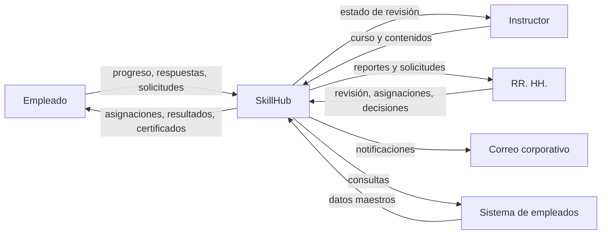

# Semana 1. Mapa sistémico de SkillHub

## 1. Propósito del sistema

SkillHub es la plataforma interna de capacitación técnica de una empresa de energía o infraestructura de aproximadamente 1.000 empleados. Su resultado principal es convertir necesidades de capacitación en aprendizaje trazable: cursos publicados, asignaciones claras, progreso y evaluaciones registrados, certificados disponibles y reportes confiables.

El sistema produce valor para tres grupos principales:

- **Empleados:** identifican qué deben aprender, completan cursos y obtienen evidencia de sus resultados.
- **Instructores:** convierten conocimiento técnico interno en cursos mantenibles y los envían a aprobación.
- **Recursos Humanos:** coordina la capacitación, controla la cobertura y consulta resultados sin consolidar información manualmente.

El sistema no produce por sí solo la competencia técnica del empleado; facilita y hace visible el proceso que puede conducir a ella.

## 2. Límite del sistema

### Dentro del sistema

- Catálogo de cursos publicados y su disponibilidad.
- Creación, edición, revisión y publicación de cursos.
- Módulos, contenidos, evaluaciones, intentos y reglas de finalización.
- Inscripciones, asignaciones, fechas límite y estados de progreso.
- Solicitudes de desbloqueo de intentos y decisiones de RR. HH.
- Certificados, notificaciones y bandeja interna.
- Reportes de cobertura, finalización y resultados.
- Autorización por rol y bitácora de asignaciones y certificados.

### Fuera del sistema

- El sistema corporativo de empleados, que es la fuente maestra de nombre, área, rol y estado activo.
- La identidad de la empresa y sus procesos organizacionales no administrados por SkillHub.
- La creación del conocimiento técnico y la decisión de qué competencias necesita el negocio.
- El alojamiento o procesamiento propio de videos externos.
- El correo corporativo como canal de entrega de notificaciones y recuperación.
- Las políticas corporativas que determinan calificación mínima, máximo de intentos y validez de certificados.

### En la frontera

- La API de consulta al sistema de empleados: SkillHub solicita datos y decide cómo actuar cuando están disponibles, desactualizados o no disponibles.
- El correo corporativo: SkillHub prepara notificaciones y registra su estado, pero el proveedor entrega el mensaje.
- Los documentos y enlaces aportados por instructores: SkillHub controla su asociación y acceso, mientras que el contenido y sus derechos pertenecen al negocio.
- Las decisiones de instructores y RR. HH.: el sistema registra y aplica sus decisiones, pero no reemplaza su criterio.
- La política corporativa: se transforma en reglas de aprobación, intentos, desbloqueos y certificados.

El límite se fija alrededor del ciclo operativo de capacitación. SkillHub controla el registro, el flujo y la evidencia del aprendizaje; depende del exterior para datos maestros, políticas, contenidos y algunos canales.

## 3. Actores y stakeholders

| Actor o stakeholder | Objetivo | Información que aporta o recibe | Preocupación principal |
|---|---|---|---|
| Empleado | Cumplir su capacitación y demostrar sus resultados | Aporta progreso, respuestas y solicitudes; recibe asignaciones, contenidos, resultados, avisos y certificados | Saber qué debe completar y que sus datos y resultados sean privados |
| Instructor | Publicar conocimiento técnico correcto y mantenible | Aporta cursos, módulos, contenidos y evaluaciones; recibe decisiones de revisión y motivos de devolución | Poder corregir contenido sin perder trabajo y conocer el estado de sus cursos |
| Administrador de RR. HH. | Asegurar cobertura y cumplimiento de la capacitación | Aporta asignaciones, decisiones, políticas y filtros; recibe reportes, solicitudes y evidencias | Tener información completa, trazable y útil para decidir |
| Sistema corporativo de empleados | Mantener los datos organizacionales oficiales | Aporta nombre, área, rol y estado activo por API; recibe consultas | Que SkillHub no cree ni contradiga datos maestros |
| Responsable de operación o TI | Mantener el servicio disponible y recuperable | Aporta operación, respaldos, mantenimiento y soporte; recibe alertas y diagnósticos | Fallos controlados, recuperación posible y cambios previsibles |
| Dirección del negocio | Desarrollar capacidades necesarias para la operación | Recibe indicadores agregados de cobertura, finalización y resultados | Que la inversión produzca capacidades y no solo actividad registrada |
| Área legal o de cumplimiento | Asegurar tratamiento adecuado de datos y evidencias | Aporta obligaciones de privacidad, retención y auditoría; recibe bitácoras y evidencias | Acceso autorizado, trazabilidad y conservación conforme a política |
| Proveedor de correo corporativo | Entregar mensajes a las cuentas corporativas | Recibe mensajes y destinatarios; devuelve estado de entrega | Volumen, formato y disponibilidad del servicio de correo |

## 4. Entradas, salidas y flujos de información

El diagrama muestra quién cruza el límite de SkillHub. Los flujos no son únicamente llamadas: cada uno cambia el significado o el estado de la información.

| # | Origen -> destino | Entrada | Transformación principal | Salida |
|---|---|---|---|---|
| 1 | Instructor -> SkillHub -> RR. HH. | Curso, módulos, contenidos y evaluación | SkillHub valida mínimos, conserva el borrador y cambia el estado a `En revisión` | Curso revisable y notificación a RR. HH. |
| 2 | RR. HH. -> SkillHub -> Instructor | Aprobación o devolución con motivo | SkillHub aplica la decisión y cambia el estado a `Publicado` o `Borrador` | Curso disponible o trabajo pendiente con explicación |
| 3 | Sistema de empleados -> SkillHub -> RR. HH. | Identidad, área, rol y estado activo | SkillHub consulta y asocia datos organizacionales sin permitir edición local | Población válida para asignaciones y reportes |
| 4 | RR. HH. -> SkillHub -> Empleado | Curso, población objetivo y fecha límite | SkillHub expande el criterio por empleado, evita duplicados y crea estados de asignación | Tareas de aprendizaje visibles y aviso de asignación |
| 5 | Empleado -> SkillHub | Lectura de contenidos y avance | SkillHub valida contenidos obligatorios y registra el progreso por curso o módulo | Estado actualizado de avance |
| 6 | Empleado -> SkillHub -> Empleado | Respuestas de evaluación | SkillHub corrige, calcula la calificación, registra el intento y aplica el límite corporativo | Resultado, bloqueo o condición para completar |
| 7 | Empleado -> RR. HH. -> SkillHub | Solicitud de desbloqueo y decisión | SkillHub conserva el motivo, registra la decisión y habilita o mantiene bloqueados los intentos | Nuevo intento autorizado o solicitud cerrada |
| 8 | SkillHub -> Empleado y correo corporativo | Evento de completitud, asignación o decisión | SkillHub genera certificado o mensaje, registra el estado de entrega y mantiene la operación aunque falle el correo | Certificado descargable, aviso interno y/o estado de entrega |
| 9 | SkillHub -> RR. HH. | Estados de asignación, progreso y resultados | SkillHub filtra y agrega información por curso, área, rol y periodo respetando permisos | Reporte de cobertura, finalización y resultados |

Cuando un flujo falla, la información debe conservar su estado conocido y hacer visible el error. En particular, una indisponibilidad del sistema de empleados no debe permitir modificar datos maestros ni corromper asignaciones ya registradas.

## 5. Dependencias

| Dependencia | Propietario | Qué necesita SkillHub | Efecto de indisponibilidad o cambio |
|---|---|---|---|
| Sistema corporativo de empleados y su API | Equipo corporativo de RR. HH. o TI | Datos oficiales de identidad, área, rol y estado activo | No se pueden validar nuevas poblaciones o permisos organizacionales; datos locales existentes deben permanecer consistentes y el error debe comunicarse |
| Correo corporativo | Equipo de mensajería/TI | Entrega de recuperación de contraseña y notificaciones | El mensaje puede quedar pendiente o fallar; la bandeja interna y el estado de entrega deben conservar la operación local |
| Política corporativa de capacitación | RR. HH. y dirección | Calificación mínima, máximo de intentos, desbloqueos y validez de certificados | Un cambio altera la finalización y los reportes; debe existir una decisión explícita sobre desde cuándo aplica |
| Infraestructura on-premise y almacenamiento | Responsable de operación/TI | Ejecución del sistema, persistencia y documentos adjuntos | Una falla interrumpe acceso o carga de contenidos; respaldos y recuperación manual deben permitir volver a operar |
| Contenidos y enlaces técnicos | Instructores y áreas técnicas | Material correcto, accesible y vigente | Un cambio o enlace roto reduce la validez del curso; el propietario debe corregirlo y el estado del curso debe hacerse visible |
| Capacidad y disponibilidad del equipo de RR. HH. | RR. HH. | Revisión de cursos, asignaciones y desbloqueos | Se acumulan cursos o solicitudes pendientes; el sistema debe mostrar estados y fechas, no ocultar la demora |

Estas dependencias son parte del comportamiento del sistema aunque no estén bajo control directo del producto. Cada contrato debe aclarar propietario, datos, disponibilidad esperada y respuesta ante error.

## 6. Feedback loops

### Bucle reforzador: adopción y evidencia

1. Un empleado recibe una asignación clara y completa un curso.
2. SkillHub registra el resultado y genera un certificado.
3. La evidencia permite a RR. HH. detectar brechas y asignar capacitación más pertinente.
4. Una asignación más pertinente aumenta la probabilidad de finalización y genera más evidencia útil.

Este bucle puede reforzar la mejora de cobertura, pero también puede amplificar asignaciones incorrectas si los datos de roles, contenidos o resultados son de baja calidad. Por eso la trazabilidad y la revisión de los reportes son controles necesarios.

### Bucle balanceador: saturación de revisión

1. Más instructores envían cursos a revisión.
2. Aumenta la cola de trabajo de RR. HH. y el tiempo de respuesta.
3. La cola visible y sus estados permiten priorizar, devolver cursos incompletos o limitar campañas nuevas.
4. Al reducir entradas pendientes, la cola vuelve a un nivel operable.

Este bucle balancea la capacidad de revisión con la demanda. Si no se controla la cola, el sistema puede aparentar capacidad de publicación mientras la demora se desplaza a un proceso humano fuera de la interfaz.

## 7. Complejidad y restricciones

### Fuentes de complejidad

1. **Estados y reglas del ciclo de aprendizaje:** un curso puede estar en borrador, revisión o publicado; un empleado puede estar asignado, avanzando, bloqueado o completado, con intentos y desbloqueos que afectan las transiciones.
2. **Coordinación entre datos maestros y decisiones locales:** SkillHub necesita datos externos de empleados, pero debe conservar progreso, asignaciones y evidencias sin permitir contradicciones ni ediciones manuales de la fuente maestra.
3. **Múltiples actores y niveles de privacidad:** empleados, instructores y RR. HH. necesitan vistas distintas; los reportes organizacionales y los resultados individuales tienen permisos y riesgos diferentes.

### Restricciones

| Restricción | Tipo | Origen | Consecuencia |
|---|---|---|---|
| La solución debe soportar aproximadamente 1.000 empleados | Dura, explícita | Contexto de producto | Capacidad inicial y pruebas deben cubrir esa población |
| La infraestructura inicial debe ser on-premise | Dura, explícita | Contexto de producto | La operación y recuperación dependen de infraestructura corporativa |
| El sistema de empleados es la fuente maestra de datos organizacionales | Dura, explícita | Política de integración | SkillHub no puede editar nombre, área, rol o estado activo |
| Los resultados individuales solo son visibles para el empleado y RR. HH. autorizado | Dura, explícita | Regla de negocio y privacidad | La autorización debe comprobarse en cada consulta relevante |
| La finalización requiere contenidos obligatorios y aprobación de evaluación | Dura, explícita | Regla de negocio | No basta con abrir el curso o responder parcialmente |
| La recuperación inicial puede ser manual y los respaldos deben ser diarios | Dura, explícita | Requisito operativo | La operación necesita un procedimiento documentado y verificable |
| El correo corporativo es el canal de notificación y recuperación | Blanda, explícita | Alcance del MVP | Se prioriza integración existente sobre nuevos canales |
| El MVP no tendrá aplicación móvil nativa ni analítica predictiva | Dura, explícita | Alcance de producto | Esas capacidades no deben introducirse para resolver necesidades iniciales |
| Los cursos técnicos deben poder mantenerse sin cambios de software | Blanda, explícita | Principio de producto | La autoría y edición deben estar al alcance del instructor autorizado |
| La política exacta de retención y validez de certificados está disponible | Implícita, pendiente | Supuesto organizacional | Debe validarse antes de fijar conservación y expiración |

Las restricciones blandas orientan decisiones y pueden renegociarse. Las implícitas son riesgos de modelado: no deben tratarse como hechos hasta confirmarlas.

## 8. Requisitos iniciales

### Requisitos funcionales

- **RF-01:** El sistema debe permitir al instructor crear y editar un curso en estado `Borrador`, incluyendo módulos, contenidos y evaluación.
- **RF-02:** El sistema debe permitir a RR. HH. aprobar un curso o devolverlo a `Borrador` con un motivo; solo un curso aprobado puede pasar a `Publicado`.
- **RF-03:** El sistema debe permitir a RR. HH. asignar un curso publicado a empleados concretos o a una población definida por área o rol, con fecha límite cuando corresponda.
- **RF-04:** El sistema debe registrar el progreso obligatorio y cada intento de evaluación, aplicar la calificación mínima y el máximo de intentos, y marcar el curso como completado solo si se cumplen ambas condiciones.
- **RF-05:** Al completar un curso, el sistema debe generar un certificado asociado al empleado y al curso, permitir su consulta y descarga, y registrar el evento.
- **RF-06:** El empleado debe poder solicitar el desbloqueo de intentos y RR. HH. debe poder aprobar o rechazar la solicitud con su decisión registrada.
- **RF-07:** RR. HH. debe poder consultar reportes filtrados al menos por curso, área, rol y periodo, incluyendo cobertura, finalización y resultados.

### Requisitos no funcionales

- **RNF-01 Seguridad:** Las contraseñas no deben almacenarse en texto plano y cada operación sobre cursos, resultados, certificados y reportes debe aplicar autorización por rol.
- **RNF-02 Privacidad:** Un empleado solo debe poder consultar sus propios resultados y un instructor no debe poder consultar resultados individuales; esto debe comprobarse mediante pruebas de autorización negativas.
- **RNF-03 Capacidad:** El sistema debe soportar la población inicial de aproximadamente 1.000 empleados y hasta 100 cursos con documentos asociados, incluyendo campañas periódicas de acceso y notificaciones; la concurrencia máxima queda por medir.
- **RNF-04 Recuperación:** Deben realizarse respaldos diarios y existir un procedimiento probado de recuperación manual. El RPO y el RTO objetivo deben quedar definidos antes de producción.
- **RNF-05 Resiliencia de integración:** Una indisponibilidad temporal del sistema de empleados no debe corromper operaciones locales; el sistema debe comunicar el error y evitar crear o modificar asignaciones que dependan de datos no validados.
- **RNF-06 Notificaciones:** Los envíos fallidos deben poder reintentarse sin duplicar indebidamente el efecto de la asignación, certificado o decisión que originó el mensaje.
- **RNF-07 Auditoría:** Cada asignación y evento de certificado debe conservar actor, empleado afectado, curso, fecha y resultado de la operación para consulta autorizada.
- **RNF-08 Disponibilidad:** El MVP debe estar disponible durante el horario laboral acordado; los mantenimientos planificados deben realizarse fuera de ese horario y quedar comunicados.

## 9. Preguntas abiertas y supuestos por validar

1. **Políticas:** ¿Cuál es la calificación mínima, el máximo de intentos adicionales y la validez o vencimiento de cada tipo de certificado?
2. **Integración y capacidad:** ¿Cuál es el contrato real de la API del sistema de empleados, su disponibilidad esperada y el máximo de usuarios simultáneos durante una campaña?
3. **Operación y contenido:** ¿Qué tamaño y formatos de documentos se aceptan, quién revisa los enlaces externos y cuáles son los objetivos formales de RPO y RTO?