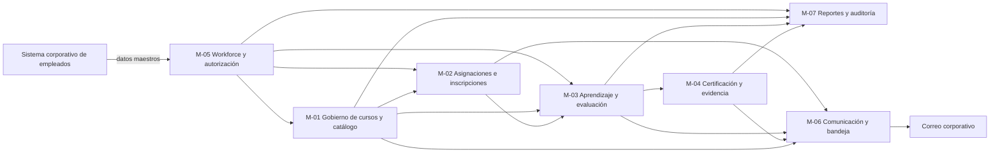

# Semana 3. Límites y modularidad de SkillHub

## 1. Criterio de la propuesta

La propuesta organiza SkillHub alrededor de responsabilidades de negocio y de los cambios que deberían permanecer juntos. No define clases, endpoints, tablas ni infraestructura. Los límites se derivan de los requisitos de las semanas anteriores:

- aproximadamente 1.000 empleados y hasta 100 cursos;
- ciclo de publicación, asignación, aprendizaje, evaluación y certificación;
- protección de resultados individuales;
- dependencia del sistema corporativo de empleados;
- operación inicial on-premise, con disponibilidad y carga todavía parcialmente pendientes de validar.

Se propone un **monolito modular** como forma provisional de despliegue, con contratos internos explícitos y posibilidad de separar un módulo solo cuando exista una razón operacional o de evolución comprobada.

## 2. Módulos y contextos delimitados

### M-01. Gobierno de cursos y catálogo

**Propósito:** gestionar la definición, calidad, revisión, publicación y disponibilidad de la oferta formativa.

**Responsabilidades:**

- crear y editar cursos en borrador;
- organizar módulos, contenidos, evaluaciones y metadatos del curso;
- validar mínimos antes de enviar a revisión;
- gestionar aprobación, devolución con motivo y publicación;
- decidir si un curso publicado aparece en el catálogo.

**Datos que posee:** definición del curso, contenido y estructura, estado editorial, motivo de devolución, configuración de catálogo y relación con el instructor propietario.

**Cambios que deberían permanecer dentro:** cambios en el flujo editorial, campos obligatorios, reglas de publicación, tipos de contenido admitidos y criterios para mostrar una oferta en catálogo. Un cambio de estas reglas no debería modificar el concepto de asignación individual ni el cálculo de resultados.

### M-02. Asignaciones e inscripciones

**Propósito:** convertir la disponibilidad de cursos en obligaciones o inscripciones concretas para empleados.

**Responsabilidades:**

- asignar cursos a empleados, áreas o roles;
- habilitar inscripciones voluntarias;
- expandir una población organizacional a empleados objetivo;
- registrar fecha de asignación, fecha límite y estado;
- evitar asignaciones activas duplicadas;
- permitir consultar el plan de aprendizaje del empleado.

**Datos que posee:** asignación, inscripción, población objetivo capturada para la operación, fecha límite y estado de la relación empleado-curso.

**Cambios que deberían permanecer dentro:** reglas de elegibilidad, duplicidad, vencimiento, cancelación o modificación de asignaciones y diferencia entre obligatorio y voluntario. No debería poseer la estructura editorial del curso ni las respuestas de una evaluación.

### M-03. Aprendizaje y evaluación

**Propósito:** registrar la interacción del empleado con el contenido y determinar si cumple las condiciones de aprendizaje y evaluación.

**Responsabilidades:**

- mostrar el contenido permitido para el participante;
- registrar progreso por contenido o módulo obligatorio;
- recibir y corregir intentos de evaluación;
- aplicar calificación mínima y límite de intentos;
- gestionar el bloqueo por intentos agotados;
- aceptar el resultado de un desbloqueo autorizado;
- determinar cuándo se cumplen las condiciones de finalización.

**Datos que posee:** progreso, respuestas e intentos, calificaciones, resultados, estado de finalización y referencia a la política aplicada al intento.

**Cambios que deberían permanecer dentro:** tipos de preguntas, cálculo de calificación, reglas de aprobación, condiciones de completitud y comportamiento ante intentos agotados. Un cambio de la política de evaluación no debería obligar a cambiar la publicación de cursos o la entrega de correo.

### M-04. Certificación y evidencia

**Propósito:** convertir una finalización válida en evidencia consultable y descargable.

**Responsabilidades:**

- recibir la confirmación de finalización;
- verificar que el evento sea elegible para certificación;
- emitir el certificado;
- asociarlo al empleado y al curso completado;
- aplicar vencimiento si la política lo define;
- permitir consulta y descarga al empleado autorizado.

**Datos que posee:** certificado, empleado, curso, fecha de emisión, vigencia, estado y referencia al hecho de finalización que lo originó.

**Cambios que deberían permanecer dentro:** formato del certificado, reglas de emisión, validez, revocación o corrección y permisos de acceso a la evidencia. La generación de un certificado no debería conocer cómo se envió un correo ni cómo se construye un reporte agregado.

### M-05. Workforce y autorización

**Propósito:** representar el contexto organizacional necesario para identificar actores y decidir qué operaciones pueden realizar.

**Responsabilidades:**

- consultar y actualizar la representación local de empleado, área, rol y estado activo desde el sistema corporativo;
- identificar al actor de una operación;
- aplicar las reglas de autorización por rol y alcance;
- impedir operaciones protegidas de usuarios inactivos;
- exponer una vista autorizada del contexto del empleado a los demás módulos.

**Datos que posee:** identificador de empleado, estado de sincronización, área, rol, estado activo y asignación de roles de SkillHub. El sistema corporativo sigue siendo propietario de los datos maestros.

**Cambios que deberían permanecer dentro:** mapeo de roles, política de autorización, manejo de empleados inactivos y adaptación al contrato del sistema de empleados. Un cambio del proveedor o formato externo debería quedar en el adaptador de frontera y no propagarse a las reglas de cursos o evaluaciones.

### M-06. Comunicación y bandeja

**Propósito:** entregar y consultar notificaciones derivadas de eventos de capacitación sin convertirse en propietario de las decisiones de negocio.

**Responsabilidades:**

- crear avisos internos para asignaciones, resultados, certificados y decisiones;
- preparar entregas al correo corporativo;
- registrar estados, fallos y reintentos;
- evitar que una entrega duplicada cambie dos veces el resultado de negocio;
- mostrar la bandeja de notificaciones al usuario autorizado.

**Datos que posee:** notificación, destinatario, evento de origen, canal, estado de entrega, reintentos y fecha de lectura interna.

**Cambios que deberían permanecer dentro:** plantillas, canales, política de reintentos, preferencias y estados de entrega. Cambiar el proveedor de correo no debería cambiar cómo se aprueba un curso o se emite un certificado.

### M-07. Reportes y auditoría

**Propósito:** ofrecer información agregada y evidencia operacional para que RR. HH. supervise cobertura, resultados y acciones relevantes.

**Responsabilidades:**

- calcular o presentar cobertura, progreso, finalización y resultados por curso, área, rol y periodo;
- aplicar el alcance autorizado a cada consulta;
- conservar eventos de auditoría de asignaciones, certificados y decisiones relevantes;
- permitir reconstruir quién hizo qué y cuándo;
- distinguir datos actuales de eventos históricos.

**Datos que posee:** hechos de reporte, agregados, filtros de consulta, eventos de auditoría y referencias de trazabilidad. No es propietario de la asignación, del progreso ni del certificado original.

**Cambios que deberían permanecer dentro:** dimensiones, filtros, agregaciones, retención de auditoría y formatos de reporte. Agregar un indicador nuevo debería no alterar las reglas que producen una asignación o una finalización.

## 3. Límites de contexto y vocabulario

Los módulos pueden intercambiar referencias y hechos necesarios, pero no deben imponer un único modelo para conceptos que tienen significados distintos.

### Límite 1: “Curso” editorial frente a “curso” asignado

- En **Gobierno de cursos y catálogo**, un curso es una oferta formativa con contenidos, estado editorial y visibilidad.
- En **Asignaciones e inscripciones**, el curso es el objeto de una relación con un empleado: una obligación o inscripción con fecha y estado.
- El contrato debe compartir un identificador y datos mínimos publicados, pero la asignación no debe modificar la definición editorial.

### Límite 2: “Completado” frente a “certificado”

- En **Aprendizaje y evaluación**, completado significa que el participante revisó los contenidos obligatorios y aprobó la evaluación según la política.
- En **Certificación y evidencia**, el certificado es una evidencia emitida a partir de una finalización elegible y puede tener vigencia o revocación.
- Una finalización puede ser un hecho de entrada; no debe confundirse con el documento ni con su entrega.

### Límite 3: “Empleado” maestro frente a “participante” autorizado

- En **Workforce y autorización**, empleado representa la identidad organizacional y su estado oficial.
- En **Asignaciones** y **Aprendizaje**, participante representa la relación de esa persona con un curso y su progreso.
- El participante no debe copiar reglas ni convertirse en una segunda fuente de área, rol o estado activo.

## 4. Contratos principales y dirección de dependencias

Los contratos expresan necesidades de negocio o hechos, no mecanismos de transporte. La flecha indica que el módulo de origen necesita el contrato del módulo de destino o consume un hecho publicado por él.

| Contrato | Proveedor | Consumidor | Contenido mínimo | Dirección y regla |
|---|---|---|---|---|
| Contexto autorizado del empleado | Workforce y autorización | Gobierno, Asignaciones, Aprendizaje, Certificación, Comunicación y Reportes | Identidad, roles, estado activo y alcance permitido | Los consumidores dependen de una vista estable; no consultan directamente el sistema externo. |
| Curso publicado disponible | Gobierno de cursos y catálogo | Asignaciones e inscripciones, Aprendizaje y evaluación, Reportes | Identificador, versión o estado vigente, título, contenidos obligatorios y configuración de disponibilidad | Gobierno es propietario de la publicación; consumidores no editan el curso. |
| Asignación o inscripción activa | Asignaciones e inscripciones | Aprendizaje y evaluación, Comunicación, Reportes | Empleado, curso, tipo, fecha límite y estado | Aprendizaje depende de una relación válida; Comunicación solo reacciona al hecho. |
| Progreso y resultado de evaluación | Aprendizaje y evaluación | Certificación, Comunicación y Reportes | Empleado, curso, cumplimiento, calificación, resultado y fecha | El módulo de aprendizaje posee la decisión de finalización; consumidores no la recalculan. |
| Finalización elegible | Aprendizaje y evaluación | Certificación y evidencia, Comunicación, Reportes | Identificador de empleado, curso, fecha y referencia a la evidencia de evaluación | Es un hecho de negocio; Certificación lo usa para emitir, no para volver a evaluar. |
| Certificado emitido | Certificación y evidencia | Comunicación y Reportes | Identificador, empleado, curso, emisión, vigencia y estado | Certificación posee la evidencia; Comunicación solo entrega un aviso. |
| Solicitud de notificación | Gobierno, Asignaciones, Aprendizaje, Certificación y Reportes | Comunicación y bandeja | Destinatario, evento, plantilla semántica y prioridad | Comunicación posee entrega y reintentos, no la transacción que originó el aviso. |
| Hecho auditable | Todos los módulos de negocio | Reportes y auditoría | Actor o proceso, entidad, acción, fecha, resultado y referencia | Reportes conserva la evidencia; no puede cambiar el estado del módulo productor. |

### Vista de dependencias

La dirección principal va desde los datos de contexto y la oferta hacia la participación, el aprendizaje y la evidencia. Comunicación y reportes consumen hechos, pero no gobiernan las decisiones de negocio. La única dependencia externa mostrada es la consulta al sistema corporativo de empleados y la entrega de correo; sus adaptadores quedan en la frontera de los módulos correspondientes.

No hay ciclos de dependencia entre los módulos de negocio. La autorización es un contexto compartido de consulta, no un consumidor de resultados. Los eventos de auditoría se dirigen hacia Reportes y auditoría, que no devuelve una dependencia de negocio a sus productores.

## 5. Reglas de separación entre negocio, mecanismos y adaptadores

### Reglas de negocio

Las reglas de publicación, asignación, evaluación, completitud, desbloqueo y emisión pertenecen respectivamente a M-01, M-02, M-03 y M-04. Estas reglas deben poder expresarse sin conocer correo, almacenamiento de documentos, API externa o interfaz de usuario.

### Mecanismos externos

El sistema corporativo de empleados y el correo corporativo son mecanismos fuera del control de SkillHub. Su disponibilidad, formato y protocolos pueden cambiar; no deben definir el vocabulario interno de cursos, asignaciones o certificados.

### Adaptadores

Los adaptadores traducen datos externos al contrato que necesita el módulo propietario. El adaptador del sistema de empleados pertenece a la frontera de M-05; el adaptador de correo pertenece a la frontera de M-06. La traducción no debe trasladar errores de formato o estados externos directamente al dominio.

## 6. Comparación: monolito modular frente a microservicios

| Criterio | Monolito modular | Microservicios |
|---|---|---|
| Latencia | Llamadas entre módulos sin red, apropiadas para catálogo, progreso, evaluación y certificados; los límites siguen siendo contratos conceptuales. | Cada llamada remota añade latencia y variabilidad; separar evaluación, certificación o autorización exige justificar sus objetivos propios. |
| Fallos | Un fallo del proceso puede afectar más capacidades, pero hay menos fallos parciales y menos coordinación distribuida; la integración externa sigue requiriendo aislamiento. | Aísla algunos fallos y permite degradar un servicio, pero añade timeouts, reintentos, duplicados y fallos parciales entre contratos. |
| Operación | Menor carga inicial de despliegue, monitoreo, seguridad entre componentes y recuperación; encaja mejor con la operación on-premise disponible. | Requiere operar múltiples procesos, contratos, diagnósticos y rutas de recuperación; aumenta el costo humano y operativo del MVP. |
| Despliegue | Una unidad facilita consistencia de versiones y puesta en marcha, aunque todos los módulos comparten el ciclo de despliegue. | Permite despliegue independiente y escalado selectivo, pero exige compatibilidad entre versiones y automatización operativa. |
| Consistencia | Facilita transiciones coherentes entre asignación, progreso, finalización y certificado cuando el negocio lo requiere. | Fuerza coordinación, eventos o consistencia eventual entre servicios; puede elevar la complejidad de estados intermedios. |
| Costo | Menor costo inicial de infraestructura, soporte y observabilidad para 1.000 empleados y hasta 100 cursos. | Mayor costo de operación y plataforma; el beneficio solo compensa si aparecen necesidades de escala, aislamiento o equipos independientes. |
| Evolución | Puede preservar límites y extraer un módulo posteriormente si el contrato es estable; riesgo de que los límites se relajen si no se protegen. | La independencia de despliegue favorece evolución local, pero una mala frontera hace más costoso corregir el diseño por la red. |

## 7. Decisión provisional

### Recomendación: monolito modular con límites de contexto explícitos

Para el MVP se recomienda implementar los siete módulos como una unidad operativa, conservando contratos internos, propiedad de datos por módulo y dirección acíclica de dependencias. La decisión se relaciona con:

- **Carga:** la población conocida es de aproximadamente 1.000 empleados y hasta 100 cursos; la concurrencia real aún está pendiente y no justifica distribución anticipada.
- **Restricciones:** el despliegue inicial es on-premise, la recuperación puede ser manual y el costo operativo debe validarse.
- **Riesgo:** el dominio todavía necesita validar políticas de evaluación, contrato del sistema de empleados, RPO/RTO y campañas reales.
- **Requisitos:** se necesita seguridad, consistencia en finalización y certificación, tolerancia a fallos del correo y mantenibilidad; todos pueden abordarse sin introducir llamadas de red internas.
- **Evolución:** los contratos permiten extraer Comunicación, Reportes o una capacidad de carga diferenciada si las métricas futuras muestran una razón concreta.

La recomendación no significa un monolito sin límites. Si módulos distintos pueden leer y modificar directamente los datos de otro, la propuesta pierde su principal beneficio y debe considerarse fallida aunque el despliegue sea único.

### Tres consecuencias aceptadas

1. **Despliegue conjunto:** un cambio de un módulo puede requerir publicar toda la unidad, por lo que se acepta menor independencia de despliegue durante el MVP.
2. **Radio de fallo compartido:** una falla del proceso puede afectar varias capacidades; se acepta este riesgo a cambio de menor complejidad distribuida, con especial aislamiento para correo y sistema de empleados.
3. **Escalado compartido:** no se podrá escalar cada módulo de forma independiente al inicio; se acepta capacidad potencialmente sobredimensionada hasta conocer la carga real y revisar la decisión con métricas.

## 8. Preguntas de revisión

1. ¿La frecuencia de cambios y el volumen de campañas harán que Asignaciones, Comunicación o Reportes necesiten un ciclo de despliegue o escalado separado?
2. ¿El contrato y la disponibilidad del sistema de empleados permiten que Workforce y autorización sea un límite estable, o requiere una estrategia distinta de actualización?
3. ¿La política de corrección y versionado de cursos publicados obligará a separar la definición editorial de la evidencia histórica de aprendizaje antes del MVP?