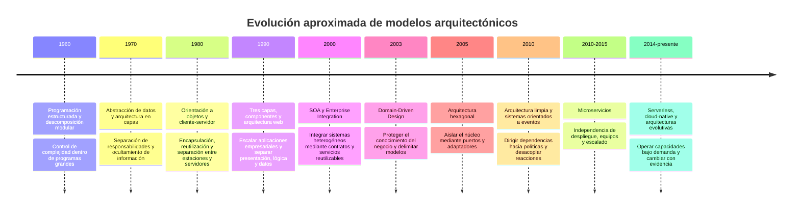
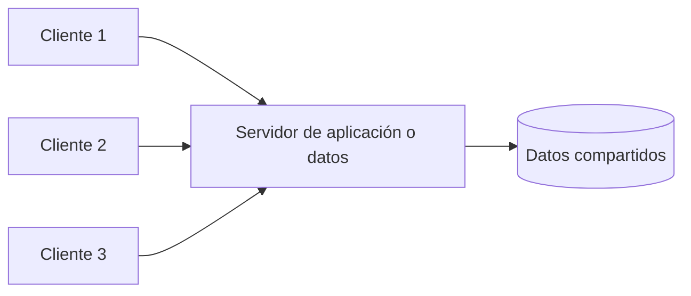
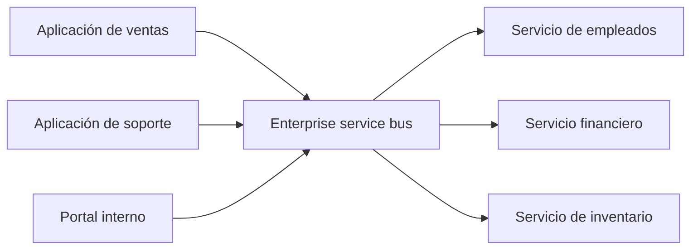
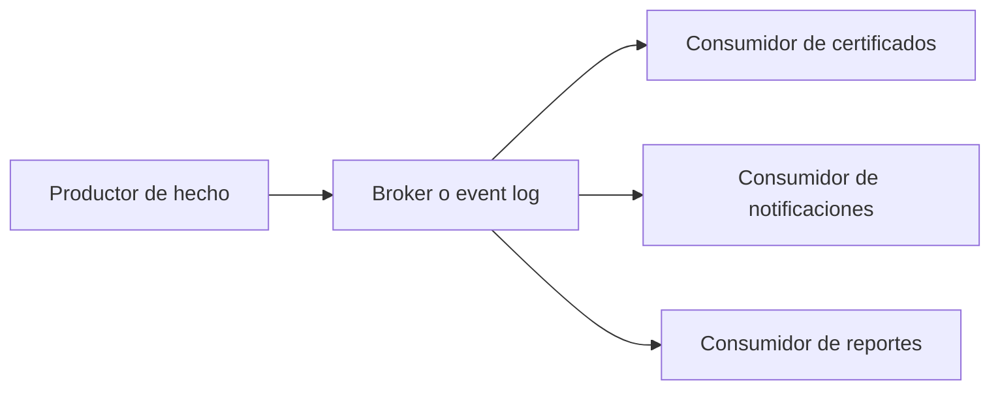
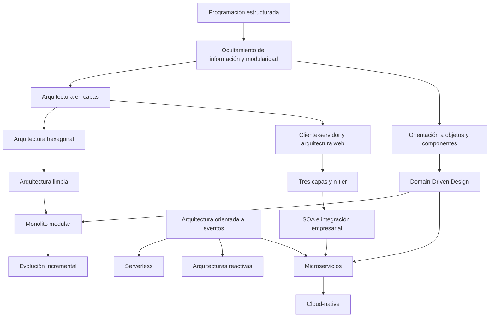

# Anexo de la Semana 3. Evolución histórica de los modelos de arquitectura de software

## Propósito del anexo

Los modelos de arquitectura de software surgieron como respuestas a problemas concretos. A medida que aumentaron el tamaño de los sistemas, la cantidad de usuarios, la diversidad de dispositivos, la necesidad de integración y la distribución de los equipos, cambiaron también las formas de organizar el software.

Este documento presenta una evolución cronológica y aproximada de esos modelos. Para cada etapa explica:

- qué problema estaba creciendo;
- qué respuesta arquitectónica se propuso;
- cuál era su filosofía general;
- qué principios introdujo o reforzó;
- qué nuevas limitaciones hizo visibles.

La historia no debe entenderse como una sucesión en la que un modelo invalida por completo al anterior. Las arquitecturas actuales combinan ideas de varias etapas. Una aplicación puede usar módulos estructurados, capas, principios hexagonales, modelos de dominio, eventos y servicios independientes al mismo tiempo.

El detalle de implementación de arquitectura en capas, hexagonal, limpia, Domain-Driven Design y microservicios se desarrolla en los anexos individuales de esta semana. Aquí el propósito es entender por qué aparecieron y cómo se relacionan.

## 1. Una advertencia sobre la cronología

Las fechas de la evolución arquitectónica son aproximadas. Las ideas suelen aparecer antes de recibir un nombre, coexistir durante años y reaparecer con nuevas tecnologías. Un modelo puede ser influyente en investigación, en sistemas empresariales o en la industria en momentos diferentes.

La evolución tampoco es únicamente tecnológica. Está condicionada por:

- capacidad y costo del hardware;
- sistemas operativos y redes disponibles;
- tamaño y habilidades de los equipos;
- formas de adquirir y operar software;
- necesidades de negocio;
- restricciones de seguridad y regulación;
- prácticas de diseño y métodos de desarrollo.

Una arquitectura debe juzgarse en su contexto. Un patrón que reduce un problema en una época puede convertirse en una carga cuando cambian la escala, el tipo de usuario o el costo de operación.

## 2. Vista general de la evolución

Esta línea no es una clasificación exhaustiva ni una única genealogía. Es una guía para reconocer las presiones que hicieron atractivas determinadas respuestas.

## 3. Primer problema: controlar programas demasiado complejos

### Periodo aproximado: 1960-1970

Los primeros sistemas de software de gran tamaño mostraron que un programa podía volverse difícil de entender y modificar incluso cuando sus instrucciones eran individualmente sencillas. El problema principal no era todavía elegir entre servicios o bases de datos: era controlar el flujo, los estados y las dependencias dentro de un programa.

### Respuesta: programación estructurada

La **programación estructurada** promovió el uso de secuencias, decisiones y repeticiones con entradas y salidas claras, evitando saltos arbitrarios que dificultaran seguir el control. La descomposición en procedimientos y funciones permitió dividir un programa en unidades más pequeñas.

### Filosofía y principios

- reducir el flujo implícito y los saltos difíciles de seguir;
- dividir problemas grandes en subproblemas comprensibles;
- controlar el estado y el alcance de los datos;
- utilizar abstracciones para que una parte oculte detalles a otra;
- razonar localmente sobre una función o procedimiento.

La idea importante fue que la estructura del programa debía ayudar a leer y verificar el comportamiento. El software dejó de considerarse únicamente una secuencia de instrucciones y comenzó a organizarse como una composición de unidades con responsabilidades.

### Qué problema resolvió y qué dejó pendiente

Resolvió parte de la complejidad del flujo de control y mejoró la mantenibilidad de programas procedurales. Sin embargo, no resolvió por completo cómo representar datos complejos, cómo separar responsabilidades que atravesaban muchas funciones ni cómo coordinar sistemas que se ejecutaban en máquinas diferentes.

La descomposición procedimental también podía producir módulos que compartían estructuras globales y dependían demasiado del orden de ejecución.

## 4. Segundo problema: proteger datos y controlar módulos

### Periodo aproximado: 1970-1980

A medida que los programas crecieron, quedó claro que separar procedimientos no bastaba si cualquier parte podía leer o modificar los datos internos de cualquier otra. Un cambio en una representación podía propagarse por todo el sistema.

### Respuesta: abstracción de datos y ocultamiento de información

La **abstracción de datos** agrupó operaciones y representación alrededor de conceptos. El **information hiding**, u ocultamiento de información, propuso que un módulo ocultara decisiones internas que otros componentes no necesitaban conocer.

Estas ideas reforzaron el concepto de módulo como límite. La interfaz pública debía expresar lo necesario para colaborar, mientras la representación interna podía cambiar sin obligar a modificar a los consumidores.

### Filosofía y principios

- separar qué hace un módulo de cómo lo hace;
- ocultar decisiones susceptibles de cambio;
- limitar el acceso a datos compartidos;
- diseñar interfaces pequeñas y significativas;
- reducir el impacto de una modificación local.

El módulo ya no era únicamente una agrupación física de código. Se convirtió en una unidad de responsabilidad y de protección frente al cambio.

### Qué problema resolvió y qué dejó pendiente

Redujo el acoplamiento causado por estructuras internas compartidas y preparó el terreno para tipos abstractos, componentes y objetos. Aun así, los sistemas podían mantener dependencias fuertes entre módulos y no existía una respuesta general para separar presentación, reglas y persistencia en aplicaciones completas.

## 5. Arquitectura en capas

### Periodo aproximado: 1970-1980, con amplia adopción posterior

Cuando los sistemas comenzaron a contener interfaces, procesamiento y almacenamiento diferenciados, se necesitaba una organización que permitiera trabajar con niveles distintos de abstracción. La arquitectura en capas respondió a esa necesidad agrupando responsabilidades horizontalmente.

### Problema que intentó resolver

Sin una separación clara, el código de interfaz podía conocer el almacenamiento, las reglas podían quedar mezcladas con la presentación y un cambio de base de datos podía afectar toda la aplicación. También era difícil asignar responsabilidades a equipos y probar una parte sin levantar el sistema completo.

### Respuesta

La **layered architecture**, o arquitectura en capas, organizó el sistema en niveles como presentación, aplicación, dominio e infraestructura. Una capa ofrece servicios a otra y oculta detalles de su implementación.

### Filosofía y principios

- separar responsabilidades por nivel de abstracción;
- dirigir las dependencias en una dirección comprensible;
- permitir sustituir mecanismos inferiores sin cambiar todas las capas;
- organizar el flujo de una solicitud de forma predecible;
- facilitar el trabajo y las pruebas por responsabilidad.

La arquitectura en capas aportó una estructura sencilla de enseñar y aplicar. Su riesgo apareció cuando las capas se volvieron conductos obligatorios, cuando todas compartían los mismos datos o cuando la lógica de negocio se dispersaba entre controladores y repositorios.

La capa visual podía estar perfectamente separada como carpeta y seguir acoplada a la base de datos mediante modelos compartidos. El modelo enseñó que la separación nominal no garantiza límites efectivos.

## 6. Orientación a objetos y componentes

### Periodo aproximado: 1980-1990

Los problemas de los programas procedurales impulsaron modelos que agrupaban estado y comportamiento. La orientación a objetos ofreció una forma de representar conceptos mediante objetos con identidad, operaciones y encapsulación.

### Problema que intentó resolver

Los datos y las funciones que los modificaban podían quedar dispersos. Además, la reutilización basada únicamente en procedimientos producía dependencias extensas y estructuras difíciles de adaptar cuando cambiaban las representaciones.

### Respuesta: objetos y encapsulación

La **object-oriented architecture**, o arquitectura orientada a objetos, organizó el software alrededor de objetos que colaboran entre sí. La encapsulación protegió el estado interno; la composición, la herencia y el polimorfismo ofrecieron formas de reutilizar y sustituir comportamientos.

La orientación a objetos no es solo crear clases. Su contribución arquitectónica aparece cuando los objetos tienen responsabilidades claras, protegen invariantes y colaboran mediante contratos.

### Filosofía y principios

- unir estado y comportamiento relacionados;
- ocultar representación interna;
- programar contra interfaces o abstracciones;
- preferir colaboración y composición cuando reduzcan acoplamiento;
- mantener una responsabilidad comprensible por objeto o componente;
- permitir sustituciones mediante polimorfismo.

Los **component-based systems**, o sistemas basados en componentes, llevaron esta intención a unidades reutilizables con interfaces y mecanismos de composición.

### Qué problema resolvió y qué dejó pendiente

Mejoró la encapsulación, la reutilización y el modelado de comportamiento. No garantizó por sí sola buenos límites: una jerarquía de clases puede estar fuertemente acoplada, y un objeto puede acumular demasiadas decisiones. También quedaba pendiente cómo distribuir componentes entre máquinas y cómo integrar sistemas empresariales heterogéneos.

## 7. Cliente-servidor

### Periodo aproximado: 1980-1990

La disponibilidad de redes locales y estaciones de trabajo permitió separar la interacción del usuario y el procesamiento o almacenamiento central. La arquitectura **client-server**, o cliente-servidor, asignó responsabilidades entre clientes que solicitan capacidades y servidores que las proporcionan.

### Problema que intentó resolver

Un sistema centralizado podía concentrar toda la carga y ofrecer una interacción limitada. También era necesario compartir datos y servicios entre varios usuarios sin instalar toda la lógica en cada estación.

### Respuesta

El cliente gestiona parte de la presentación o la interacción y el servidor ofrece datos, procesamiento o servicios compartidos. La división puede ser ligera, con clientes relativamente inteligentes, o concentrar más lógica en el servidor.

### Filosofía y principios

- separar consumidores de proveedores de capacidades;
- centralizar datos o servicios que deben compartirse;
- permitir que varios clientes utilicen una misma fuente;
- distribuir parte del procesamiento según las capacidades disponibles;
- establecer un protocolo de comunicación entre extremos.

### Qué problema resolvió y qué dejó pendiente

Permitió compartir recursos y escalar el acceso más allá de una única estación. Sin embargo, podía producir servidores centrales como cuellos de botella y clientes difíciles de actualizar. La lógica podía duplicarse entre clientes y servidor, y el contrato de red introducía nuevos problemas de disponibilidad.

La arquitectura web posterior mantuvo la idea de cliente y servidor, pero trasladó el cliente a navegadores y estandarizó protocolos de alcance mucho mayor.

## 8. Tres capas y aplicaciones empresariales

### Periodo aproximado: 1990-2000

Con la expansión de sistemas empresariales y aplicaciones web, se hizo frecuente separar presentación, lógica de negocio y datos. La **three-tier architecture**, o arquitectura de tres capas, refinó una distribución común para aplicaciones de negocio.

### Problema que intentó resolver

Las aplicaciones cliente-servidor podían mezclar interfaz, reglas y acceso a datos. Cambiar la interfaz, reutilizar una regla en otro canal o escalar la persistencia requería tocar una parte demasiado grande del sistema.

### Respuesta

Una organización típica distinguió:

- **Presentation tier:** interacción con el usuario o cliente;
- **Application or business tier:** reglas y coordinación;
- **Data tier:** persistencia y acceso a información.

La separación ayudó a desplegar partes en servidores diferentes y a reutilizar la lógica desde varios clientes.

### Filosofía y principios

- aislar presentación, comportamiento y datos;
- centralizar reglas para evitar duplicación entre clientes;
- controlar el acceso a datos mediante una capa responsable;
- permitir cambiar un nivel sin reescribir los otros;
- organizar el despliegue según responsabilidades técnicas.

### Qué problema resolvió y qué dejó pendiente

Redujo la duplicación y facilitó el crecimiento de aplicaciones empresariales. Pero el nivel de negocio podía convertirse en un bloque monolítico, y la separación por capas no distinguía necesariamente las distintas capacidades del dominio. La aplicación podía tener una arquitectura interna débil aunque su topología tuviera tres niveles.

## 9. Arquitectura web y n-tier

### Periodo aproximado: 1990-2000

La popularización de la Web cambió el modo de entregar software. Los navegadores se convirtieron en clientes ampliamente disponibles y HTTP pasó a ser un mecanismo común de interacción.

### Problema que intentó resolver

Las aplicaciones de escritorio requerían instalación, actualización y compatibilidad con cada estación. Las organizaciones necesitaban publicar capacidades a muchos usuarios con un cliente más fácil de distribuir.

### Respuesta

La arquitectura web colocó servidores de presentación y aplicación detrás de un protocolo común. El navegador se encargó de representar la interfaz y el servidor mantuvo una mayor parte de las reglas y datos.

En arquitecturas **n-tier**, o de múltiples niveles, podían aparecer servidores diferenciados para presentación, aplicación, integración, almacenamiento, cachés o servicios especializados.

### Filosofía y principios

- entregar capacidades mediante protocolos comunes;
- centralizar actualización y control de la aplicación;
- separar la representación externa de las reglas internas;
- escalar componentes mediante replicación o balanceo;
- tratar la red como un límite explícito.

La Web hizo más visible que una llamada remota no es igual que una llamada local. Latencia, disponibilidad, autenticación y serialización pasaron a ser preocupaciones arquitectónicas centrales.

## 10. SOA y la integración empresarial

### Periodo aproximado: 1990-2000, con fuerte adopción en la década de 2000

Las organizaciones ya tenían sistemas de recursos humanos, finanzas, manufactura y atención al cliente construidos con tecnologías diferentes. El problema no era solo crear una nueva aplicación, sino integrar capacidades existentes.

### Problema que intentó resolver

La integración punto a punto producía muchas conexiones difíciles de mantener. Cada sistema conocía detalles de los demás, los formatos se duplicaban y un cambio en un proveedor podía romper múltiples consumidores.

### Respuesta: Service-Oriented Architecture

La **Service-Oriented Architecture**, o **SOA**, propuso exponer capacidades de negocio como servicios con contratos, a menudo mediante un bus o una plataforma de integración. Los servicios podían reutilizarse por varias aplicaciones.

### Filosofía y principios

- integrar capacidades existentes mediante contratos;
- reducir conexiones directas entre sistemas;
- reutilizar servicios de negocio;
- separar consumidores de implementaciones proveedoras;
- centralizar transformaciones, seguridad y políticas de integración cuando sea útil;
- aceptar que los servicios pueden tener ciclos de vida distintos.

### Qué problema resolvió y qué dejó pendiente

SOA hizo visible la importancia de contratos, transformación de mensajes y gobierno de integraciones. En algunas organizaciones, el bus se convirtió en un punto central demasiado complejo y los servicios terminaron siendo interfaces técnicas sobre aplicaciones existentes, no límites autónomos de negocio.

La lección fue que “servicio” no significa automáticamente propiedad de datos, independencia de despliegue ni autonomía de equipo.

## 11. Domain-Driven Design

### Periodo aproximado: 2003 en adelante

A comienzos del siglo XXI, muchos equipos podían construir capas, servicios e integraciones, pero seguían produciendo modelos que no representaban bien el negocio. Los mismos términos significaban cosas diferentes en áreas distintas y las reglas se dispersaban en estructuras técnicas.

### Problema que intentó resolver

El software podía estar bien organizado técnicamente y, aun así, resolver mal el problema porque el equipo no compartía el significado del dominio. Un modelo único para toda la organización podía mezclar vocabularios y crear reglas contradictorias.

### Respuesta

**Domain-Driven Design**, o DDD, puso el modelo del dominio y el lenguaje compartido en el centro del diseño. Introdujo herramientas estratégicas como subdominios, contextos delimitados y mapas de contexto, y herramientas tácticas como entidades, objetos de valor, agregados, repositorios, servicios de dominio y eventos.

### Filosofía y principios

- colaborar con expertos del dominio;
- mantener un lenguaje ubicuo y verificable;
- separar contextos cuando cambian los significados;
- proteger invariantes dentro de agregados;
- asignar propiedad clara a reglas y datos;
- diseñar servicios alrededor de capacidades, no de tablas;
- utilizar eventos para expresar hechos importantes.

DDD no es una topología de despliegue. Un contexto delimitado puede vivir dentro de un monolito o convertirse en un servicio. Su aporte principal es descubrir límites semánticos y responsabilidades de negocio.

### Qué problema resolvió y qué dejó pendiente

Mejoró la alineación entre software y dominio y ofreció criterios para elegir límites. No resolvió por sí solo la operación distribuida, la latencia ni los despliegues independientes. Esas preocupaciones aparecerían con más fuerza al aplicar límites de dominio a procesos separados.

## 12. Arquitectura hexagonal

### Periodo aproximado: 2005 en adelante

Los equipos buscaban ejecutar reglas de negocio sin quedar atados a interfaces, bases de datos o frameworks. Las pruebas unitarias revelaban que las dependencias técnicas hacían difícil aislar el núcleo.

### Problema que intentó resolver

Las aplicaciones podían estar organizadas en capas, pero el dominio seguía dependiendo de persistencia o de una interfaz concreta. La capa externa podía dominar la dirección de las dependencias y hacer que cambiar la tecnología implicara cambiar las reglas.

### Respuesta

La **arquitectura hexagonal**, también llamada **ports and adapters**, colocó el núcleo en el centro y definió puertos para sus entradas y salidas. Los adaptadores traducen entre esos contratos y mecanismos externos.

### Filosofía y principios

- proteger el núcleo de los detalles externos;
- definir contratos desde las necesidades del núcleo;
- permitir varias entradas para una capacidad;
- sustituir persistencia, transporte o proveedores;
- probar casos de uso con adaptadores controlados;
- hacer explícita la dirección de las dependencias.

### Qué problema resolvió y qué dejó pendiente

Mejoró el aislamiento y la sustituibilidad de los mecanismos. Sin embargo, no decide por sí sola cómo dividir el dominio en contextos ni cómo operar varios procesos. Puede utilizarse dentro de un monolito o dentro de cada microservicio.

El hexágono es una forma de explicar los lados de interacción, no una obligación de crear seis componentes.

## 13. Arquitectura limpia

### Periodo aproximado: 2010-2012 en adelante

Las ideas de inversión de dependencias, arquitectura de puertos y adaptadores, separación de políticas y detalles, y diseño orientado a casos de uso convergieron en propuestas más explícitas sobre círculos de dependencia.

### Problema que intentó resolver

Los frameworks y mecanismos de entrega podían terminar definiendo la estructura de la aplicación. Los casos de uso quedaban escondidos dentro de controladores, las entidades dependían del ORM y los detalles externos se confundían con las políticas.

### Respuesta

La **clean architecture**, o arquitectura limpia, organizó el sistema en círculos de estabilidad: entidades, casos de uso, adaptadores de interfaz y frameworks o detalles. La regla central indica que las dependencias del código deben apuntar hacia políticas más estables.

### Filosofía y principios

- mantener las reglas empresariales en el centro;
- separar reglas generales de reglas específicas de una aplicación;
- traducir modelos en los límites;
- tratar frameworks y bases de datos como detalles sustituibles;
- hacer visibles las dependencias de cada caso de uso;
- permitir pruebas de políticas sin infraestructura completa.

### Qué problema resolvió y qué dejó pendiente

Aclaró cómo proteger políticas y casos de uso frente a tecnologías externas. No determina por sí misma si el sistema debe ser monolítico, modular o distribuido, ni resuelve automáticamente el modelado del dominio. Es un marco de organización de dependencias que puede combinarse con DDD y puertos/adaptadores.

## 14. Arquitecturas orientadas a eventos

### Periodo aproximado: 2000 en adelante, con expansión durante la década de 2010

Las aplicaciones comenzaron a procesar flujos continuos, integrarse con múltiples consumidores y reaccionar a cambios sin esperar una cadena síncrona completa. El almacenamiento y las plataformas de mensajería también permitieron conservar y distribuir hechos a gran escala.

### Problema que intentó resolver

Las llamadas directas crean acoplamiento temporal: el productor necesita que el consumidor esté disponible en ese momento. También dificultan agregar nuevos consumidores y procesar picos sin bloquear al productor.

### Respuesta

Una **event-driven architecture**, o arquitectura orientada a eventos, utiliza hechos, colas, streams o brokers para comunicar cambios. Los productores publican eventos y los consumidores reaccionan según sus necesidades.

### Filosofía y principios

- comunicar hechos significativos en lugar de invocar siempre una operación directa;
- desacoplar tiempo y ritmo de productores y consumidores;
- permitir múltiples consumidores independientes;
- aceptar procesamiento asíncrono y consistencia eventual;
- diseñar para duplicados, orden, reintentos y evolución de esquemas;
- observar el flujo completo mediante correlación.

### Qué problema resolvió y qué dejó pendiente

Redujo acoplamiento temporal y facilitó reacciones independientes. A cambio, introdujo estados intermedios, diagnóstico distribuido, entrega repetida, orden parcial y mayor complejidad operacional. Los eventos son una herramienta para una necesidad de colaboración, no una sustitución automática de todas las APIs.

## 15. REST y arquitectura orientada a recursos

### Periodo aproximado: 2000 en adelante

La Web necesitaba una forma escalable de conectar clientes y servidores sin depender de sesiones o conocimiento íntimo del servidor. Los principios de **REST**, derivados del estilo arquitectónico de la Web, ofrecieron restricciones para diseñar interfaces uniformes.

### Problema que intentó resolver

Las integraciones podían depender de llamadas procedurales específicas y estados de sesión difíciles de escalar. Los consumidores conocían demasiado sobre operaciones internas y los servidores tenían dificultades para evolucionar sin romper clientes.

### Respuesta

REST organizó la interacción alrededor de recursos, representaciones, identificadores, operaciones uniformes, ausencia de estado de sesión en el servidor y respuestas cacheables cuando corresponde.

### Filosofía y principios

- identificar recursos de forma consistente;
- utilizar una interfaz uniforme;
- separar cliente y servidor;
- mantener las solicitudes autocontenidas cuando sea posible;
- permitir intermediarios y cachés;
- evolucionar representaciones sin exponer la implementación.

REST no es sinónimo de “usar HTTP con JSON”. Una API puede usar HTTP y seguir acoplada a procedimientos internos. El estilo aporta restricciones que buscan escalabilidad, independencia y evolución de clientes y servidores.

## 16. Arquitecturas reactivas y sistemas distribuidos elásticos

### Periodo aproximado: 2010 en adelante

El crecimiento de servicios en línea y flujos de datos hizo necesario responder a cargas variables, fallos parciales y grandes volúmenes de mensajes. El foco pasó de solo dividir componentes a diseñar sistemas que continuaran respondiendo bajo presión.

### Problema que intentó resolver

Una arquitectura podía escalar en condiciones normales y fallar cuando aumentaba la carga, cuando un componente se ralentizaba o cuando la comunicación dejaba de ser confiable. Las llamadas bloqueantes podían agotar hilos y propagar fallos.

### Respuesta

La filosofía **reactive** o reactiva enfatizó sistemas responsive, resilient, elastic y message-driven:

- **Responsive:** responder dentro de límites aceptables;
- **Resilient:** permanecer disponibles ante fallos;
- **Elastic:** adaptarse a cambios de carga;
- **Message-driven:** coordinar mediante mensajes para aislar y regular el flujo.

### Principios

- controlar la presión entre productores y consumidores;
- aislar fallos y limitar su propagación;
- procesar de forma asíncrona cuando sea conveniente;
- escalar horizontalmente;
- medir latencia, colas, capacidad y saturación;
- diseñar recuperación como parte del comportamiento normal.

Las arquitecturas reactivas no son una forma alternativa de nombrar microservicios. Un monolito puede ser reactivo en ciertos flujos y un conjunto de microservicios puede ser poco resiliente si ignora backpressure, timeouts y recuperación.

## 17. Microservicios

### Periodo aproximado: 2010-2015 en adelante

La experiencia con sistemas empresariales y SOA mostró que un catálogo de servicios no garantizaba autonomía. Algunos equipos buscaban desplegar capacidades de forma independiente, reducir la coordinación de releases y asignar ownership a equipos pequeños.

### Problema que intentó resolver

Un sistema monolítico podía tener límites lógicos, pero todos los cambios compartían proceso y despliegue. Una organización grande podía necesitar escalar una capacidad concreta, aislar un fallo o permitir que un equipo evolucionara sin coordinar cada publicación con todos los demás.

### Respuesta

Los **microservices**, o microservicios, organizan la solución como servicios alrededor de capacidades de negocio, con procesos, contratos, datos y despliegues independientes.

### Filosofía y principios

- autonomía de equipos y servicios;
- propiedad de datos y reglas por capacidad;
- despliegue independiente;
- contratos explícitos y versionables;
- comunicación síncrona o asíncrona según la necesidad;
- tolerancia a fallos parciales;
- observabilidad y automatización como capacidades esenciales;
- aceptación consciente de consistencia eventual y costo operativo.

### Qué problema resolvió y qué dejó pendiente

Facilitó independencia de despliegue, escalado diferenciado y aislamiento de ciertos fallos. A cambio, hizo explícitos problemas antes ocultos: latencia de red, duplicados, versionado, seguridad entre servicios, migraciones, trazas y operación distribuida.

Los microservicios requieren límites de dominio suficientemente comprendidos. DDD puede ayudar a descubrirlos, pero un contexto delimitado no se convierte automáticamente en un microservicio.

## 18. Serverless y funciones como servicio

### Periodo aproximado: 2014 en adelante

Las plataformas cloud comenzaron a ofrecer ejecución bajo demanda sin que el equipo administrara directamente servidores o procesos permanentes. Las funciones como servicio ampliaron la idea de desplegar capacidades pequeñas asociadas a eventos o solicitudes.

### Problema que intentó resolver

Operar servidores, escalar cargas variables y pagar capacidad ociosa podía ser costoso para procesos intermitentes. También se buscaba reducir trabajo de infraestructura para equipos centrados en una capacidad.

### Respuesta

En una arquitectura **serverless**, el proveedor gestiona gran parte de la infraestructura de ejecución. El equipo publica funciones, configura eventos y utiliza servicios administrados. La ausencia de servidores administrados no significa ausencia de servidores ni de decisiones arquitectónicas.

### Filosofía y principios

- pagar o consumir capacidad según uso;
- activar procesamiento ante eventos o solicitudes;
- delegar escalado y operación de infraestructura al proveedor;
- componer capacidades administradas;
- diseñar para ejecución efímera, límites de tiempo y reintentos.

### Nuevas preocupaciones

Aparecen límites de ejecución, arranques en frío, observabilidad fragmentada, dependencia del proveedor, costos variables, límites de concurrencia y dificultad para coordinar transacciones largas. Serverless puede ser adecuado para notificaciones, procesamiento de documentos o consumidores de eventos, pero no debe elegirse solo porque reduce la visibilidad de los servidores.

## 19. Cloud-native y plataformas distribuidas

### Periodo aproximado: 2010 en adelante

La adopción de contenedores, orquestadores, infraestructura automatizada y servicios administrados cambió la forma de desplegar aplicaciones. **Cloud-native** describe un conjunto de prácticas para aprovechar elasticidad, automatización, observabilidad y recuperación en plataformas distribuidas.

### Problema que intentó resolver

Desplegar manualmente muchos componentes producía inconsistencias, recuperaciones lentas y dependencia de conocimiento individual. Era necesario tratar infraestructura y configuración como artefactos reproducibles.

### Respuesta

Las arquitecturas cloud-native suelen combinar:

- contenedores o unidades reproducibles;
- infraestructura como código;
- despliegue continuo;
- configuración externa;
- observabilidad;
- escalado automatizado;
- servicios administrados;
- diseño para fallos y reemplazo de instancias.

### Filosofía y principios

- automatizar pasos repetibles;
- hacer reemplazables las instancias;
- externalizar estado cuando el proceso es efímero;
- medir operación y capacidad;
- diseñar seguridad y recuperación desde el inicio;
- tratar la plataforma como parte de la arquitectura.

Cloud-native no equivale a microservicios. Una aplicación modular puede ejecutarse en una plataforma cloud y un conjunto de microservicios puede operar de forma poco automatizada. Son decisiones relacionadas, pero no idénticas.

## 20. Arquitectura evolutiva y monolito modular

### Periodo aproximado: 2010 en adelante

El costo de sobrediseñar sistemas distribuidos y la experiencia de migraciones complejas reforzaron una idea pragmática: los límites pueden diseñarse y validarse antes de convertirse en procesos independientes.

### Problema que intentó resolver

Una organización podía adoptar microservicios antes de comprender el dominio, generando demasiados servicios, contratos inestables y alto costo operativo. También podía conservar un monolito sin límites hasta que cualquier cambio exigiera una reescritura riesgosa.

### Respuesta

El **monolito modular** mantiene una unidad de despliegue, pero organiza el sistema en módulos con ownership, contratos y dependencias protegidos. La **arquitectura evolutiva** prepara cambios probables y utiliza migraciones incrementales, compatibilidad, métricas y rutas de retorno.

### Filosofía y principios

- diseñar límites antes de distribuir procesos;
- medir antes de extraer o escalar;
- preferir cambios pequeños y reversibles;
- proteger contratos y propiedad de datos;
- utilizar fitness functions para conservar propiedades;
- extraer un servicio solo cuando exista una razón demostrable;
- retirar soluciones temporales después de validar el estado nuevo.

Esta respuesta no es un retroceso frente a los microservicios. Es una forma de reconocer que la independencia operativa debe ganarse con límites, automatización y evidencia.

## 21. Cómo se relacionan los modelos

Los modelos históricos responden a preocupaciones diferentes y pueden combinarse:

Esta relación no representa una cadena de reemplazos. Muestra que algunas ideas se ocupan principalmente de:

- **organización interna:** estructurada, modular, orientada a objetos, capas;
- **distribución de clientes y servidores:** cliente-servidor, web, n-tier;
- **integración:** SOA, REST, eventos;
- **modelado del dominio:** DDD;
- **dirección de dependencias:** hexagonal y limpia;
- **operación distribuida:** microservicios, reactiva, cloud-native, serverless;
- **cambio controlado:** monolito modular y arquitectura evolutiva.

## 22. Qué problema intenta resolver cada modelo

| Modelo o enfoque | Presión principal | Idea de respuesta |
|---|---|---|
| Programación estructurada | Flujo de control difícil de comprender | Descomponer en estructuras controladas y procedimientos. |
| Ocultamiento de información | Datos internos compartidos | Proteger decisiones detrás de interfaces. |
| Orientación a objetos | Datos y comportamiento dispersos | Encapsular estado y comportamiento en objetos. |
| Arquitectura en capas | Responsabilidades mezcladas | Separar niveles de abstracción. |
| Cliente-servidor | Compartir datos y procesamiento | Dividir consumidores y proveedores de capacidades. |
| Tres capas y n-tier | Escalar aplicaciones empresariales | Separar presentación, lógica y datos. |
| Arquitectura web | Distribuir capacidades ampliamente | Usar protocolos comunes y clientes ligeros. |
| SOA | Integrar sistemas heterogéneos | Exponer servicios mediante contratos reutilizables. |
| DDD | Modelos que no representan el negocio | Alinear lenguaje, límites y reglas con el dominio. |
| Hexagonal | Núcleo acoplado a mecanismos externos | Usar puertos y adaptadores. |
| Limpia | Políticas subordinadas a frameworks | Dirigir dependencias hacia círculos estables. |
| REST | Interfaces remotas acopladas a procedimientos | Recursos, interfaz uniforme y separación cliente-servidor. |
| Orientada a eventos | Acoplamiento temporal y picos | Publicar hechos y procesar reacciones asíncronas. |
| Reactiva | Carga variable y fallos parciales | Mensajes, elasticidad, resiliencia y control de presión. |
| Microservicios | Necesidad de autonomía operativa | Servicios independientes por capacidad. |
| Serverless | Costo de operar capacidad intermitente | Ejecución bajo demanda gestionada por plataforma. |
| Cloud-native | Operación manual de sistemas distribuidos | Automatización, reemplazo, observabilidad y escalado. |
| Monolito modular | Distribución prematura o monolito acoplado | Límites fuertes dentro de una unidad de despliegue. |
| Arquitectura evolutiva | Incertidumbre y cambio continuo | Migración incremental con evidencia y reversibilidad. |

## 23. Patrones que reaparecen a lo largo de la historia

Aunque los nombres cambian, varias preocupaciones reaparecen:

### Ocultar decisiones variables

Desde el ocultamiento de información hasta los adaptadores y contratos de servicio, la arquitectura intenta evitar que una parte conozca detalles que podrían cambiar.

### Reducir el radio de cambio

Módulos, objetos, capas, contextos y servicios buscan que un cambio quede limitado a una parte comprensible. La separación útil agrupa lo que cambia junto y separa lo que cambia por motivos diferentes.

### Controlar dependencias

La dirección de dependencias evoluciona desde llamadas y datos compartidos hacia interfaces, puertos, APIs y eventos. La dependencia no desaparece; se vuelve explícita, gobernada y, cuando es posible, reversible.

### Elegir cuándo coordinar

Las primeras estructuras coordinaban principalmente dentro de un proceso. Los sistemas distribuidos deben decidir qué coordinar de forma síncrona, qué diferir mediante eventos y qué consistencia aceptar.

### Hacer visible la operación

Cuando el software se distribuye, logs, métricas, trazas, despliegue, seguridad y recuperación dejan de ser preocupaciones auxiliares. Se convierten en parte de la arquitectura.

### Aprender antes de comprometerse

La arquitectura evolutiva refuerza una idea presente en modelos anteriores: las decisiones deben relacionarse con problemas reales. La complejidad no es una señal de madurez si no protege una propiedad que importa.

## 24. Lectura histórica aplicada a SkillHub

SkillHub puede ilustrar cómo una misma solución acumula respuestas históricas:

1. **Programación estructurada y modularidad:** separar operaciones de cursos, asignaciones y evaluaciones para controlar el flujo.
2. **Orientación a objetos:** modelar `Course`, `Assignment`, `AssessmentAttempt` y `Certificate` con comportamiento e invariantes.
3. **Capas:** separar la interfaz, los casos de uso, el dominio y la infraestructura.
4. **DDD:** distinguir los significados de curso editorial, curso publicado, asignación, finalización y certificado.
5. **Hexagonal y limpia:** proteger las reglas de evaluación y certificación frente a HTTP, SQL y el sistema corporativo.
6. **Eventos:** publicar hechos de finalización y emisión para comunicación y reportes.
7. **Microservicios:** separar Learning o Communication solo si requieren autonomía de despliegue, escalado o aislamiento.
8. **Cloud-native o serverless:** automatizar y operar capacidades específicas si la plataforma y los requisitos lo justifican.
9. **Evolución:** comenzar con un monolito modular, medir carga y fallos, y extraer de forma incremental una capacidad con contrato estable.

La arquitectura final no tiene que elegir una sola etiqueta. Puede ser un monolito modular con DDD, dependencias hexagonales, eventos internos y una futura ruta de extracción. La combinación debe explicar qué problema resuelve cada decisión.

## 25. Cómo utilizar esta historia para decidir

Ante una propuesta arquitectónica, preguntar en orden:

1. ¿Qué problema concreto estamos intentando resolver?
2. ¿Ese problema es de flujo, modelo, dependencia, integración, carga, despliegue u operación?
3. ¿Qué modelo ofrece una respuesta proporcional?
4. ¿Qué costo introduce la respuesta?
5. ¿Qué propiedades deben conservarse durante el cambio?
6. ¿Podemos validar la necesidad con un escenario, métrica o experimento?
7. ¿Existe una forma reversible o incremental de introducirla?
8. ¿Qué límite y qué contrato deben quedar protegidos?
9. ¿Qué parte del futuro estamos intentando anticipar sin evidencia?
10. ¿Cómo sabremos que la decisión dejó de ser adecuada?

Estas preguntas evitan adoptar una arquitectura porque su nombre es conocido o porque otra organización la utiliza. También evitan rechazar una técnica útil por asociarla con una implementación exagerada.

## Cierre

La evolución histórica de la arquitectura de software es una historia de límites y presiones. La programación estructurada controló el flujo; la modularidad y la orientación a objetos protegieron responsabilidades; las capas separaron niveles; cliente-servidor y la Web distribuyeron interacción y procesamiento; SOA organizó integraciones; DDD protegió significados del negocio; hexagonal y limpia dirigieron dependencias hacia el núcleo; los eventos desacoplaron reacciones; y microservicios, cloud-native y serverless llevaron esas preocupaciones al terreno de la operación distribuida.

Cada respuesta resolvió problemas reales y creó otros nuevos. Por eso los modelos no deben tratarse como etapas obligatorias ni como tecnologías de moda. Una arquitectura saludable selecciona las ideas que responden a sus requisitos, restricciones y riesgos actuales, y conserva una ruta para cambiar cuando el contexto vuelva a moverse.

La pregunta final es: **¿qué presión concreta explica cada decisión arquitectónica y qué costo estamos aceptando para aliviarla?**
