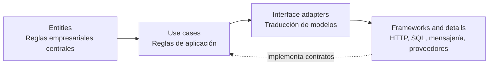
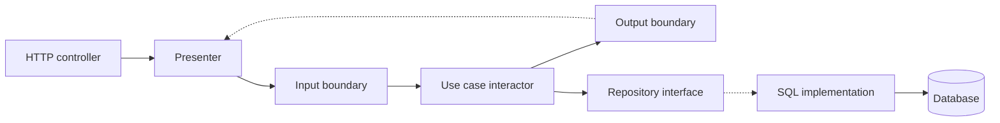
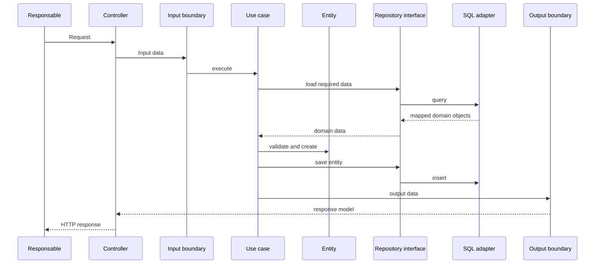
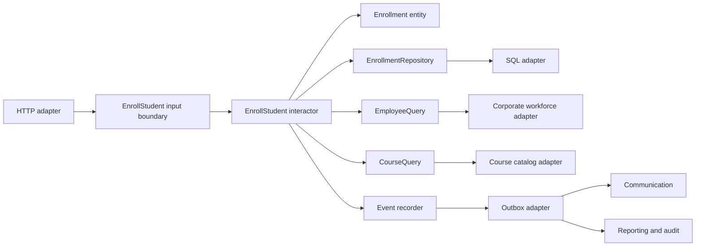

# Anexo de la Semana 3. Arquitectura limpia: políticas, casos de uso y detalles externos

## Propósito del anexo

La **clean architecture**, o arquitectura limpia, organiza un sistema en círculos de responsabilidad y estabilidad. Las reglas de negocio ocupan el centro; los casos de uso expresan las capacidades de la aplicación; los adaptadores traducen entre modelos y tecnologías; y los frameworks, bases de datos y proveedores externos quedan en el borde.

Este anexo desarrolla cómo se ve una arquitectura limpia dentro de un proyecto. Explica qué representa cada círculo, cómo se aplica la regla de dependencia, dónde se ubican las interfaces, cómo se conectan los detalles externos y cómo se prueba una operación completa.

El ejemplo utiliza Java como lenguaje ilustrativo. El código es seudocódigo cercano a Java: sirve para hacer visibles las responsabilidades y los contratos, no para definir una implementación completa ni elegir un framework.

## 1. Qué es la arquitectura limpia

La arquitectura limpia es un enfoque para organizar el código de modo que las políticas importantes sean independientes de los detalles externos. Su idea central es que las dependencias del código deben apuntar hacia dentro, hacia reglas más estables y significativas.

Una vista simplificada contiene cuatro círculos:



La flecha conceptual apunta hacia el centro, aunque el flujo de control de una operación pueda recorrer el sistema en sentido contrario. Por ejemplo, una solicitud HTTP entra desde el borde, atraviesa un adaptador y activa un caso de uso. El caso de uso puede invocar una interfaz que un detalle externo implementa.

La arquitectura limpia no exige que todo proyecto tenga exactamente cuatro paquetes ni que cada círculo sea un proceso diferente. Los círculos representan estabilidad y responsabilidad:

- **Entities:** reglas empresariales generales y conceptos centrales.
- **Use cases:** reglas específicas de la aplicación y coordinación de una capacidad.
- **Interface adapters:** traducción entre formatos externos y modelos internos.
- **Frameworks and details:** mecanismos concretos de entrega, persistencia e integración.

La idea decisiva es la **Dependency Rule**, o regla de dependencia: ningún código de un círculo interior debe conocer el nombre, tipo o detalle de un círculo exterior.

## 2. Políticas y detalles

Una **policy**, o política, es una decisión que expresa qué debe ocurrir en el dominio o en la aplicación. Un **detail**, o detalle, es un mecanismo concreto utilizado para ejecutar esa decisión.

En SkillHub:

- “Un empleado inactivo no puede recibir una asignación” es una política.
- “El estado del empleado se consulta mediante REST” es un detalle.
- “Una evaluación se aprueba con una calificación mínima” es una política.
- “Las respuestas se almacenan en PostgreSQL” es un detalle.
- “Una finalización elegible produce evidencia” es una política.
- “El certificado se guarda como PDF en un sistema de archivos” es un detalle.

La arquitectura limpia protege las políticas de los cambios en los detalles. No intenta eliminar los detalles: los coloca en una posición donde puedan sustituirse sin cambiar el centro.

Esta distinción evita que decisiones accidentales se vuelvan decisiones de producto. Si una clase de dominio depende de una anotación ORM, la tecnología empieza a definir la forma de la política. Si un controlador decide cuándo una evaluación está aprobada, el protocolo HTTP empieza a poseer una regla que debería sobrevivir aunque la entrada llegue por mensajería.

## 3. Entidades: el círculo más estable

Una **entity**, o entidad, encapsula reglas que son importantes para el negocio incluso si cambia la aplicación que las utiliza. Tiene identidad y puede mantener su estado a través del tiempo.

Una entidad puede contener:

- identidad propia;
- estado válido;
- transiciones permitidas;
- invariantes;
- comportamiento relacionado con su responsabilidad;
- objetos de valor que expresan conceptos del dominio.

Ejemplo:

```java
public final class Enrollment {
    private final EnrollmentId id;
    private final EmployeeId employeeId;
    private final CourseId courseId;
    private final Deadline deadline;
    private EnrollmentStatus status;

    private Enrollment(EnrollmentId id,
                       EmployeeId employeeId,
                       CourseId courseId,
                       Deadline deadline) {
        this.id = id;
        this.employeeId = employeeId;
        this.courseId = courseId;
        this.deadline = deadline;
        this.status = EnrollmentStatus.ACTIVE;
    }

    public static Enrollment create(EnrollmentId id,
                                    EmployeeId employeeId,
                                    CourseId courseId,
                                    Deadline deadline) {
        return new Enrollment(id, employeeId, courseId, deadline);
    }

    public void validateEligibility(Employee employee, Course course) {
        if (!employee.isActive()) {
            throw new BusinessRuleViolation(
                    "Inactive employees cannot enroll");
        }
        if (!course.isPublished()) {
            throw new BusinessRuleViolation(
                    "Only published courses can be assigned");
        }
        if (!course.accepts(employee)) {
            throw new BusinessRuleViolation(
                    "Employee is not eligible for course");
        }
    }

    public void cancel(CancellationReason reason) {
        if (status != EnrollmentStatus.ACTIVE) {
            throw new BusinessRuleViolation(
                    "Only active enrollments can be cancelled");
        }
        status = EnrollmentStatus.CANCELLED;
    }
}
```

La entidad no conoce cómo fue cargada, cómo se serializa ni dónde se guarda. La regla `validateEligibility` puede ejecutarse en una prueba sin crear un servidor web o una conexión de base de datos.

### Objetos de valor

Un **value object**, u objeto de valor, representa un concepto por sus atributos y no por una identidad independiente. Suele ser inmutable y valida sus propias condiciones básicas.

```java
public record Deadline(LocalDate value) {
    public Deadline {
        if (value == null) {
            throw new IllegalArgumentException("Deadline is required");
        }
    }

    public static Deadline from(LocalDate value) {
        return new Deadline(value);
    }

    public boolean hasPassedAt(LocalDate currentDate) {
        return value.isBefore(currentDate);
    }
}
```

`Deadline` expresa un concepto del dominio mejor que un `LocalDate` disperso por toda la aplicación. Aun así, no debe convertirse en una abstracción artificial: debe aportar significado o proteger una condición relevante.

### Entidades y modelos persistentes

Una entidad de dominio no es necesariamente una entidad ORM ni una fila de base de datos. Puede coincidir con ellas en un diseño simple, pero son modelos con responsabilidades distintas:

- la entidad de dominio protege comportamiento y reglas;
- el modelo persistente representa la forma eficiente de guardar y recuperar información;
- el DTO representa la forma adecuada para una frontera externa.

Separarlos evita que una columna técnica o una restricción del ORM termine definiendo el modelo del negocio.

## 4. Casos de uso: reglas específicas de la aplicación

Un **use case**, o caso de uso, describe una capacidad que la aplicación ofrece a un actor o proceso. Coordina entidades, aplica reglas propias del flujo y define el resultado observable.

Los casos de uso suelen responder a estas preguntas:

- ¿Qué intención se está ejecutando?
- ¿Qué actor o proceso puede iniciarla?
- ¿Qué precondiciones se deben cumplir?
- ¿Qué entidades o políticas colaboran?
- ¿Qué cambios se confirman juntos?
- ¿Qué resultado o hecho se produce?

En una arquitectura limpia, los casos de uso son más específicos que las entidades. Una entidad puede saber qué significa que una inscripción sea válida; el caso de uso sabe qué pasos debe coordinar para crearla, persistirla y producir el resultado.

```java
public interface EnrollStudentInput {
    void execute(EnrollStudentRequest request,
                 EnrollStudentOutput output);
}
```

En este ejemplo, el caso de uso recibe un modelo de entrada y comunica el resultado a un puerto de salida. Es una forma frecuente, aunque no obligatoria, de separar el flujo de aplicación de los adaptadores.

Una variante devuelve directamente un resultado:

```java
public interface EnrollStudentUseCase {
    EnrollmentResult execute(EnrollStudentCommand command);
}
```

Lo importante no es elegir una firma universal. Lo importante es que el caso de uso exprese una operación de negocio y no dependa del protocolo que la inicia.

### Interactor o application service

Un **interactor** es la implementación de un caso de uso. También puede llamarse servicio de aplicación o handler de aplicación.

```java
public final class EnrollStudentInteractor
        implements EnrollStudentUseCase {
    private final EnrollmentRepository enrollments;
    private final EmployeeQuery employees;
    private final CourseQuery courses;
    private final EnrollmentIdGenerator ids;
    private final Transaction transaction;

    @Override
    public EnrollmentResult execute(EnrollStudentCommand command) {
        return transaction.run(() -> {
            Employee employee = employees.requireActive(
                    command.employeeId());
            Course course = courses.requirePublished(
                    command.courseId());

            if (enrollments.existsActive(employee.id(), course.id())) {
                throw new BusinessRuleViolation(
                        "Active enrollment already exists");
            }

            Enrollment enrollment = Enrollment.create(
                    ids.next(),
                    employee.id(),
                    course.id(),
                    command.deadline());
            enrollment.validateEligibility(employee, course);
            enrollments.save(enrollment);

            return EnrollmentResult.from(enrollment);
        });
    }
}
```

El interactor coordina, pero no necesita conocer JDBC, HTTP, JSON o una anotación de framework. Depende de abstracciones que representan información y acciones necesarias para completar el caso de uso.

### Boundary de entrada y salida

En la terminología de arquitectura limpia, un **boundary** es un límite entre un círculo y otro. Puede expresarse con una interfaz:

- el **input boundary** ofrece el caso de uso al exterior;
- el **input data** transporta los datos necesarios para entrar;
- el **output boundary** comunica el resultado hacia el adaptador;
- el **output data** representa el resultado sin adoptar el formato de HTTP o SQL.

```java
public interface EnrollStudentOutput {
    void present(EnrollmentViewModel viewModel);
}

public record EnrollmentViewModel(
        String enrollmentId,
        String courseId,
        String status) {}
```

El caso de uso puede construir `EnrollmentViewModel` y entregarlo al puerto de salida. Un presentador transforma ese modelo en JSON, una vista HTML o un mensaje. Así, el interactor no conoce el formato final.

## 5. Regla de dependencia

La **Dependency Rule** establece que el código solo puede mencionar elementos del mismo círculo o de círculos más internos. Los círculos internos no pueden conocer los externos.

Una dependencia prohibida sería:

```java
public final class Enrollment {
    private final JdbcTemplate jdbc;

    public void save() {
        jdbc.update("INSERT INTO enrollment ...");
    }
}
```

La entidad ahora conoce persistencia, SQL y una biblioteca concreta. Un cambio de almacenamiento obliga a modificar una política del dominio.

La forma protegida separa el contrato de la implementación:

```java
public interface EnrollmentRepository {
    boolean existsActive(EmployeeId employeeId, CourseId courseId);
    void save(Enrollment enrollment);
}
```

```java
public final class SqlEnrollmentRepository
        implements EnrollmentRepository {
    private final JdbcTemplate jdbc;

    @Override
    public boolean existsActive(EmployeeId employeeId, CourseId courseId) {
        return jdbc.queryForObject(
                "SELECT EXISTS (...) WHERE employee_id = ? AND course_id = ?",
                Boolean.class,
                employeeId.value(),
                courseId.value());
    }

    @Override
    public void save(Enrollment enrollment) {
        jdbc.update(
                "INSERT INTO enrollment(employee_id, course_id, status) "
                        + "VALUES (?, ?, ?)",
                enrollment.employeeId().value(),
                enrollment.courseId().value(),
                enrollment.status().name());
    }
}
```

El contrato pertenece al lado que necesita la capacidad. La implementación pertenece al detalle externo. Esta es una aplicación de la inversión de dependencias: los detalles dependen de políticas, no al revés.

### Flujo de control y dirección de dependencias

Una operación puede recorrer el sistema así:



El controlador inicia el flujo hacia el caso de uso, pero la interfaz de repositorio puede estar definida cerca del caso de uso y ser implementada por SQL. La dirección del control y la dirección de la dependencia no son la misma cosa.

## 6. Los círculos de la arquitectura

### 6.1. Entities

El círculo de entidades contiene reglas empresariales centrales. Estas reglas serían relevantes incluso si el sistema tuviera otra interfaz, otro flujo de aplicación o ningún software temporalmente.

Ejemplos en SkillHub:

- una inscripción puede estar activa, completada o cancelada;
- una calificación debe pertenecer a un rango válido;
- una certificación puede estar vigente o revocada;
- una fecha límite no puede interpretarse como una fecha nula.

Las entidades no deberían depender de casos de uso concretos. Una inscripción puede ser creada por una asignación obligatoria o por una inscripción voluntaria; sus invariantes básicas siguen siendo las mismas.

### 6.2. Use cases

El círculo de casos de uso contiene las reglas de aplicación. Define cómo se combinan entidades y servicios para cumplir una capacidad concreta.

Ejemplos:

- asignar un curso a un empleado;
- registrar un intento de evaluación;
- emitir un certificado tras una finalización elegible;
- generar una vista autorizada del plan de aprendizaje.

Este círculo puede conocer puertos de repositorio, consultas, transacciones, relojes o publicación de hechos. No debe conocer las implementaciones concretas de esas capacidades.

### 6.3. Interface adapters

Los **interface adapters**, o adaptadores de interfaz, convierten datos entre el formato exterior y el formato que necesitan entidades y casos de uso.

Pueden incluir:

- controladores y handlers;
- presentadores;
- mapeadores de DTO;
- repositorios concretos;
- clientes que traducen APIs externas;
- conversores de mensajes;
- gateways de autenticación.

Un adaptador no es solo una clase que “conecta”. Es el lugar donde se conserva la diferencia entre modelos. Un JSON puede utilizar `course_id`, un caso de uso `CourseId` y una tabla `course_id`; el adaptador evita que una representación externa se propague sin control.

### 6.4. Frameworks y detalles

El círculo exterior contiene tecnologías reemplazables o configurables:

- framework web;
- ORM o driver de base de datos;
- sistema de mensajería;
- proveedor de identidad;
- cliente HTTP;
- almacenamiento de archivos;
- proveedor de correo;
- configuración y arranque.

Los frameworks deben ser herramientas al servicio de los casos de uso. Una práctica útil es mantener las clases del framework en el borde y reducir las anotaciones o tipos técnicos que cruzan hacia dentro.

## 7. Puertos de entrada y salida

Aunque la arquitectura limpia utiliza el vocabulario de círculos y boundaries, en la implementación aparecen contratos equivalentes a puertos de entrada y salida.

### Entrada al caso de uso

```java
public interface AssignCourseInputBoundary {
    void execute(AssignCourseInputData input,
                 AssignCourseOutputBoundary output);
}
```

El controlador depende del `InputBoundary`, no de una clase concreta:

```java
public final class AssignCourseController {
    private final AssignCourseInputBoundary input;

    public void handle(AssignCourseRequest request,
                       AuthenticatedUser user) {
        AssignCourseInputData data = new AssignCourseInputData(
                user.employeeId(),
                request.courseId(),
                request.deadline());
        input.execute(data, new AssignCoursePresenter());
    }
}
```

### Salida hacia una dependencia

Un caso de uso puede necesitar consultar un empleado:

```java
public interface EmployeeQuery {
    Employee requireActive(EmployeeId employeeId);
}
```

O guardar un agregado:

```java
public interface EnrollmentRepository {
    boolean existsActive(EmployeeId employeeId, CourseId courseId);
    void save(Enrollment enrollment);
}
```

El contrato no debe reproducir la API de la base de datos. Debe expresar qué necesita la política de aplicación.

### Puerto de salida de presentación

Una arquitectura limpia puede evitar devolver directamente la entidad del dominio al controlador:

```java
public final class AssignCoursePresenter
        implements AssignCourseOutputBoundary {
    private AssignCourseViewModel model;

    @Override
    public void present(AssignCourseViewModel model) {
        this.model = model;
    }

    public HttpResponse response() {
        return HttpResponse.created(model);
    }
}
```

El presentador transforma el resultado. Esto es especialmente útil cuando una misma operación se muestra como JSON, HTML, mensaje o respuesta de una tarea interna.

No siempre hace falta una interfaz de salida separada. En un caso sencillo, un resultado inmutable puede ser suficiente. La estructura debe justificarse por la necesidad de proteger el modelo y controlar la dirección de las dependencias.

## 8. Modelos de datos por frontera

Una arquitectura limpia suele distinguir varios modelos porque cada círculo tiene motivos de cambio diferentes.

### Request model

Representa la entrada externa. Puede contener strings, fechas serializadas y nombres definidos por la API.

```java
public record EnrollmentHttpRequest(
        String courseId,
        String deadline) {}
```

### Input data

Representa los datos que necesita el caso de uso. Ya no depende del formato HTTP:

```java
public record EnrollStudentCommand(
        EmployeeId employeeId,
        CourseId courseId,
        Deadline deadline) {}
```

### Entity y domain objects

Representan conceptos con identidad, invariantes y comportamiento. No deben incorporar el modelo de la API o de la tabla.

### Output data o view model

Representa la información que el presentador necesita para construir una salida:

```java
public record EnrollmentViewModel(
        String enrollmentId,
        String courseTitle,
        String status,
        String deadline) {}
```

### Persistence model

Representa una fila, documento o estructura optimizada para almacenar y consultar:

```java
public record EnrollmentRow(
        String id,
        String employeeId,
        String courseId,
        String status,
        LocalDate deadline) {}
```

El mapeador traduce entre `EnrollmentRow` y `Enrollment`. El núcleo no debe recibir una fila SQL esperando que conozca sus columnas.

Separar modelos no significa duplicar cada campo sin razón. Significa evitar que una frontera se convierta en propietaria accidental de las decisiones de otra.

## 9. Recorrido completo: asignar un curso

Consideremos el caso de uso: un responsable asigna un curso publicado a un empleado activo.

### Paso 1. El controlador recibe una petición

El controlador valida la forma de la entrada, obtiene la identidad y crea un `EnrollStudentCommand`. No decide si el curso puede asignarse.

### Paso 2. El input boundary invoca el caso de uso

El controlador conoce el contrato del caso de uso. La clase concreta del interactor se conecta durante la composición.

### Paso 3. El interactor carga información

El caso de uso utiliza `EmployeeQuery`, `CourseQuery` y `EnrollmentRepository`. Estos contratos pueden tener adaptadores SQL, HTTP, memoria o una combinación de mecanismos.

### Paso 4. Las entidades aplican reglas

`Enrollment` comprueba sus invariantes. Otras políticas pueden verificar elegibilidad, autorización o límites de asignación. Los detalles técnicos no participan en estas decisiones.

### Paso 5. El interactor persiste y construye la salida

El caso de uso guarda la inscripción y produce un modelo de salida. El presentador lo transforma en una respuesta HTTP. Un adaptador de mensajería podría traducirlo a otro formato sin cambiar el interactor.



En un monolito, el diagrama representa llamadas en memoria salvo la persistencia o integraciones. En una solución distribuida, algunos límites pueden convertirse en contratos de red, pero la regla de dependencia del núcleo sigue siendo una preocupación del código.

## 10. Estructura de carpetas

Una estructura por círculos puede verse así:

```text
src/main/java/com/example/skillhub/
├── entities/
│   ├── enrollment/
│   │   ├── Enrollment.java
│   │   ├── EnrollmentId.java
│   │   └── EnrollmentStatus.java
│   ├── course/
│   │   ├── Course.java
│   │   └── CourseId.java
│   └── employee/
│       ├── Employee.java
│       └── EmployeeId.java
├── usecases/
│   ├── enrollment/
│   │   ├── EnrollStudentInputBoundary.java
│   │   ├── EnrollStudentInteractor.java
│   │   ├── EnrollStudentInputData.java
│   │   └── EnrollStudentOutputData.java
│   └── ports/
│       ├── EnrollmentRepository.java
│       ├── EmployeeQuery.java
│       └── CourseQuery.java
├── adapters/
│   ├── controllers/
│   │   └── EnrollmentController.java
│   ├── presenters/
│   │   └── EnrollmentPresenter.java
│   ├── persistence/
│   │   ├── SqlEnrollmentRepository.java
│   │   └── EnrollmentRowMapper.java
│   └── external/
│       └── CorporateWorkforceAdapter.java
└── frameworks/
    ├── web/
    ├── database/
    ├── messaging/
    └── configuration/
```

La carpeta `frameworks` no tiene que contener todo el código externo en sentido literal. En muchos proyectos, los adaptadores y la configuración se distribuyen según su tecnología. Lo importante es que las dependencias de compilación sigan apuntando hacia el centro.

### Estructura por módulo de negocio

Para SkillHub, puede ser más útil aplicar los círculos dentro de cada módulo:

```text
skillhub/
├── enrollment/
│   ├── entities/
│   ├── usecases/
│   ├── adapters/
│   └── frameworks/
├── course_catalog/
│   ├── entities/
│   ├── usecases/
│   ├── adapters/
│   └── frameworks/
├── learning/
├── certification/
├── workforce/
├── communication/
└── reporting/
```

Esta forma evita crear un único paquete global de entidades donde se mezclen curso, asignación, evaluación y certificado. También facilita que cada módulo defina sus propios límites, casos de uso y adaptadores.

## 11. Composición y frameworks

El círculo exterior debe construir y conectar las implementaciones concretas. Esta zona se denomina **composition root**, o raíz de composición.

```java
public final class SkillHubConfiguration {
    public EnrollStudentInputBoundary enrollStudent() {
        EnrollmentRepository repository =
                new SqlEnrollmentRepository(jdbcTemplate());
        EmployeeQuery employees =
                new CorporateEmployeeQuery(httpClient());
        CourseQuery courses =
                new SqlCourseQuery(jdbcTemplate());
        Transaction transaction =
                new SqlTransaction(jdbcTemplate());

        return new EnrollStudentInteractor(
                repository,
                employees,
                courses,
                transaction);
    }
}
```

El framework de inyección de dependencias puede generar esta composición, pero la estructura conceptual permanece: el exterior elige implementaciones y las entrega al núcleo.

El núcleo no debería buscar dependencias en un contenedor global:

```java
public final class EnrollStudentInteractor {
    public EnrollmentResult execute(EnrollStudentCommand command) {
        EnrollmentRepository repository = ServiceLocator
                .get(EnrollmentRepository.class);
        return repository.findAndCreate(command);
    }
}
```

Ese patrón oculta dependencias, dificulta las pruebas y hace que el centro conozca un mecanismo exterior. La inyección explícita en el constructor muestra qué necesita cada caso de uso.

### Framework como detalle

El framework puede ser importante para operar el sistema, pero no debería decidir la estructura de las políticas. Un controlador anotado puede ser un adaptador legítimo; una entidad de dominio que hereda de una clase del framework queda más atada a ese detalle.

No siempre es posible eliminar por completo un framework de una entidad o de un modelo. La pregunta práctica es qué costo introduce y si la dependencia limita cambios relevantes. La arquitectura limpia busca controlar ese acoplamiento, no cumplir una purificación formal a cualquier precio.

## 12. Transacciones y consistencia

El caso de uso suele conocer la unidad de trabajo porque coordina varios cambios. Por eso la frontera transaccional suele ubicarse alrededor del interactor o en un puerto de aplicación.

```java
public EnrollmentResult execute(EnrollStudentCommand command) {
    return transaction.run(() -> {
        Enrollment enrollment = buildValidEnrollment(command);
        enrollments.save(enrollment);
        events.record(new EnrollmentCreated(enrollment));
        return EnrollmentResult.from(enrollment);
    });
}
```

`Transaction` es un contrato del núcleo o de la aplicación. Su implementación puede utilizar una transacción de base de datos, una unidad de trabajo o una estrategia de prueba.

Los efectos externos requieren decisiones adicionales:

- guardar un certificado y enviar su correo pueden ser operaciones separadas;
- publicar un evento puede requerir una outbox;
- un sistema externo puede responder tarde o no responder;
- un mensaje duplicado debe ser idempotente;
- un reporte puede aceptar consistencia eventual.

La arquitectura limpia ayuda a ubicar estas decisiones, pero no las resuelve automáticamente. La política de consistencia debe quedar expresada en el caso de uso, los contratos y los adaptadores responsables.

## 13. Errores y traducción de modelos

Cada círculo debe manejar el tipo de error que le corresponde.

| Situación | Círculo que la interpreta | Salida posible |
|---|---|---|
| JSON inválido | Adaptador de interfaz | Error de entrada HTTP |
| Falta un permiso | Caso de uso o autorización | Operación no autorizada |
| Curso no publicado | Entidad o política de aplicación | Regla de negocio incumplida |
| Empleado inexistente | Adaptador traducido al modelo | Empleado no disponible |
| SQL no disponible | Detalle externo | Error técnico o reintento |
| Timeout del sistema corporativo | Adaptador y caso de uso | Dependencia temporalmente no disponible |
| Fallo del presentador | Adaptador de salida | Error del canal de entrega |

El núcleo no debe lanzar una excepción de ORM para expresar que una inscripción ya existe. Puede recibir un error técnico del repositorio, pero el adaptador debe traducirlo si corresponde a una condición de negocio.

```java
public final class CorporateEmployeeQuery implements EmployeeQuery {
    private final CorporateDirectoryClient client;

    @Override
    public Employee requireActive(EmployeeId employeeId) {
        try {
            CorporateEmployee external = client.find(employeeId.value());
            if (!external.enabled()) {
                throw new EmployeeUnavailable(employeeId);
            }
            return Employee.fromExternalData(
                    employeeId, external.displayName());
        } catch (CorporateNotFound error) {
            throw new EmployeeUnavailable(employeeId);
        } catch (CorporateTimeout error) {
            throw new WorkforceTemporarilyUnavailable(error);
        }
    }
}
```

El adaptador traduce el modelo externo; la entidad y el caso de uso trabajan con conceptos propios de SkillHub.

## 14. Pruebas por círculo

La separación por círculos permite elegir el nivel de aislamiento que necesita cada comportamiento.

### Pruebas de entidades

Verifican reglas centrales sin dependencias externas:

```java
@Test
void cancelledEnrollmentCannotBeCancelledAgain() {
    Enrollment enrollment = activeEnrollment();
    enrollment.cancel(CancellationReason.ADMINISTRATIVE);

    assertThrows(BusinessRuleViolation.class,
            () -> enrollment.cancel(CancellationReason.ADMINISTRATIVE));
}
```

### Pruebas de casos de uso

Usan dobles de los puertos de salida y verifican la capacidad completa. No necesitan HTTP, SQL ni un proveedor corporativo real.

```java
@Test
void useCasePersistsValidEnrollment() {
    InMemoryEnrollmentRepository repository =
            new InMemoryEnrollmentRepository();
    StubEmployeeQuery employees = StubEmployeeQuery.active("E-10");
    StubCourseQuery courses = StubCourseQuery.published("C-20");

    EnrollStudentUseCase useCase = new EnrollStudentInteractor(
            repository, employees, courses, new NoopTransaction());

    useCase.execute(commandFor("E-10", "C-20"));

    assertTrue(repository.existsActive(
            new EmployeeId("E-10"), new CourseId("C-20")));
}
```

### Pruebas de adaptadores

Comprueban la traducción entre un puerto y una tecnología:

- persistencia: entidad ↔ fila o documento;
- HTTP: request/response ↔ input/output data;
- workforce: respuesta corporativa ↔ empleado interno;
- mensajería: evento ↔ mensaje y confirmación;
- presentador: output data ↔ JSON, HTML o archivo.

### Pruebas de composición

Verifican que las clases concretas se conectan correctamente y que la configuración puede iniciar la aplicación. Son útiles para detectar una implementación incorrecta de un puerto o una dependencia omitida.

### Pruebas de extremo a extremo

Confirman el recorrido completo con framework, base de datos y servicios integrados. Deben complementar, no sustituir, las pruebas de entidades y casos de uso. Cuando falla una prueba de extremo a extremo, el aislamiento por círculos ayuda a localizar si el problema está en la política, el adaptador o la composición.

## 15. Aplicación a SkillHub

Los módulos definidos en la semana 3 pueden estructurarse con círculos propios. La arquitectura limpia no cambia la responsabilidad de cada módulo; define cómo protegerla de los detalles.

- **Gobierno de cursos y catálogo:** entidades de curso y publicación; casos de uso de creación, revisión y publicación; adaptadores para edición, persistencia y consulta.
- **Asignaciones e inscripciones:** entidades de asignación e inscripción; casos de uso para asignar, cancelar y consultar; puertos hacia catálogo, workforce, persistencia y eventos.
- **Aprendizaje y evaluación:** entidades de intento, progreso y resultado; casos de uso para registrar actividad y evaluar; adaptadores para almacenamiento y entrega de contenido.
- **Certificación y evidencia:** entidad de certificado y reglas de vigencia; caso de uso de emisión; adaptadores para documentos, consulta y notificaciones.
- **Workforce y autorización:** modelo interno de empleado y contexto autorizado; casos de uso de sincronización y autorización; adaptador del sistema corporativo.
- **Comunicación y bandeja:** entidades de notificación y entrega; casos de uso de creación y consulta; adaptadores de correo y bandeja.
- **Reportes y auditoría:** modelos de hechos y vistas; casos de uso de consulta; adaptadores de proyección, exportación y almacenamiento histórico.

Para la inscripción de un empleado, el límite puede verse así:



El controlador conoce el límite de entrada. El interactor coordina. Las entidades protegen las reglas. Los contratos expresan necesidades. Los adaptadores traducen bases de datos, sistema corporativo y eventos.

Una estructura de carpetas por módulo podría ser:

```text
skillhub/
├── enrollment/
│   ├── entities/
│   ├── usecases/
│   │   ├── input/
│   │   ├── output/
│   │   └── interactors/
│   ├── adapters/
│   │   ├── controllers/
│   │   ├── presenters/
│   │   ├── persistence/
│   │   └── external/
│   └── frameworks/
├── course_catalog/
│   ├── entities/
│   ├── usecases/
│   ├── adapters/
│   └── frameworks/
├── learning/
├── certification/
├── workforce/
├── communication/
└── reporting/
```

El módulo de asignaciones puede consumir un contrato de curso publicado sin importar las entidades internas del catálogo. Si ambos módulos comparten proceso, la frontera puede ser una interfaz interna; si se separan más adelante, el adaptador puede traducir una API o un evento. El núcleo no debe cambiar de significado por ese movimiento.

## 16. Errores frecuentes

### Poner todas las reglas en entidades gigantes

La entidad termina con responsabilidades de asignación, correo, persistencia y autorización. Una entidad debe proteger su propia coherencia; el caso de uso coordina el flujo y otros servicios expresan políticas que no pertenecen a una sola entidad.

### Tratar los casos de uso como controladores con otro nombre

Si el interactor recibe `HttpServletRequest`, construye `ResponseEntity` o interpreta códigos HTTP, el borde se filtró hacia dentro. El caso de uso debe trabajar con datos y contratos de aplicación.

### Colocar interfaces en el círculo exterior

Una interfaz de repositorio definida junto al adaptador SQL suele ser una abstracción propiedad de la tecnología. El contrato debe estar cerca de la política que necesita la capacidad, para que el centro controle el lenguaje y el alcance.

### Convertir cada clase en un boundary

Crear un input boundary, output boundary, gateway y mapper para cada operación puede generar demasiada ceremonia. Los límites deben proteger cambios reales, no satisfacer una lista de nombres.

### Depender del framework desde el dominio

Anotaciones ORM, clases de configuración y tipos HTTP dentro de las entidades hacen que el detalle externo se vuelva parte de la política. La integración puede ser pragmática, pero debe reconocerse y evaluarse como acoplamiento.

### Confundir círculo con capa de despliegue

Entities y use cases no tienen que ejecutarse en procesos separados. La arquitectura limpia organiza dependencias de código. Separar procesos añade latencia, fallos parciales, observabilidad distribuida y coordinación operativa.

### Compartir entidades con la API y la base de datos

Una misma clase para dominio, JSON y persistencia parece eficiente, pero permite que cambios externos alteren reglas internas. Los mapeadores existen para conservar la propiedad de cada modelo.

### Ocultar dependencias con localizadores globales

Un contenedor global puede hacer que una clase parezca fácil de construir, pero sus dependencias quedan invisibles y sus pruebas pierden control. La inyección explícita hace observable el contrato.

### Hacer que el centro conozca el proveedor

Un `CorporateEmployeeResponse` o un `PostgresEnrollment` dentro de un caso de uso introduce vocabulario externo en una política. El adaptador debe traducir antes de entregar los datos al núcleo.

## 17. Cuándo resulta útil

La arquitectura limpia suele ser apropiada cuando:

- el dominio contiene reglas que deben mantenerse independientes de la tecnología;
- los casos de uso son una unidad importante de comprensión y prueba;
- existen varios canales de entrada o salida;
- hay integraciones externas que pueden cambiar;
- se desea prolongar la vida útil de las políticas frente a frameworks y proveedores;
- la aplicación necesita un monolito modular con dependencias internas claras;
- los requisitos de calidad justifican el costo de separar modelos y contratos.

Puede requerir adaptación cuando:

- el sistema es pequeño y sus reglas no tienen una vida independiente de la infraestructura;
- la separación de círculos crea más indirección que comprensión;
- no existe una frontera real que justifique varios modelos;
- el equipo añade interfaces y mapeadores sin un cambio o riesgo concreto que proteger;
- se interpreta la regla de dependencia de manera tan rígida que se vuelve imposible trabajar con herramientas prácticas.

La arquitectura limpia no exige que todo núcleo sea abstracto ni que toda dependencia externa sea eliminada. Exige que las decisiones relevantes tengan una dirección de dependencia que las proteja.

## 18. Lista de revisión

Antes de considerar implementada una arquitectura limpia, revisar:

1. ¿Las entidades contienen reglas centrales y no detalles de HTTP, SQL o frameworks?
2. ¿Cada caso de uso expresa una capacidad concreta de la aplicación?
3. ¿Las dependencias del código apuntan hacia círculos más estables?
4. ¿Los contratos están definidos cerca de la política que necesita la capacidad?
5. ¿Los adaptadores traducen modelos externos antes de que entren al núcleo?
6. ¿Los detalles externos implementan contratos sin definir el vocabulario del negocio?
7. ¿La composición conecta dependencias de forma explícita?
8. ¿Los modelos de entrada, salida, dominio y persistencia se separan cuando cambian por motivos distintos?
9. ¿Las transacciones, eventos e idempotencia tienen decisiones observables?
10. ¿Las pruebas de entidades y casos de uso pueden ejecutarse sin infraestructura completa?
11. ¿Las fronteras entre módulos reflejan capacidades y no solo categorías técnicas?
12. ¿Cada abstracción protege una política, una variabilidad o una necesidad de prueba real?

## Cierre

La arquitectura limpia busca que el núcleo del sistema sea más estable que sus mecanismos externos. Las entidades conservan reglas empresariales centrales; los casos de uso coordinan capacidades concretas; los adaptadores traducen modelos; y los frameworks, bases de datos y proveedores permanecen en el borde.

La regla de dependencia es el criterio que mantiene unida la propuesta: el centro no debe conocer los detalles que pueden cambiar. En SkillHub, esto permite que las reglas de inscripción, evaluación y certificación se prueben y evolucionen sin quedar definidas por HTTP, SQL o el sistema corporativo de empleados.

La arquitectura puede desplegarse como un monolito modular y convivir con puertos, adaptadores y contextos delimitados. Lo esencial es que cada círculo tenga un motivo claro para existir y que el costo de separar modelos y contratos corresponda a un riesgo real.

La pregunta práctica es: **¿qué política debe permanecer estable aunque cambiemos el framework, el almacenamiento, el canal de entrada o el proveedor externo?**
