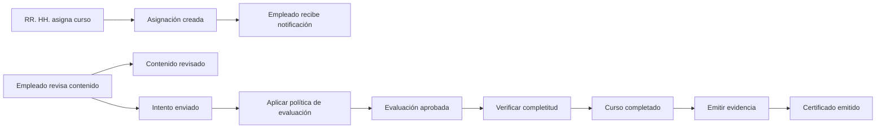
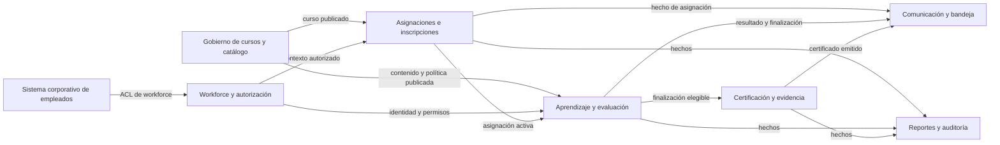
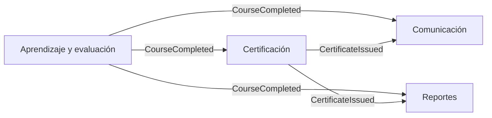
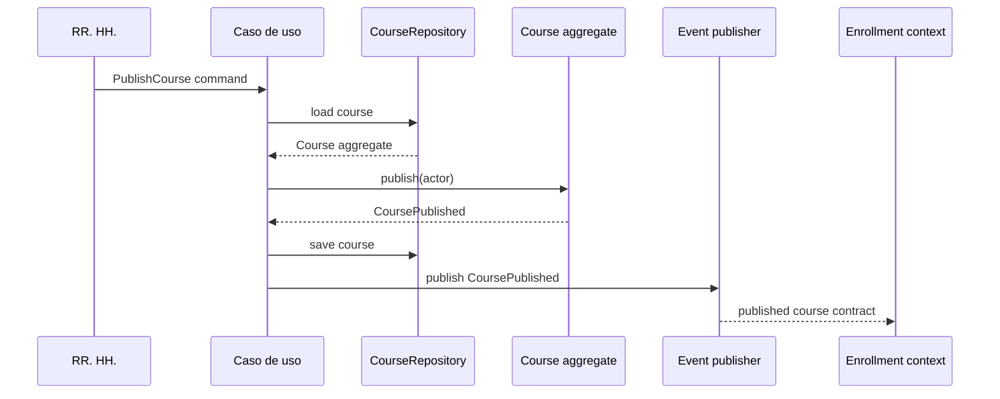

# Anexo de la Semana 3. Domain-Driven Design: modelar el negocio y proteger sus límites

## Propósito del anexo

**Domain-Driven Design**, o **DDD**, es un enfoque para diseñar software alrededor del conocimiento del dominio. Su punto de partida no es una tecnología ni una estructura de carpetas, sino la comprensión compartida de los conceptos, reglas, procesos y límites que hacen significativo al problema.

DDD combina dos áreas relacionadas:

- **Strategic design:** decide cómo dividir el dominio en subdominios, contextos delimitados y relaciones entre modelos.
- **Tactical design:** expresa esos modelos mediante entidades, objetos de valor, agregados, servicios, repositorios, fábricas y eventos de dominio.

Este anexo desarrolla cómo se ve DDD dentro de un proyecto. Utiliza SkillHub para mostrar cómo un mismo término puede adquirir significados diferentes, cómo se protege la consistencia de un agregado y cómo una decisión del negocio se convierte en código Java.

El código es seudocódigo cercano a Java. Su propósito es hacer visibles los conceptos y las responsabilidades, no definir una implementación completa ni elegir un framework.

## 1. El dominio como centro del diseño

Un **domain**, o dominio, es el área de conocimiento y actividad que el sistema intenta apoyar. Incluye vocabulario, actores, reglas, procesos, excepciones, datos y decisiones que las personas del negocio consideran importantes.

Para SkillHub, el dominio no es simplemente “una aplicación con cursos”. Incluye preguntas como:

- ¿Qué significa que un curso esté publicado?
- ¿Quién puede asignar un curso y a quién?
- ¿Cuál es la diferencia entre una asignación obligatoria y una inscripción voluntaria?
- ¿Cuándo está realmente completado un curso?
- ¿Qué condiciones permiten emitir un certificado?
- ¿Qué ocurre cuando el empleado agota sus intentos?
- ¿Qué puede consultar un administrador de Recursos Humanos?

DDD propone que estas preguntas se respondan colaborativamente entre personas del negocio y del equipo técnico. El modelo de software debe hacer explícitas las decisiones importantes en lugar de ocultarlas en controladores, tablas o nombres genéricos.

Una arquitectura puede tener buenas capas y aun así representar mal el dominio. También puede tener clases técnicamente bien separadas y mezclar significados que deberían permanecer separados. DDD aporta herramientas para decidir qué conceptos pertenecen juntos y qué límites necesitan su propio modelo.

## 2. Lenguaje ubicuo

El **ubiquitous language**, o **lenguaje ubicuo**, es el vocabulario compartido por las personas del dominio y el equipo que construye el sistema. Se utiliza en conversaciones, requisitos, pruebas, nombres de clases, eventos, documentación y decisiones arquitectónicas.

El lenguaje ubicuo no es una lista de traducciones técnicas. Debe reflejar significados que las personas del negocio puedan reconocer y corregir.

### Ejemplo inicial de vocabulario de SkillHub

| Término | Significado de trabajo |
|---|---|
| Curso | Oferta formativa que contiene contenidos, evaluación y política de publicación. |
| Curso publicado | Oferta aprobada y disponible para una población según su configuración. |
| Asignación | Relación obligatoria entre un empleado y un curso, normalmente con fecha límite. |
| Inscripción | Relación de participación de un empleado en un curso voluntario o asignado. |
| Progreso | Evidencia de revisión de contenidos o módulos requeridos. |
| Intento | Ejecución de una evaluación con respuestas, fecha, calificación y resultado. |
| Completado | Estado alcanzado cuando se cumplen contenido obligatorio y evaluación aprobada. |
| Certificado | Evidencia emitida a partir de una finalización elegible. |
| Desbloqueo | Autorización excepcional para permitir nuevos intentos de evaluación. |

Estas definiciones son hipótesis iniciales, no verdades permanentes. Durante el descubrimiento pueden cambiar. Lo importante es que el cambio se discuta y se refleje en el modelo, en lugar de dejar significados distintos bajo el mismo nombre.

### Palabras que necesitan precisión

“Curso” puede significar una oferta editorial en un contexto y el objeto de una relación empleado-curso en otro. “Completado” puede ser un resultado del aprendizaje, mientras que “certificado” es una evidencia posterior. Si el equipo usa estas palabras como sinónimos, el código probablemente mezclará responsabilidades.

Una regla útil es preguntar:

1. ¿Quién utiliza este término?
2. ¿Qué decisión permite tomar?
3. ¿Qué datos necesita para conservar su significado?
4. ¿Cambiaría su definición en otra parte del negocio?
5. ¿Qué ejemplo real confirmaría o refutaría esta definición?

## 3. Descubrimiento del dominio

Antes de diseñar clases, el equipo puede estudiar cómo funciona el negocio mediante entrevistas, ejemplos, escenarios y eventos relevantes. El objetivo es descubrir decisiones, no recopilar sustantivos para convertirlos automáticamente en entidades.

### Event storming

**Event storming** es una técnica colaborativa que parte de hechos que ya ocurrieron o que el negocio necesita observar:

- Curso publicado.
- Asignación creada.
- Inscripción activada.
- Contenido revisado.
- Intento enviado.
- Evaluación aprobada.
- Intentos agotados.
- Desbloqueo aprobado.
- Curso completado.
- Certificado emitido.
- Notificación entregada.

A partir de estos hechos se identifican comandos, actores, políticas, agregados y sistemas externos.



Los eventos ayudan a observar el flujo del dominio desde sus consecuencias. También revelan que una acción como “completar curso” puede involucrar varias decisiones y que emitir un certificado no es lo mismo que registrar una evaluación aprobada.

### Comandos y políticas

Un **command**, o comando, expresa una intención: `PublicarCurso`, `AsignarCurso`, `EnviarIntento`, `AprobarDesbloqueo`. Un comando puede ser rechazado si no cumple precondiciones.

Una **policy**, o política, reacciona a un hecho y decide una acción posterior. Por ejemplo, cuando ocurre `CursoCompletado`, una política puede solicitar la emisión de un certificado y una notificación.

```text
Comando: AprobarDesbloqueo
Actor: Administrador de Recursos Humanos
Regla: solo una solicitud pendiente puede aprobarse
Hecho: DesbloqueoAprobado
Consecuencia: se habilitan nuevos intentos
```

Esta forma de pensar evita diseñar primero una tabla y descubrir después que el proceso tiene estados, permisos y decisiones que la tabla no expresa.

## 4. Diseño estratégico: subdominios

Un **subdomain**, o subdominio, es una parte del dominio que representa un conjunto coherente de capacidades y conocimientos. No es simplemente una tabla, una pantalla o un paquete técnico.

DDD suele distinguir tres tipos:

### 4.1. Core domain

El **core domain**, o subdominio núcleo, contiene la capacidad que diferencia al producto o donde se concentra el conocimiento más importante para la organización.

En SkillHub, la política de capacitación, evaluación, completitud y evidencia puede ser parte del núcleo porque expresa cómo la empresa demuestra que sus empleados adquirieron capacidades técnicas.

### 4.2. Supporting subdomain

Un **supporting subdomain**, o subdominio de apoyo, es necesario para el producto, pero no constituye su principal diferenciador. La gestión editorial de cursos, la asignación de poblaciones y la comunicación interna pueden entrar en esta categoría según el alcance del negocio.

### 4.3. Generic subdomain

Un **generic subdomain**, o subdominio genérico, resuelve una capacidad común que puede adquirirse, reutilizarse o implementarse con una solución estándar. Autenticación, envío de correo, almacenamiento genérico o generación básica de documentos pueden ser ejemplos.

La clasificación no es una propiedad universal. Una capacidad puede ser genérica para una empresa y estratégica para otra. La pregunta es qué conocimiento diferencia al producto y qué parte conviene construir, comprar o mantener simple.

## 5. Bounded context

Un **bounded context**, o **contexto delimitado**, es un límite dentro del cual un modelo y su lenguaje tienen un significado consistente. El mismo término puede existir en varios contextos con definiciones distintas.

Un contexto delimitado puede coincidir con:

- un módulo de un monolito;
- un equipo;
- una base de datos;
- un servicio desplegable;
- una frontera de código;
- una combinación de estas cosas.

No es obligatorio que coincida con un microservicio. Su función principal es proteger el significado del modelo y hacer explícito quién es responsable de cada regla.

### “Curso” en dos contextos

En **Gobierno de cursos y catálogo**, un curso es una oferta editorial:

- tiene título, descripción y contenidos;
- pasa por borrador, revisión y publicación;
- tiene un instructor propietario;
- define disponibilidad y configuración de evaluación.

En **Asignaciones e inscripciones**, el curso es el objeto de una relación con un empleado:

- se asigna a una persona o población;
- tiene fecha de asignación y fecha límite;
- determina si la participación es obligatoria o voluntaria;
- tiene un estado de inscripción.

El contexto de asignaciones puede necesitar el identificador, la versión publicada y la elegibilidad, pero no debe modificar la estructura editorial del catálogo.

### “Completado” y “certificado”

En **Aprendizaje y evaluación**, completado significa que se revisó el contenido obligatorio y se aprobó la evaluación conforme a una política.

En **Certificación y evidencia**, el certificado es un documento o registro emitido a partir de una finalización elegible. Puede tener fecha de emisión, vigencia, revocación y formato de descarga.

Separar estos significados evita que el certificado vuelva a calcular la evaluación o que el módulo de aprendizaje tenga que conocer cómo se almacena un documento.

## 6. Mapa de contexto

Un **context map**, o mapa de contexto, muestra los contextos delimitados y las relaciones entre ellos. No es un diagrama de clases; describe quién provee información, quién la consume y qué traducción o contrato existe.



Las flechas no indican que todos los contextos deban compartir clases o tablas. Indican relaciones semánticas y contratos. Cada contexto debe traducir la información externa a su propio modelo cuando los significados no coinciden.

## 7. Relaciones entre contextos

DDD ofrece nombres para describir relaciones entre equipos o modelos. No son etiquetas decorativas: ayudan a reconocer quién controla el contrato y qué riesgo de acoplamiento existe.

### Upstream y downstream

Un contexto **upstream** provee información o decisiones a otro. El contexto **downstream** depende de esa relación. En SkillHub, el catálogo puede ser upstream de asignaciones cuando publica la oferta disponible.

### Published language

Un **published language**, o lenguaje publicado, es un contrato compartido para comunicarse con otros contextos. Puede ser un esquema de evento, una API o un modelo de consulta estable.

```text
CoursePublished {
    courseId
    publishedVersion
    requiredContentIds
    evaluationPolicy
    eligibility
}
```

El contrato debe contener lo necesario para el consumidor, no toda la estructura privada del contexto productor.

### Anti-corruption layer

Una **anti-corruption layer**, o capa anticorrupción, traduce el modelo externo para evitar que sus conceptos se propaguen al contexto consumidor.

```java
public final class CorporateWorkforceAdapter {
    private final CorporateDirectoryClient client;

    public EmployeeContext employeeContext(EmployeeId employeeId) {
        CorporateEmployee external = client.find(employeeId.value());
        return new EmployeeContext(
                new EmployeeId(external.id()),
                external.status() == CorporateStatus.ACTIVE,
                mapRoles(external.groups()));
    }
}
```

El contexto interno trabaja con `EmployeeContext`, `EmployeeId` y sus propios roles. No necesita conocer grupos, estados o códigos específicos del directorio corporativo.

### Conformist

Un consumidor puede aceptar el modelo del proveedor cuando el costo de traducirlo no se justifica y el riesgo es bajo. Esto se denomina **conformist**. Es una decisión consciente, no una excusa para compartir todo el modelo sin evaluar consecuencias.

### Customer-supplier

En una relación **customer-supplier**, el consumidor puede expresar necesidades y el proveedor considera esas necesidades al definir el contrato. Esta relación requiere coordinación y acuerdos claros sobre cambios.

### Shared kernel

Un **shared kernel**, o núcleo compartido, es un pequeño conjunto de modelos o reglas que dos contextos acuerdan mantener juntos. Es costoso porque ambos quedan acoplados a cambios coordinados. Debe ser pequeño, explícito y gobernado, no una forma de compartir todas las entidades.

## 8. Diseño táctico: entidades

Una **entity**, o entidad, tiene identidad que permanece aunque cambien algunos atributos. Su comportamiento debe proteger reglas que pertenecen a su responsabilidad.

```java
public final class Assignment {
    private final AssignmentId id;
    private final EmployeeId employeeId;
    private final PublishedCourseId courseId;
    private final AssignmentType type;
    private AssignmentStatus status;
    private final Deadline deadline;

    private Assignment(AssignmentId id,
                       EmployeeId employeeId,
                       PublishedCourseId courseId,
                       AssignmentType type,
                       Deadline deadline) {
        this.id = id;
        this.employeeId = employeeId;
        this.courseId = courseId;
        this.type = type;
        this.deadline = deadline;
        this.status = AssignmentStatus.ACTIVE;
    }

    public static Assignment create(AssignmentId id,
                                    EmployeeId employeeId,
                                    PublishedCourseId courseId,
                                    AssignmentType type,
                                    Deadline deadline) {
        return new Assignment(id, employeeId, courseId, type, deadline);
    }

    public void cancel() {
        if (status != AssignmentStatus.ACTIVE) {
            throw new DomainRuleViolation(
                    "Only active assignments can be cancelled");
        }
        status = AssignmentStatus.CANCELLED;
    }
}
```

La entidad no es simplemente un contenedor de campos. Protege transiciones y condiciones que deben ser válidas independientemente de la interfaz que inició la acción.

## 9. Objetos de valor

Un **value object**, u objeto de valor, no tiene identidad independiente. Dos instancias con los mismos valores representan el mismo concepto. Suele ser inmutable y valida sus condiciones.

```java
public record PublishedCourseId(String value) {
    public PublishedCourseId {
        if (value == null || value.isBlank()) {
            throw new IllegalArgumentException(
                    "Published course id is required");
        }
    }
}

public record PassingScore(BigDecimal value) {
    public PassingScore {
        if (value.compareTo(BigDecimal.ZERO) < 0
                || value.compareTo(BigDecimal.valueOf(100)) > 0) {
            throw new IllegalArgumentException(
                    "Passing score must be between 0 and 100");
        }
    }
}
```

Ejemplos de objetos de valor en SkillHub:

- `EmployeeId`;
- `CourseId`;
- `PublishedCourseId`;
- `Deadline`;
- `PassingScore`;
- `AttemptNumber`;
- `CertificationValidity`;
- `NotificationRecipient`.

Usar objetos de valor evita que cualquier `String` o `int` pueda ocupar el lugar de cualquier otro concepto. También concentra validaciones básicas y hace que las firmas expresen mejor el lenguaje del dominio.

## 10. Agregados y consistencia

Un **aggregate**, o agregado, es un conjunto de objetos de dominio que se modifica como una unidad de consistencia. Tiene una **aggregate root**, o raíz del agregado, que es la única entrada autorizada para cambiar el estado interno relevante.

El agregado no debe ser simplemente “todo lo relacionado” con un concepto. Su tamaño debe responder a las invariantes que deben mantenerse juntas.

### Ejemplo: intento de evaluación

Un intento puede proteger la consistencia de sus respuestas y calificación:

```java
public final class AssessmentAttempt {
    private final AttemptId id;
    private final EmployeeId employeeId;
    private final PublishedCourseId courseId;
    private final List<Answer> answers;
    private AttemptStatus status;
    private Score score;

    public void submit(AnswerSet submittedAnswers,
                       AssessmentPolicy policy) {
        if (status != AttemptStatus.OPEN) {
            throw new DomainRuleViolation(
                    "Only open attempts can be submitted");
        }

        Score calculated = policy.calculateScore(submittedAnswers);
        answers.clear();
        answers.addAll(submittedAnswers.values());
        score = calculated;
        status = policy.isPassing(calculated)
                ? AttemptStatus.PASSED
                : AttemptStatus.FAILED;
    }
}
```

El consumidor utiliza la raíz `AssessmentAttempt`, no modifica directamente la lista de respuestas ni cambia el estado desde fuera.

### Tamaño del agregado

Un agregado demasiado grande produce bloqueos, cargas innecesarias y cambios difíciles de coordinar. Uno demasiado pequeño puede dejar invariantes repartidas entre varias transacciones.

Preguntas útiles:

1. ¿Qué objetos deben cambiar juntos para mantener una regla?
2. ¿Qué invariantes puede garantizar la raíz?
3. ¿Qué información puede referenciarse solo por identificador?
4. ¿Qué operación necesita consistencia inmediata?
5. ¿Qué relación puede comunicarse mediante un evento posterior?

En SkillHub, un curso editorial completo probablemente no debe cargarse cada vez que se registra un intento. El módulo de aprendizaje puede utilizar una versión publicada y una política de evaluación, mientras conserva sus propios agregados de progreso e intento.

## 11. Repositorios

Un **repository**, o repositorio, representa una colección de agregados desde la perspectiva del dominio. Permite recuperar y guardar raíces sin exponer cómo se persisten.

```java
public interface AssignmentRepository {
    Optional<Assignment> findActive(
            EmployeeId employeeId,
            PublishedCourseId courseId);

    void save(Assignment assignment);
}
```

La interfaz expresa una necesidad del contexto de asignaciones. Su implementación puede utilizar SQL, documentos, una API o memoria de prueba.

Un repositorio no debe convertirse en una clase genérica que contenga todas las consultas y reglas de todos los contextos:

```java
public interface GenericRepository<T> {
    Optional<T> findById(String id);
    void save(T entity);
    List<T> findAll(Map<String, Object> filters);
}
```

Ese contrato oculta qué significa recuperar un objeto y permite que detalles de persistencia se filtren hacia los casos de uso. Los repositorios específicos hacen visible el lenguaje y las necesidades del contexto.

### Consultas y repositorios

Las consultas de lectura pueden necesitar modelos distintos de los agregados. Un `LearningProgressQuery` puede devolver una vista optimizada para el empleado sin reconstruir todas las entidades de progreso.

DDD no exige que toda lectura pase por un agregado completo. La regla es que las decisiones y cambios que protegen invariantes deben pasar por el propietario adecuado.

## 12. Servicios de dominio

Un **domain service**, o servicio de dominio, expresa una regla que pertenece al dominio pero no encaja naturalmente dentro de una sola entidad u objeto de valor.

```java
public final class CourseCompletionPolicy {
    public CompletionDecision evaluate(
            Progress progress,
            AssessmentResult assessment,
            CourseCompletionRequirements requirements) {
        boolean contentComplete = progress.completed(
                requirements.requiredContentIds());
        boolean assessmentPassed = assessment.isPassing();

        return contentComplete && assessmentPassed
                ? CompletionDecision.completed()
                : CompletionDecision.pending(contentComplete, assessmentPassed);
    }
}
```

La política conoce conceptos del dominio y no depende de HTTP, SQL o un proveedor de mensajería.

Un **application service** coordina un caso de uso. Un **domain service** expresa una regla del dominio. Un servicio técnico envía correo o interactúa con una API. Usar el nombre `Service` para las tres cosas oculta diferencias importantes.

## 13. Fábricas y creación válida

Una **factory**, o fábrica, encapsula la creación de un objeto o agregado cuando construirlo requiere reglas, datos o colaboraciones que harían confusa la entidad.

```java
public final class AssessmentAttemptFactory {
    private final AttemptIdGenerator ids;
    private final Clock clock;

    public AssessmentAttempt open(
            EmployeeId employeeId,
            PublishedCourseId courseId,
            AttemptNumber number,
            AssessmentPolicy policy) {
        if (!policy.allows(number)) {
            throw new DomainRuleViolation(
                    "Attempt limit has been reached");
        }

        return AssessmentAttempt.open(
                ids.next(), employeeId, courseId, number, clock.instant());
    }
}
```

La fábrica no debe ocultar un proceso completo de aplicación. Su función es crear un objeto válido con las condiciones iniciales correctas.

## 14. Eventos de dominio

Un **domain event**, o evento de dominio, representa un hecho significativo que ya ocurrió dentro del modelo. Se nombra en pasado:

- `CoursePublished`;
- `AssignmentCreated`;
- `AssessmentSubmitted`;
- `CourseCompleted`;
- `CertificateIssued`;
- `UnlockRequestApproved`.

```java
public record CourseCompleted(
        EmployeeId employeeId,
        PublishedCourseId courseId,
        Instant completedAt) implements DomainEvent {}
```

Un evento debe describir un hecho del dominio, no una instrucción técnica como `SendEmailNow`. Comunicación puede reaccionar al hecho y decidir cómo entregar una notificación.



Los eventos ayudan a reducir dependencias directas entre contextos, pero introducen consistencia eventual, duplicados, reintentos y evolución de contratos. Deben utilizarse cuando el hecho tiene consumidores reales y no solo para hacer que el diseño parezca más distribuido.

## 15. Aplicación, dominio e infraestructura

DDD no prescribe una arquitectura física, pero sus modelos deben vivir en límites que protejan sus significados.

Una organización habitual dentro de un contexto es:

```text
course_catalog/
├── domain/
│   ├── Course.java
│   ├── CourseId.java
│   ├── PublicationStatus.java
│   └── CoursePublished.java
├── application/
│   ├── PublishCourse.java
│   ├── ReviewCourse.java
│   └── CourseCatalogQueries.java
├── ports/
│   ├── CourseRepository.java
│   ├── NotificationPublisher.java
│   └── WorkforceAuthorization.java
└── infrastructure/
    ├── persistence/
    ├── web/
    └── messaging/
```

- **Dominio:** conceptos y reglas propios del contexto.
- **Aplicación:** casos de uso y coordinación.
- **Puertos:** contratos que el contexto ofrece o necesita.
- **Infraestructura:** mecanismos concretos y traducciones.

Esta estructura puede combinarse con arquitectura hexagonal o limpia. DDD aporta el modelo y sus límites; los otros estilos pueden aportar una forma de dirigir dependencias y organizar adaptadores.

## 16. Recorrido completo: publicar un curso

Consideremos el caso de uso: un administrador de Recursos Humanos aprueba un curso en revisión y lo publica.

### Paso 1. Intención y autorización

El adaptador de entrada recibe el comando `PublishCourse`. La aplicación verifica que el actor tenga el permiso necesario. El contexto de catálogo no necesita recibir un objeto de sesión HTTP; necesita una identidad y una autorización expresada en términos del caso de uso.

### Paso 2. Cargar el agregado

El caso de uso solicita al `CourseRepository` el agregado `Course`. El repositorio traduce la persistencia a un modelo del catálogo.

### Paso 3. Aplicar la transición

La raíz del agregado comprueba que el curso esté en revisión y que cumpla la información mínima para publicarse.

```java
public final class Course {
    private CourseStatus status;
    private final CourseContent content;

    public void publish(PublisherId actor) {
        if (status != CourseStatus.IN_REVIEW) {
            throw new DomainRuleViolation(
                    "Only courses under review can be published");
        }
        if (!content.isReadyForPublication()) {
            throw new DomainRuleViolation(
                    "Course content is incomplete");
        }
        status = CourseStatus.PUBLISHED;
        domainEvents.add(new CoursePublished(id(), version()));
    }
}
```

### Paso 4. Guardar y publicar el hecho

El caso de uso guarda el agregado y registra `CoursePublished`. Asignaciones puede utilizar una vista publicada del curso, mientras Comunicación notifica al instructor.

```java
public final class PublishCourseHandler {
    private final CourseRepository courses;
    private final DomainEventPublisher events;
    private final Transaction transaction;

    public void handle(PublishCourseCommand command) {
        transaction.run(() -> {
            Course course = courses.require(command.courseId());
            course.publish(command.actorId());
            courses.save(course);
            events.publish(course.pullDomainEvents());
        });
    }
}
```

El hecho de publicación no contiene toda la entidad del catálogo. Expone la información que los consumidores necesitan para actualizar su modelo o reaccionar.



## 17. Aplicación a los módulos de SkillHub

La propuesta de la semana 3 ya identifica módulos con responsabilidades diferentes. DDD ayuda a convertirlos en contextos con vocabulario y modelos propios.

### Gobierno de cursos y catálogo

**Modelo principal:** `Course`, `CourseContent`, `PublicationReview`, `PublishedCourse`.

**Reglas:** un instructor edita un borrador; un curso pasa a revisión; Recursos Humanos puede aprobar o devolver; solo un curso aprobado y completo puede publicarse.

**Eventos:** `CourseSubmittedForReview`, `CourseReturnedToDraft`, `CoursePublished`.

**Propiedad:** este contexto posee la definición editorial y la versión publicada.

### Asignaciones e inscripciones

**Modelo principal:** `Assignment`, `Enrollment`, `AssignmentPopulation`.

**Reglas:** evitar duplicados activos; conservar fecha límite; distinguir obligatorio de voluntario; permitir consultar el plan del empleado.

**Eventos:** `AssignmentCreated`, `EnrollmentActivated`, `AssignmentCancelled`.

**Propiedad:** este contexto posee la relación empleado-curso, no la definición editorial del curso.

### Aprendizaje y evaluación

**Modelo principal:** `LearningProgress`, `AssessmentAttempt`, `AssessmentPolicy`, `CompletionDecision`.

**Reglas:** registrar contenidos revisados; limitar intentos; calcular calificación; aceptar desbloqueos autorizados; decidir completitud.

**Eventos:** `ContentCompleted`, `AssessmentSubmitted`, `AssessmentPassed`, `CourseCompleted`.

**Propiedad:** este contexto posee progreso, intentos y decisión de finalización.

### Certificación y evidencia

**Modelo principal:** `Certificate`, `CertificateValidity`, `CertificationEligibility`.

**Reglas:** emitir solo desde una finalización elegible; asociar empleado, curso y fecha; aplicar vigencia; permitir consulta y descarga autorizada.

**Eventos:** `CertificateIssued`, `CertificateRevoked`.

**Propiedad:** este contexto posee la evidencia emitida, no vuelve a calcular la evaluación.

### Workforce y autorización

**Modelo principal:** `EmployeeContext`, `Role`, `AuthorizationScope`.

**Reglas:** representar empleados activos, roles y alcance de autorización; traducir el sistema corporativo; evitar que datos maestros externos se mezclen con el modelo de aprendizaje.

**Propiedad:** el sistema corporativo sigue siendo dueño de los datos maestros; Workforce posee la representación y las decisiones locales necesarias para SkillHub.

### Comunicación y bandeja

**Modelo principal:** `Notification`, `Delivery`, `DeliveryAttempt`.

**Reglas:** crear avisos desde hechos; evitar duplicados; reintentar fallos; registrar entrega y lectura.

**Propiedad:** este contexto posee la entrega, no la decisión que originó el evento.

### Reportes y auditoría

**Modelo principal:** `TrainingFact`, `AuditEvent`, `ReportView`.

**Reglas:** conservar hechos relevantes; aplicar filtros autorizados; distinguir agregados actuales de históricos.

**Propiedad:** reportes posee sus vistas y evidencias, no modifica las entidades de los contextos productores.

## 18. Estructura de carpetas orientada al dominio

Una implementación de monolito modular podría organizarse así:

```text
skillhub/
├── course_catalog/
│   ├── domain/
│   ├── application/
│   ├── ports/
│   └── infrastructure/
├── enrollment/
│   ├── domain/
│   ├── application/
│   ├── ports/
│   └── infrastructure/
├── learning/
│   ├── domain/
│   ├── application/
│   ├── ports/
│   └── infrastructure/
├── certification/
│   ├── domain/
│   ├── application/
│   ├── ports/
│   └── infrastructure/
├── workforce/
├── communication/
└── reporting/
```

La organización por capacidad evita que todas las entidades terminen en un único paquete global. Dentro de cada módulo, `domain` expresa el modelo, `application` coordina casos de uso, `ports` define contratos y `infrastructure` conecta mecanismos externos.

Un módulo puede exponer una interfaz pública pequeña:

```java
public interface PublishedCourseReader {
    PublishedCourseView findPublished(CourseId courseId);
}
```

El módulo consumidor depende de esa vista o contrato, no de `Course` y sus entidades editoriales internas. Esto protege la autonomía del contexto incluso dentro del mismo proceso.

## 19. Persistencia y mapeo

DDD no significa ignorar la base de datos. Significa evitar que el esquema de persistencia se convierta automáticamente en el modelo del dominio.

```java
public record CourseRow(
        String id,
        String title,
        String status,
        int version) {}

public final class CourseMapper {
    public Course toDomain(CourseRow row) {
        return Course.rehydrate(
                new CourseId(row.id()),
                row.title(),
                CourseStatus.valueOf(row.status()),
                row.version());
    }

    public CourseRow toRow(Course course) {
        return new CourseRow(
                course.id().value(),
                course.title(),
                course.status().name(),
                course.version());
    }
}
```

El mapeo puede ser sencillo o complejo según el dominio. La decisión importante es quién posee las reglas de reconstrucción, versionado, concurrencia y consistencia.

### Concurrencia

Un agregado puede necesitar **optimistic concurrency**, o concurrencia optimista, para evitar que dos cambios sobrescriban una versión más reciente:

```text
UPDATE course
SET status = ?, version = version + 1
WHERE id = ? AND version = ?
```

Si no se actualiza ninguna fila, el contexto detecta un conflicto y decide si rechaza, reintenta o solicita una nueva revisión. Esta preocupación pertenece al contrato entre dominio, aplicación y persistencia; no debe ocultarse como una simple operación de guardado.

## 20. Pruebas orientadas al dominio

DDD favorece pruebas que utilizan el lenguaje del dominio y describen decisiones observables.

### Prueba de entidad

```java
@Test
void courseUnderReviewCanBePublishedWhenContentIsReady() {
    Course course = Course.underReviewWithCompleteContent();

    course.publish(new PublisherId("HR-01"));

    assertEquals(CourseStatus.PUBLISHED, course.status());
    assertTrue(course.hasEvent(CoursePublished.class));
}
```

### Prueba de agregado

```java
@Test
void attemptCannotBeSubmittedTwice() {
    AssessmentAttempt attempt = openAttempt();
    attempt.submit(answersForPassingScore(), policy());

    assertThrows(DomainRuleViolation.class,
            () -> attempt.submit(answersForPassingScore(), policy()));
}
```

### Prueba de caso de uso

Verifica que el comando correcto carga el agregado, aplica la decisión y guarda el resultado. Utiliza repositorios de prueba y no necesita la base de datos real.

### Prueba de contrato entre contextos

Verifica que `CoursePublished` contiene los datos mínimos que Asignaciones o Aprendizaje necesitan. Evita que un cambio silencioso en un contexto productor rompa a los consumidores.

### Prueba de escenarios

Un escenario puede documentarse y automatizarse con lenguaje cercano al negocio:

```text
Dado un curso en revisión con contenidos completos
Cuando Recursos Humanos lo publica
Entonces el curso queda disponible como oferta publicada
Y se registra el hecho CursoPublicado
Y Asignaciones puede consultar la versión publicada
```

Las pruebas no sustituyen las conversaciones con expertos. Sirven para conservar decisiones compartidas y detectar cambios de significado.

## 21. Errores frecuentes

### Convertir sustantivos en entidades automáticamente

Que una palabra aparezca en un requisito no significa que deba ser una entidad. Una entidad debe tener identidad, comportamiento o reglas que justifiquen su existencia. A veces un concepto es un objeto de valor, un evento o simplemente un atributo.

### Crear un modelo único para todo el sistema

Compartir una clase `Course` entre catálogo, asignaciones, aprendizaje y reportes parece evitar duplicación, pero mezcla significados y hace que cualquier cambio afecte a todos los contextos.

### Usar una base de datos compartida como contrato

Dos contextos que leen y escriben las mismas tablas comparten detalles de persistencia y dificultan saber quién posee cada regla. Una base de datos común puede ser una restricción inicial, pero no debe confundirse con un límite de dominio saludable.

### Hacer agregados demasiado grandes

Un agregado que contiene curso, todos sus contenidos, todos los empleados asignados y todos los intentos no puede cargarse ni modificarse con una unidad razonable. Los agregados deben proteger invariantes concretas, no representar todo el mapa del negocio.

### Hacer agregados demasiado pequeños

Si una regla necesita coordinarse entre cinco objetos que se guardan de forma independiente sin una estrategia, la consistencia queda dispersa. El tamaño debe partir de las invariantes, no de una obsesión por clases pequeñas.

### Poner reglas en servicios genéricos

Una clase `CourseService` con publicación, asignación, evaluación y certificado no tiene un lenguaje claro ni un propietario único. Los casos de uso y servicios de dominio deben corresponder a capacidades concretas.

### Usar eventos para todo

Un evento tiene valor cuando representa un hecho significativo con consumidores reales. Convertir cada llamada interna en un evento puede ocultar el flujo, aumentar la consistencia eventual y dificultar el diagnóstico.

### Tratar el contexto delimitado como sinónimo de microservicio

Un contexto puede vivir dentro de un monolito modular. Distribuirlo requiere razones operativas, de escalado, de autonomía o de aislamiento que van más allá del modelado.

### Confundir lenguaje ubicuo con traducción literal

Usar palabras en inglés o español no crea un lenguaje ubicuo. El lenguaje debe ser preciso, compartido y conectado con decisiones que el negocio pueda validar.

### Modelar el dominio sin hablar con expertos

DDD no se obtiene leyendo patrones y asignando nombres a clases. Sin conversación con quienes conocen el proceso, el modelo puede reflejar supuestos del equipo y no la realidad que debe soportar.

## 22. Cuándo resulta útil

DDD suele ser apropiado cuando:

- el dominio tiene reglas, estados y excepciones relevantes;
- distintos grupos usan los mismos términos con significados diferentes;
- una mala interpretación del negocio produciría errores costosos;
- el producto necesita evolucionar con conocimiento especializado;
- existen límites de responsabilidad que deben reflejarse en el software;
- la consistencia de ciertas reglas debe protegerse mediante agregados;
- el equipo puede colaborar de forma continua con expertos del dominio.

Puede requerir una aplicación más ligera cuando:

- el sistema es principalmente CRUD y no tiene decisiones complejas;
- los conceptos son estables, simples y compartidos sin ambigüedad;
- el costo de reuniones, modelos y traducciones supera el riesgo real;
- se intenta aplicar todos los patrones tácticos aunque no exista una regla que proteger;
- el equipo no tiene acceso suficiente al conocimiento del dominio.

DDD no obliga a usar todos sus patrones. El lenguaje ubicuo, los límites explícitos y la propiedad clara de las reglas pueden aportar valor incluso si el modelo táctico es pequeño.

## 23. Lista de revisión

Antes de considerar que un diseño aplica DDD de forma útil, revisar:

1. ¿El equipo y las personas del negocio utilizan un vocabulario compartido?
2. ¿Cada término importante tiene una definición y un contexto claros?
3. ¿Se identificaron subdominios y se justificó su importancia?
4. ¿Cada contexto delimitado posee un modelo coherente y una responsabilidad reconocible?
5. ¿Se sabe quién es dueño de cada regla y de cada dato?
6. ¿Las entidades tienen identidad y comportamiento que justifiquen su existencia?
7. ¿Los objetos de valor representan conceptos y protegen condiciones básicas?
8. ¿Cada agregado protege invariantes concretas y tiene una raíz clara?
9. ¿Los repositorios expresan necesidades del dominio sin filtrar persistencia?
10. ¿Los servicios de dominio se distinguen de los servicios de aplicación y técnicos?
11. ¿Los eventos representan hechos significativos y tienen consumidores reales?
12. ¿Las relaciones entre contextos tienen contratos y traducciones explícitas?
13. ¿Las pruebas utilizan ejemplos y lenguaje que el negocio pueda revisar?
14. ¿El modelo se revisa cuando cambian las reglas o los significados?

## Cierre

Domain-Driven Design ayuda a que la arquitectura represente el problema que el producto debe resolver. El lenguaje ubicuo conserva significados compartidos; los subdominios y contextos delimitados establecen límites; las entidades, objetos de valor y agregados protegen reglas; y los eventos y contratos permiten colaborar sin compartir todos los modelos.

En SkillHub, esta forma de pensar evita tratar curso, asignación, progreso, completitud y certificado como una única estructura indiferenciada. Cada contexto puede mantener el lenguaje y las invariantes que le corresponden, mientras los contratos publican solo la información necesaria para colaborar.

La pregunta práctica es: **¿qué significado debe permanecer coherente dentro de un límite y quién tiene autoridad para cambiarlo?**
