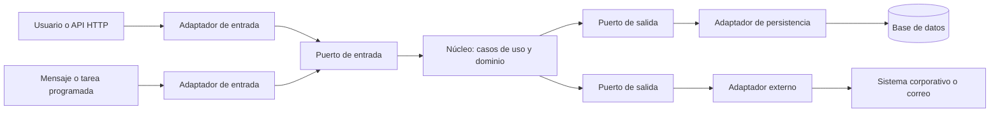
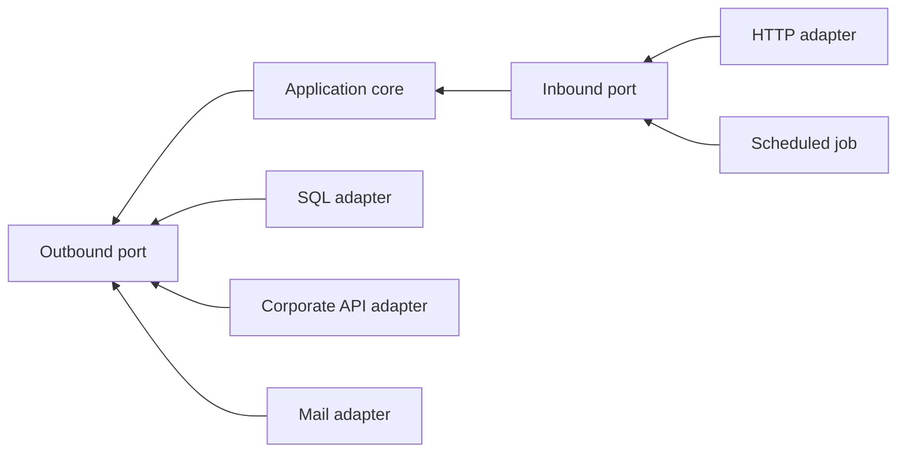
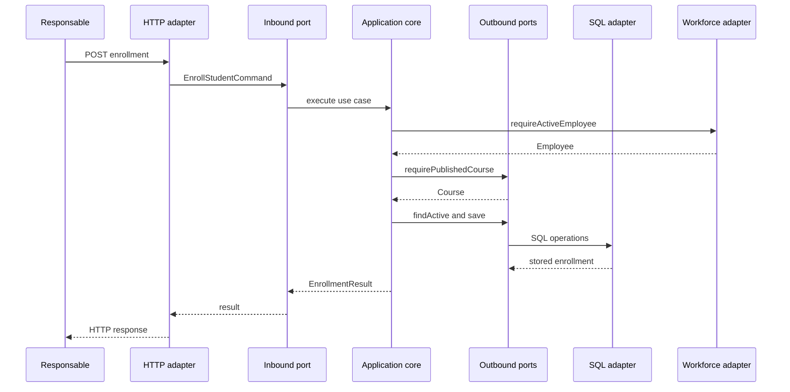
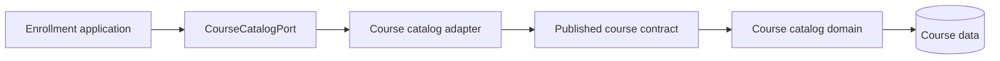
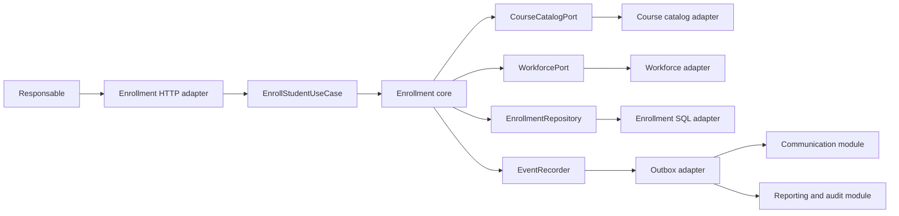

# Anexo de la Semana 3. Arquitectura hexagonal: núcleo, puertos y adaptadores

## Propósito del anexo

La arquitectura hexagonal organiza un sistema alrededor de su núcleo de negocio y define puntos de entrada y salida mediante contratos explícitos. Su objetivo es que las reglas importantes puedan ejecutarse sin depender de HTTP, una base de datos, un framework, un proveedor externo o cualquier otro mecanismo que pueda cambiar.

Este anexo desarrolla cómo se ve una arquitectura hexagonal dentro de un proyecto. Explica qué significa núcleo, qué diferencia existe entre puertos de entrada y salida, cómo trabajan los adaptadores, cómo se conectan en el arranque de la aplicación y cómo se prueba una operación completa.

El ejemplo utiliza Java como lenguaje ilustrativo. El código es seudocódigo cercano a Java: sirve para hacer visibles los contratos y las responsabilidades, no para definir una implementación completa ni elegir un framework.

## 1. Qué es una arquitectura hexagonal

La **hexagonal architecture**, también llamada **ports and adapters architecture**, coloca el dominio y los casos de uso en el centro de la solución. El exterior puede contener usuarios, APIs, bases de datos, sistemas corporativos, colas, archivos, relojes o proveedores de correo. La interacción entre ambos lados ocurre mediante puertos y adaptadores.

El hexágono es una metáfora visual. No significa que deban existir seis capas, seis módulos o seis integraciones. La forma representa que el núcleo puede tener múltiples lados de entrada y salida:



La arquitectura distingue dos relaciones:

- **El núcleo define puertos de salida** cuando necesita algo del exterior, como guardar una inscripción o consultar empleados.
- **El exterior implementa esos puertos** mediante adaptadores concretos, como un repositorio SQL o un cliente HTTP.

En el sentido inverso:

- **El núcleo ofrece puertos de entrada** cuando expone capacidades, como inscribir a un empleado o emitir un certificado.
- **El exterior utiliza esos puertos** mediante adaptadores de entrada, como un controlador HTTP, un consumidor de mensajes o una tarea programada.

La dirección de las dependencias es la parte esencial. Los adaptadores conocen los puertos del núcleo; el núcleo no conoce los adaptadores concretos.

## 2. El núcleo de la aplicación

El **application core**, o núcleo de la aplicación, contiene las decisiones que dan significado al producto. En una solución típica incluye dos tipos de responsabilidad:

- **Aplicación:** coordina casos de uso, transacciones y colaboración entre componentes.
- **Dominio:** expresa entidades, valores, políticas, invariantes y hechos propios del problema.

El núcleo no tiene que ser un único paquete ni un único módulo. Puede organizarse por capacidades de negocio, siempre que las reglas permanezcan protegidas de los detalles externos.

Una pregunta útil para identificar el núcleo es: **¿qué parte de esta operación seguiría siendo válida si cambiáramos HTTP por un mensaje, SQL por otra persistencia y el sistema corporativo por un archivo?** Esa parte contiene políticas y decisiones que merecen aislamiento.

En SkillHub, el núcleo de una inscripción puede conocer que:

- solo un empleado activo puede inscribirse;
- el curso debe estar publicado;
- no puede existir una inscripción activa duplicada;
- una inscripción válida debe quedar registrada;
- la operación puede producir el hecho `EnrollmentCreated`.

El núcleo no necesita saber si la solicitud llegó por `POST`, si la inscripción se guardó en PostgreSQL o si el sistema corporativo respondió mediante REST.

## 3. Puertos de entrada

Un **inbound port**, o puerto de entrada, es un contrato que representa una capacidad que el sistema ofrece a un actor externo. También se conoce como **driving port**, porque algo externo impulsa la ejecución a través de él.

El puerto suele expresar un caso de uso:

```java
public interface EnrollStudentUseCase {
    EnrollmentResult enroll(EnrollStudentCommand command);
}
```

El puerto no describe HTTP ni una pantalla. Describe una intención del negocio. Puede ser invocado por distintos adaptadores:

```java
public final class EnrollStudentController {
    private final EnrollStudentUseCase enrollStudent;

    public EnrollmentResponse handle(EnrollmentRequest request,
                                     AuthenticatedUser user) {
        EnrollStudentCommand command = new EnrollStudentCommand(
                new EmployeeId(user.employeeId()),
                new CourseId(request.courseId()),
                Deadline.from(request.deadline()));

        EnrollmentResult result = enrollStudent.enroll(command);
        return EnrollmentResponse.from(result);
    }
}
```

El controlador conoce el puerto de entrada y el DTO de su frontera. No necesita conocer la clase concreta que ejecuta el caso de uso.

Otros adaptadores pueden utilizar el mismo puerto:

```java
public final class EnrollmentMessageConsumer {
    private final EnrollStudentUseCase enrollStudent;

    public void consume(EnrollmentRequestedMessage message) {
        EnrollStudentCommand command = message.toCommand();
        enrollStudent.enroll(command);
    }
}
```

El caso de uso conserva el mismo contrato aunque cambie el mecanismo de entrada. Esta propiedad permite probar la capacidad sin levantar un servidor HTTP y evita que el protocolo externo defina el modelo interno.

### Qué debe contener un puerto de entrada

Un puerto de entrada debe expresar:

- la intención que se ejecuta;
- los datos necesarios para esa intención;
- el resultado que puede observar el actor;
- errores de negocio que el consumidor debe poder interpretar.

No debería exponer:

- tipos propios de un framework web;
- objetos de sesión HTTP;
- entidades persistentes mutables sin una razón;
- consultas SQL;
- detalles de autenticación del proveedor concreto.

El contrato debe ser suficientemente estable para que varios adaptadores puedan utilizarlo sin obligar al núcleo a conocer sus formatos.

## 4. Puertos de salida

Un **outbound port**, o puerto de salida, es un contrato que expresa una necesidad del núcleo hacia el exterior. También se conoce como **driven port**, porque el núcleo lo utiliza para obtener algo que necesita.

```java
public interface EnrollmentRepository {
    Optional<Enrollment> findActive(EmployeeId employeeId, CourseId courseId);
    void save(Enrollment enrollment);
}

public interface WorkforcePort {
    Employee requireActiveEmployee(EmployeeId employeeId);
}

public interface CourseCatalogPort {
    Course requirePublishedCourse(CourseId courseId);
}
```

Estos contratos no dicen si los datos provienen de SQL, una API, una caché o una memoria de prueba. Expresan la capacidad que el núcleo necesita para tomar una decisión.

Un puerto de salida debe diseñarse desde el consumidor. `WorkforcePort` no debería copiar todas las operaciones disponibles en el sistema corporativo. Debe ofrecer solo la información y las acciones que SkillHub necesita para ese límite.

Una interfaz demasiado amplia aumenta el acoplamiento:

```java
// Contrato demasiado ligado al proveedor externo.
public interface CorporateEmployeeApi {
    CorporateEmployeeResponse getEmployeeByDn(String distinguishedName);
    List<CorporateGroup> listGroups(String distinguishedName);
    String refreshAccessToken();
    void updateDirectoryAttribute(String name, String value);
}
```

Un contrato orientado a la necesidad del núcleo es más preciso:

```java
public interface WorkforcePort {
    Employee requireActiveEmployee(EmployeeId employeeId);
    AuthorizationContext authorizationFor(EmployeeId employeeId);
}
```

El adaptador puede usar la API corporativa completa, pero el núcleo no queda obligado a conocerla.

## 5. Adaptadores de entrada y salida

Un **adapter**, o adaptador, traduce entre una tecnología externa y un puerto. El adaptador es responsable de las diferencias de formato, protocolo, errores y configuración que no deben contaminar el núcleo.

### 5.1. Adaptadores de entrada

Un adaptador de entrada recibe una acción externa y la convierte en una llamada a un puerto de entrada. Puede ser:

- un controlador HTTP;
- un consumidor de una cola;
- una tarea programada;
- una interfaz de línea de comandos;
- una función invocada por otro módulo;
- un adaptador de pruebas.

El adaptador decide cómo leer la entrada y cómo traducir la salida. No debe duplicar la política del caso de uso.

```java
public final class EnrollmentHttpAdapter {
    private final EnrollStudentUseCase useCase;

    public HttpResponse post(EnrollmentHttpRequest request,
                             AuthenticatedUser user) {
        try {
            EnrollmentResult result = useCase.enroll(
                    new EnrollStudentCommand(
                            new EmployeeId(user.employeeId()),
                            new CourseId(request.courseId()),
                            Deadline.from(request.deadline())));
            return HttpResponse.created(EnrollmentResponse.from(result));
        } catch (BusinessRuleViolation error) {
            return HttpResponse.unprocessableEntity(
                    ApiError.from(error));
        }
    }
}
```

### 5.2. Adaptadores de salida

Un adaptador de salida implementa un puerto que el núcleo necesita. Puede ser:

- un repositorio SQL;
- un cliente de un sistema corporativo;
- un productor de mensajes;
- un proveedor de correo;
- un reloj del sistema;
- un almacenamiento de archivos;
- una implementación en memoria para pruebas.

```java
public final class SqlEnrollmentAdapter implements EnrollmentRepository {
    private final JdbcTemplate jdbc;

    @Override
    public Optional<Enrollment> findActive(EmployeeId employeeId,
                                            CourseId courseId) {
        return jdbc.query("SELECT ...", enrollmentRowMapper,
                employeeId.value(), courseId.value())
                .stream()
                .findFirst();
    }

    @Override
    public void save(Enrollment enrollment) {
        jdbc.update(
                "INSERT INTO enrollment(employee_id, course_id, status) "
                        + "VALUES (?, ?, ?)",
                enrollment.employeeId().value(),
                enrollment.courseId().value(),
                enrollment.status().name());
    }
}
```

El adaptador conoce JDBC y el esquema. El puerto no necesita conocerlos. Si se sustituye SQL por otra tecnología, el cambio queda contenido en el adaptador mientras se conserva el contrato.

### 5.3. Adaptadores de prueba

Una implementación en memoria permite probar el núcleo sin infraestructura real:

```java
public final class InMemoryEnrollmentRepository
        implements EnrollmentRepository {
    private final List<Enrollment> stored = new ArrayList<>();

    @Override
    public Optional<Enrollment> findActive(EmployeeId employeeId,
                                            CourseId courseId) {
        return stored.stream()
                .filter(enrollment -> enrollment.matches(employeeId, courseId))
                .filter(Enrollment::isActive)
                .findFirst();
    }

    @Override
    public void save(Enrollment enrollment) {
        stored.add(enrollment);
    }
}
```

Este adaptador no pretende simular todas las propiedades de una base de datos. Su finalidad es permitir que una prueba del caso de uso controle el escenario y verifique el comportamiento del núcleo.

## 6. Dependencias y composición

La regla principal de la arquitectura hexagonal es que las dependencias de código apuntan hacia el núcleo:



El diagrama se lee de forma distinta según la relación:

- El adaptador de entrada llama al puerto que ofrece el núcleo.
- El caso de uso del núcleo llama a un puerto de salida.
- El adaptador de salida implementa ese puerto.

El punto donde se conectan las implementaciones concretas se denomina **composition root**, o raíz de composición. Allí se construye el grafo de objetos:

```java
public final class ApplicationConfiguration {
    public EnrollStudentUseCase enrollStudentUseCase() {
        EnrollmentRepository enrollments = new SqlEnrollmentAdapter(jdbc());
        WorkforcePort workforce = new CorporateWorkforceAdapter(httpClient());
        CourseCatalogPort courses = new SqlCourseCatalogAdapter(jdbc());
        TransactionRunner transactions = new SqlTransactionRunner(jdbc());

        return new EnrollStudentService(
                enrollments,
                workforce,
                courses,
                transactions);
    }
}
```

El núcleo conoce los tipos de los puertos, pero la configuración decide qué adaptadores concretos utilizar. En un framework, la raíz de composición suele estar repartida entre configuración, inyección de dependencias y ciclo de vida de la aplicación. La responsabilidad conceptual sigue siendo la misma.

La composición permite cambiar un adaptador sin cambiar la política. También obliga a hacer visible qué dependencias necesita cada caso de uso, en lugar de obtenerlas desde variables globales o buscar servicios implícitamente.

## 7. Casos de uso y servicios de aplicación

Un **application service**, o servicio de aplicación, implementa normalmente uno o varios puertos de entrada. Coordina el trabajo, pero no debe ser el propietario de todas las reglas.

```java
public final class EnrollStudentService implements EnrollStudentUseCase {
    private final EnrollmentRepository enrollments;
    private final WorkforcePort workforce;
    private final CourseCatalogPort courses;
    private final TransactionRunner transactions;

    @Override
    public EnrollmentResult enroll(EnrollStudentCommand command) {
        return transactions.inTransaction(() -> {
            Employee employee = workforce.requireActiveEmployee(
                    command.employeeId());
            Course course = courses.requirePublishedCourse(
                    command.courseId());

            if (enrollments.findActive(employee.id(), course.id()).isPresent()) {
                throw new BusinessRuleViolation(
                        "Active enrollment already exists");
            }

            Enrollment enrollment = Enrollment.create(
                    employee.id(), course.id(), command.deadline());
            enrollment.ensureEligible(employee, course);
            enrollments.save(enrollment);
            return EnrollmentResult.from(enrollment);
        });
    }
}
```

La clase coordina puertos y una entidad. La entidad mantiene una regla que le pertenece:

```java
public final class Enrollment {
    private final EmployeeId employeeId;
    private final CourseId courseId;
    private final Deadline deadline;
    private EnrollmentStatus status;

    private Enrollment(EmployeeId employeeId,
                       CourseId courseId,
                       Deadline deadline) {
        this.employeeId = employeeId;
        this.courseId = courseId;
        this.deadline = deadline;
        this.status = EnrollmentStatus.ACTIVE;
    }

    public static Enrollment create(EmployeeId employeeId,
                                    CourseId courseId,
                                    Deadline deadline) {
        return new Enrollment(employeeId, courseId, deadline);
    }

    public void ensureEligible(Employee employee, Course course) {
        if (!employee.isActive()) {
            throw new BusinessRuleViolation(
                    "Inactive employees cannot enroll");
        }
        if (!course.isPublished()) {
            throw new BusinessRuleViolation(
                    "Only published courses can be assigned");
        }
        if (!course.accepts(employee)) {
            throw new BusinessRuleViolation(
                    "Employee is not eligible for course");
        }
    }
}
```

El puerto de entrada expresa la capacidad; el servicio de aplicación la coordina; la entidad conserva el conocimiento que define una inscripción válida. Esta separación evita que el adaptador HTTP, el adaptador SQL o el servicio de aplicación se conviertan en propietarios accidentales de todas las decisiones.

## 8. Recorrido completo de una operación

Consideremos el caso de uso: un responsable asigna un curso publicado a un empleado activo.

### Paso 1. Un adaptador recibe la intención

El controlador HTTP recibe una petición y obtiene la identidad autenticada. Valida forma y tipos básicos, transforma los datos en un comando y llama al puerto de entrada.

```java
EnrollStudentCommand command = new EnrollStudentCommand(
        new EmployeeId(user.employeeId()),
        new CourseId(request.courseId()),
        Deadline.from(request.deadline()));

EnrollmentResult result = enrollStudent.enroll(command);
```

Un consumidor de mensajes podría crear el mismo comando desde otro formato. El núcleo no necesita conocer cuál de los dos inició el proceso.

### Paso 2. El caso de uso utiliza puertos de salida

El servicio solicita al sistema corporativo un empleado activo, al catálogo un curso publicado y al repositorio la posible inscripción existente. Las llamadas son contra contratos definidos por el núcleo.

### Paso 3. El dominio toma decisiones

La entidad y las políticas del dominio verifican elegibilidad, publicación, estados e invariantes. Si una regla falla, el núcleo devuelve un error de negocio que los adaptadores pueden traducir a sus propios formatos.

### Paso 4. Un adaptador persiste el resultado

El adaptador SQL traduce la entidad a filas. Una implementación de otro tipo podría traducirla a un documento o a un mensaje, sin modificar la regla que hizo válida la inscripción.

### Paso 5. Se notifican efectos posteriores

El caso de uso puede producir un hecho como `EnrollmentCreated`. Un adaptador de mensajería o un procesador posterior puede utilizarlo para crear una notificación. La política de inscripción no tiene que llamar directamente al proveedor de correo.



Las flechas externas no implican que todos los adaptadores sean procesos separados. En un monolito, pueden ser objetos dentro del mismo proceso; el límite es conceptual y de dependencias.

## 9. Estructura de carpetas

Una estructura inicial puede organizar el núcleo y los adaptadores de una capacidad así:

```text
src/main/java/com/example/skillhub/enrollment/
├── application/
│   ├── EnrollStudentUseCase.java
│   ├── EnrollStudentCommand.java
│   ├── EnrollmentResult.java
│   └── EnrollStudentService.java
├── domain/
│   ├── Enrollment.java
│   ├── EnrollmentStatus.java
│   ├── EmployeeId.java
│   ├── CourseId.java
│   ├── Deadline.java
│   └── BusinessRuleViolation.java
├── port/
│   ├── inbound/
│   │   └── EnrollStudentUseCase.java
│   └── outbound/
│       ├── EnrollmentRepository.java
│       ├── WorkforcePort.java
│       └── CourseCatalogPort.java
├── adapter/
│   ├── inbound/
│   │   ├── http/
│   │   │   ├── EnrollmentHttpAdapter.java
│   │   │   └── EnrollmentRequest.java
│   │   ├── messaging/
│   │   │   └── EnrollmentMessageConsumer.java
│   │   └── scheduled/
│   │       └── EnrollmentJob.java
│   └── outbound/
│       ├── persistence/
│       │   ├── SqlEnrollmentAdapter.java
│       │   └── EnrollmentRowMapper.java
│       ├── workforce/
│       │   └── CorporateWorkforceAdapter.java
│       └── messaging/
│           └── EnrollmentEventPublisher.java
└── configuration/
    └── ApplicationConfiguration.java
```

Hay dos decisiones de organización posibles dentro del mismo estilo. Los puertos pueden vivir cerca de `application` y `domain`, o en un paquete explícito `port`. Los adaptadores pueden agruparse por tecnología o por dirección. La elección debe hacer visible quién define el contrato y quién lo implementa.

### Estructura por módulo para SkillHub

Como SkillHub es un monolito modular, conviene repetir la frontera hexagonal dentro de cada módulo de negocio:

```text
skillhub/
├── course_catalog/
│   ├── application/
│   ├── domain/
│   ├── port/
│   │   ├── inbound/
│   │   └── outbound/
│   └── adapter/
│       ├── inbound/
│       └── outbound/
├── enrollment/
│   ├── application/
│   ├── domain/
│   ├── port/
│   └── adapter/
├── learning/
├── certification/
├── workforce/
├── communication/
└── reporting/
```

Esta estructura mantiene juntos los conceptos y casos de uso de cada capacidad, mientras separa las tecnologías externas por adaptadores. El módulo de inscripciones puede usar un puerto de cursos publicados sin acceder directamente a las tablas o entidades internas del módulo de catálogo.

## 10. Límites entre puertos y módulos

Un puerto no es automáticamente un contrato entre módulos de negocio. Puede ser un contrato interno de un módulo o una frontera que otro módulo consume.

Por ejemplo, `CourseCatalogPort` puede expresar una necesidad de Asignaciones hacia Gobierno de cursos. Hay dos formas de implementarlo:

- un adaptador interno que llama a una interfaz pública del módulo de catálogo;
- un adaptador que consume un evento o una API externa si los módulos están distribuidos.

La decisión de transporte no debe cambiar el significado del puerto. El módulo de asignaciones necesita saber si existe una oferta publicada y qué datos mínimos requiere; no necesita poseer el modelo editorial completo.



El adaptador es una frontera de traducción. Si el catálogo representa un curso con estados editoriales, contenidos y revisiones, el módulo de asignaciones puede recibir una vista más pequeña: identificador, versión publicada, elegibilidad y disponibilidad.

### Anti-corruption layer

Un **anti-corruption layer**, o capa anticorrupción, traduce el modelo de un sistema externo o de otro contexto al modelo que necesita el núcleo. Su objetivo es impedir que nombres, estados o estructuras ajenas se propaguen por el dominio.

```java
public final class CorporateWorkforceAdapter implements WorkforcePort {
    private final CorporateDirectoryClient client;

    @Override
    public Employee requireActiveEmployee(EmployeeId employeeId) {
        CorporateEmployee external = client.findById(employeeId.value());
        if (external == null || !external.enabled()) {
            throw new EmployeeUnavailable(employeeId);
        }
        return new Employee(
                employeeId,
                external.displayName(),
                external.status() == CorporateStatus.ACTIVE);
    }
}
```

El núcleo trabaja con `Employee` y `EmployeeId`, no con `CorporateStatus`, códigos de directorio ni respuestas HTTP del proveedor.

## 11. Transacciones, eventos y efectos externos

El hecho de que el núcleo esté aislado no elimina los problemas de consistencia. Una aplicación hexagonal todavía debe decidir qué cambios se confirman juntos y cómo se manejan los efectos que ocurren fuera de la transacción.

La frontera transaccional suele rodear un caso de uso:

```java
public EnrollmentResult enroll(EnrollStudentCommand command) {
    return transactions.inTransaction(() -> {
        Enrollment enrollment = createValidEnrollment(command);
        enrollments.save(enrollment);
        events.record(new EnrollmentCreated(enrollment));
        return EnrollmentResult.from(enrollment);
    });
}
```

El puerto de salida `EventRecorder` puede tener una implementación en memoria, una tabla outbox o un productor de mensajes. El núcleo decide qué hecho debe existir; el adaptador decide cómo transportarlo.

```java
public interface EventRecorder {
    void record(DomainEvent event);
}
```

Una **outbox** permite guardar el evento junto con el cambio principal y publicarlo después. Es útil cuando una inscripción confirmada no debe perder el aviso que otros módulos necesitan procesar. No es obligatoria en toda aplicación hexagonal: se justifica por requisitos de confiabilidad, reintentos y consistencia entre almacenamiento y mensajería.

Para cada puerto de salida conviene definir:

- si la llamada es síncrona o asíncrona;
- qué errores puede devolver;
- si admite reintentos;
- si la operación es idempotente;
- qué ocurre cuando el sistema externo está indisponible;
- si el resultado forma parte de la transacción o es posterior.

## 12. Errores y traducción en las fronteras

El núcleo debe expresar errores con significado de negocio o de contrato, no con excepciones propias de una tecnología externa.

| Situación | Lugar que la detecta primero | Traducción posterior |
|---|---|---|
| JSON inválido | Adaptador HTTP | Error de entrada HTTP |
| Mensaje no parseable | Adaptador de mensajería | Rechazo o cola de errores |
| Curso no publicado | Núcleo | Error de regla de negocio |
| Empleado inactivo | Puerto o dominio | Operación no permitida |
| Base de datos inaccesible | Adaptador SQL | Error técnico, reintento o indisponibilidad |
| Sistema corporativo sin respuesta | Adaptador externo | Dependencia temporalmente no disponible |
| Evento duplicado | Núcleo o adaptador idempotente | Resultado ya procesado |

Un adaptador puede traducir un `404` del sistema corporativo a `EmployeeUnavailable`, pero no debería dejar que `HttpClientException` se propague hasta la entidad. Del mismo modo, el controlador puede convertir `BusinessRuleViolation` en un código HTTP, mientras un consumidor de mensajes puede reintentar o enviar el mensaje a una cola de errores.

```java
public final class CorporateWorkforceAdapter implements WorkforcePort {
    @Override
    public Employee requireActiveEmployee(EmployeeId employeeId) {
        try {
            return map(client.getEmployee(employeeId.value()));
        } catch (CorporateNotFound error) {
            throw new EmployeeUnavailable(employeeId);
        } catch (CorporateTimeout error) {
            throw new WorkforceTemporarilyUnavailable(error);
        }
    }
}
```

El núcleo puede decidir si `WorkforceTemporarilyUnavailable` impide completar el caso de uso. La política de reintentos técnicos pertenece al adaptador o a la aplicación, según el alcance que deba tener.

## 13. Pruebas por puertos y adaptadores

Una ventaja de la arquitectura hexagonal es que permite probar el comportamiento desde el puerto que representa la capacidad, sin depender del adaptador que la inició.

### Pruebas del dominio

Comprueban entidades, objetos de valor e invariantes sin usar puertos ni infraestructura.

```java
@Test
void inactiveEmployeeCannotBeEnrolled() {
    Employee inactive = Employee.inactive(new EmployeeId("E-10"));
    Course published = Course.published(new CourseId("C-20"));
    Enrollment enrollment = Enrollment.create(
            inactive.id(), published.id(), Deadline.tomorrow());

    assertThrows(BusinessRuleViolation.class,
            () -> enrollment.ensureEligible(inactive, published));
}
```

### Pruebas del puerto de entrada

Usan adaptadores de salida en memoria o sustitutos controlados. Verifican el comportamiento observable del caso de uso: qué ocurre con un empleado inactivo, un curso no publicado, una inscripción duplicada o una operación válida.

```java
@Test
void enrollmentUseCaseStoresValidEnrollment() {
    InMemoryEnrollmentRepository enrollments =
            new InMemoryEnrollmentRepository();
    StubWorkforcePort workforce = StubWorkforcePort.withActiveEmployee("E-10");
    StubCourseCatalogPort courses = StubCourseCatalogPort.withPublishedCourse("C-20");

    EnrollStudentUseCase useCase = new EnrollStudentService(
            enrollments, workforce, courses, new NoopTransactions());

    useCase.enroll(commandFor("E-10", "C-20"));

    assertTrue(enrollments.contains("E-10", "C-20"));
}
```

Esta prueba no necesita saber si la entrada real será HTTP o mensajería. Prueba el puerto que representa la capacidad.

### Pruebas de adaptadores

Comprueban que cada adaptador cumple el contrato del puerto:

- un adaptador SQL conserva y reconstruye correctamente una inscripción;
- un adaptador del sistema corporativo transforma estados externos;
- un adaptador HTTP traduce DTOs y errores;
- un adaptador de mensajes reconoce confirmaciones, duplicados y fallos.

Las pruebas de contrato pueden ayudar cuando varios adaptadores deben cumplir la misma interfaz. Un conjunto de pruebas común puede ejecutar contra una implementación en memoria y contra una implementación SQL, siempre que se mantengan las expectativas relevantes del contrato.

### Pruebas de composición

Verifican que la raíz de composición conecta el puerto correcto con el adaptador correcto y que la aplicación puede arrancar. Son pocas, pero detectan errores de configuración que las pruebas unitarias no observan.

## 14. Estructuras posibles del núcleo

La arquitectura hexagonal no exige una única distribución interna.

### Núcleo centrado en casos de uso

```text
core/
├── usecase/
├── domain/
└── port/
```

Es útil cuando los casos de uso son la principal forma de comprender la aplicación y el dominio tiene reglas moderadas.

### Núcleo centrado en módulos de negocio

```text
core/
├── enrollment/
│   ├── application/
│   ├── domain/
│   └── port/
├── learning/
│   ├── application/
│   ├── domain/
│   └── port/
└── certification/
    ├── application/
    ├── domain/
    └── port/
```

Es apropiado cuando varios contextos tienen vocabulario y reglas diferentes. Cada módulo puede ofrecer puertos de entrada y mantener privados sus puertos de salida internos.

### Núcleo pequeño con lógica en funciones

No todo dominio necesita entidades complejas. Un proceso sencillo puede tener funciones o servicios de aplicación con objetos de valor mínimos. La arquitectura protege una frontera; no obliga a construir un modelo rico cuando la complejidad real no lo requiere.

## 15. Errores frecuentes

### Confundir puertos con interfaces técnicas

Una interfaz no es un puerto por el hecho de llamarse `Port`. `JdbcTemplate`, una interfaz de HTTP o un cliente genérico de mensajería siguen expresando tecnología. Un puerto debe representar una necesidad o capacidad del núcleo.

### Dejar que el framework entre al núcleo

Anotaciones de controladores, clases de configuración, entidades ORM y excepciones HTTP dentro del dominio acoplan la política al mecanismo. El framework puede facilitar la composición, pero no debe definir los conceptos del negocio.

### Crear puertos para cada clase

Si cada dependencia interna tiene una interfaz sin que exista variabilidad, frontera o necesidad de sustitución, el código gana nombres pero no aislamiento. Un puerto debe proteger una decisión significativa.

### Usar un puerto como objeto genérico de datos

Un puerto de salida no debe devolver una respuesta técnica enorme para que el caso de uso la interprete. Debe ofrecer una capacidad clara o un modelo traducido al lenguaje del núcleo.

### Permitir que el adaptador aplique reglas de negocio

Un adaptador puede validar que un JSON tenga forma correcta o que una respuesta externa pueda traducirse. No debería decidir si un empleado cumple la política de inscripción; esa decisión debe ser consistente sin importar el adaptador de entrada utilizado.

### Confundir aislamiento con despliegue independiente

Una arquitectura hexagonal puede vivir dentro de un monolito. Los puertos y adaptadores aíslan dependencias de código; no convierten automáticamente cada adaptador en un servicio desplegable. Distribuirlo añade latencia, fallos parciales y coordinación operativa que deben justificarse por separado.

### Devolver entidades del dominio a cualquier cliente

Exponer directamente entidades puede filtrar invariantes, campos internos y relaciones mutables. El adaptador de entrada debería traducir el resultado del puerto a una respuesta adecuada para su frontera.

### Usar eventos para ocultar llamadas sincrónicas

Publicar un evento no elimina la necesidad de definir qué significa éxito, qué ocurre con duplicados o cómo se informa un fallo. La comunicación asíncrona es una decisión de consistencia y operación, no solo una forma de reducir dependencias visibles.

## 16. Aplicación al monolito modular de SkillHub

La propuesta de la semana 3 identifica siete módulos de negocio. Cada uno puede tener su propio núcleo y sus adaptadores, aunque todos se desplieguen en un mismo proceso.

- **Gobierno de cursos y catálogo:** ofrece puertos para crear, revisar y consultar cursos publicados; adapta persistencia y herramientas editoriales.
- **Asignaciones e inscripciones:** ofrece el puerto `EnrollStudentUseCase`; necesita puertos de catálogo, workforce, persistencia y eventos.
- **Aprendizaje y evaluación:** ofrece puertos para registrar progreso, enviar intentos y determinar finalización; adapta almacenamiento y políticas configurables.
- **Certificación y evidencia:** ofrece puertos para emitir y consultar certificados; adapta almacenamiento de documentos y notificaciones.
- **Workforce y autorización:** ofrece contexto autorizado al resto; adapta el sistema corporativo de empleados.
- **Comunicación y bandeja:** ofrece puertos para consultar notificaciones y recibe hechos o solicitudes de entrega; adapta correo y bandeja interna.
- **Reportes y auditoría:** ofrece consultas y recibe hechos auditable; adapta proyecciones, almacenamiento de eventos y exportaciones.

Para el caso de inscripción, una vista simplificada sería:



El módulo de inscripciones define qué necesita para decidir. Los adaptadores traducen las fronteras de catálogo y workforce. Comunicación y reportes reaccionan a hechos sin modificar la inscripción directamente.

Una estructura concreta podría ser:

```text
skillhub/
├── enrollment/
│   ├── application/
│   │   ├── EnrollStudentUseCase.java
│   │   └── EnrollStudentService.java
│   ├── domain/
│   │   ├── Enrollment.java
│   │   └── EnrollmentStatus.java
│   ├── port/
│   │   ├── inbound/
│   │   │   └── EnrollStudentUseCase.java
│   │   └── outbound/
│   │       ├── CourseCatalogPort.java
│   │       ├── WorkforcePort.java
│   │       ├── EnrollmentRepository.java
│   │       └── EventRecorder.java
│   └── adapter/
│       ├── inbound/http/
│       └── outbound/
│           ├── persistence/
│           ├── workforce/
│           └── messaging/
└── course_catalog/
    ├── application/
    ├── domain/
    ├── port/
    └── adapter/
```

La separación permite cambiar el proveedor de empleados sin modificar la entidad `Enrollment`, cambiar HTTP por mensajería sin duplicar el caso de uso y probar la política de inscripción con adaptadores controlados.

## 17. Cuándo resulta útil

La arquitectura hexagonal suele ser apropiada cuando:

- las reglas de negocio tienen valor propio y deben sobrevivir a cambios técnicos;
- existen varias formas de entrada para una misma capacidad;
- se integran sistemas externos con contratos o modelos inestables;
- la persistencia puede cambiar o debe ser sustituible en pruebas;
- se necesita probar casos de uso sin levantar toda la infraestructura;
- el equipo quiere hacer explícita la dirección de dependencias;
- un monolito necesita límites internos fuertes antes de considerar una distribución física.

Puede requerir adaptación cuando:

- el sistema es principalmente una transformación técnica sin reglas de negocio relevantes;
- los puertos propuestos solo repiten APIs de proveedores y no protegen decisiones;
- el equipo no puede mantener contratos, adaptadores y composición con claridad;
- el costo de aislar una capacidad es mayor que el cambio técnico que se pretende proteger;
- se intenta aplicar el patrón de forma uniforme a módulos que no tienen la misma complejidad.

El valor no reside en que toda clase esté detrás de una interfaz. Reside en que las decisiones importantes no queden atadas a detalles que cambian por razones externas.

## 18. Lista de revisión

Antes de considerar implementada una arquitectura hexagonal, revisar:

1. ¿El núcleo puede ejecutarse sin servidor HTTP, base de datos ni proveedor externo?
2. ¿Cada capacidad importante está representada por un puerto de entrada claro?
3. ¿Los puertos de salida expresan necesidades del núcleo en su propio vocabulario?
4. ¿Los adaptadores traducen formatos y protocolos sin duplicar reglas de negocio?
5. ¿Las dependencias de código apuntan hacia el núcleo y no hacia adaptadores concretos?
6. ¿La raíz de composición conecta explícitamente puertos e implementaciones?
7. ¿El contrato de cada puerto es pequeño, estable y orientado al consumidor?
8. ¿Los modelos externos se traducen antes de entrar al dominio?
9. ¿Las transacciones y los efectos asíncronos tienen una política explícita?
10. ¿Los errores técnicos se traducen en las fronteras correctas?
11. ¿Las pruebas del núcleo usan adaptadores controlados y no infraestructura innecesaria?
12. ¿La arquitectura protege un cambio o una frontera real, en lugar de añadir interfaces por costumbre?

## Cierre

La arquitectura hexagonal no se define por dibujar un hexágono ni por crear paquetes llamados `ports` y `adapters`. Se define por colocar las decisiones del producto en un núcleo protegido y hacer que toda interacción externa pase por contratos con una dirección explícita.

Los puertos de entrada expresan capacidades que el sistema ofrece. Los puertos de salida expresan necesidades del núcleo. Los adaptadores traducen protocolos, formatos y mecanismos concretos. La raíz de composición conecta las piezas sin hacer que el núcleo conozca sus implementaciones.

En SkillHub, esta estructura permite que una inscripción se pruebe sin HTTP ni SQL, que el sistema corporativo de empleados quede detrás de un contrato propio y que los hechos de negocio lleguen a comunicación y auditoría sin mezclar sus responsabilidades. La arquitectura puede permanecer dentro de un monolito modular; el aislamiento conceptual no depende de separar procesos.

La pregunta práctica es: **¿qué decisión pertenece al núcleo y qué contrato permite reemplazar el mecanismo externo sin cambiarla?**
