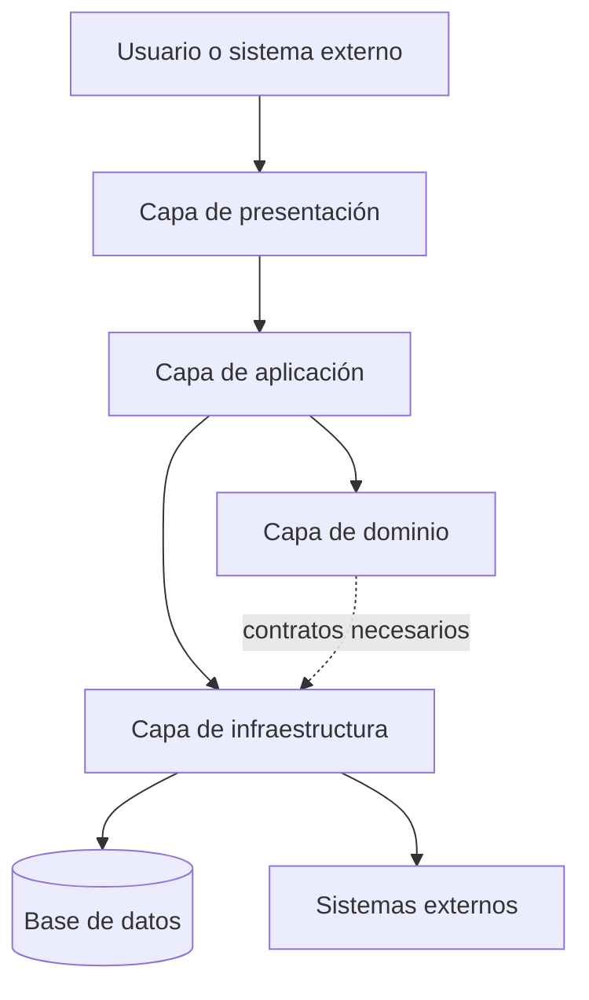
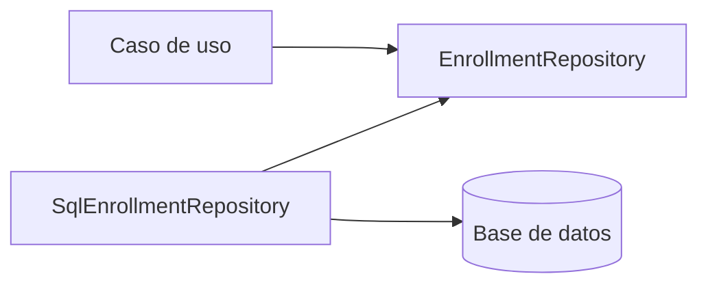
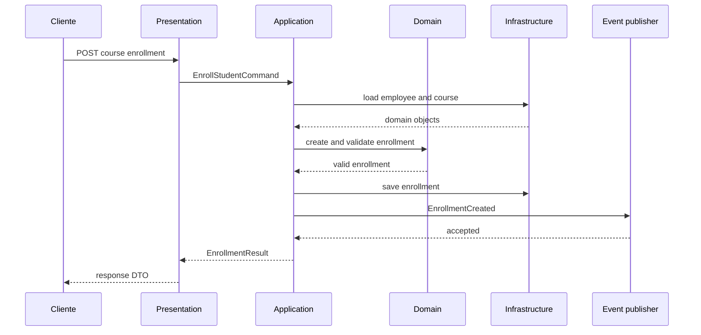
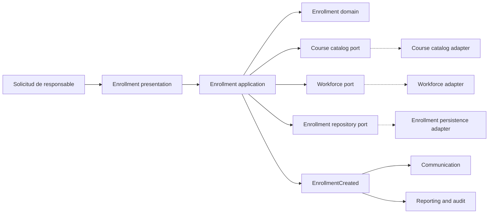

# Anexo de la Semana 3. Arquitectura en capas: de los conceptos a la implementación

## Propósito del anexo

La arquitectura en capas organiza un sistema en niveles de responsabilidad. Cada nivel reúne decisiones relacionadas, ofrece servicios al nivel superior y oculta los detalles que no necesitan conocer las demás partes. Es una estructura frecuente porque proporciona un punto de partida comprensible para separar la interfaz, los casos de uso, las reglas del dominio y los mecanismos técnicos.

Este anexo desarrolla cómo se ve una arquitectura en capas dentro de un proyecto. El objetivo no es proponer un framework ni imponer una cantidad fija de capas, sino mostrar qué responsabilidades pertenecen a cada una, cómo circula una operación, cómo se dirigen las dependencias y qué señales indican que la separación dejó de ser útil.

El ejemplo utiliza Java como lenguaje ilustrativo. El código es seudocódigo cercano a Java: sirve para hacer visibles los contratos y las responsabilidades, no para definir una implementación completa.

## 1. Qué es una arquitectura en capas

Una **layered architecture**, o arquitectura en capas, divide el sistema en niveles horizontales. Una capa agrupa componentes que trabajan en el mismo nivel de abstracción y que responden a una responsabilidad arquitectónica común.

En su forma más habitual, una solicitud atraviesa las capas en una dirección principal:



La figura combina dos ideas que deben distinguirse:

- **Flujo de control:** la solicitud suele entrar por presentación, pasa por aplicación, ejecuta reglas de dominio y produce una respuesta.
- **Dirección de dependencias:** el código que contiene políticas importantes no debería depender directamente de detalles variables como HTTP, SQL o un proveedor de correo.

En una versión estricta, cada capa solo utiliza la capa inmediatamente inferior. En una versión más flexible, la capa de aplicación puede coordinar dominio e infraestructura mediante contratos, mientras los adaptadores concretos se ubican en infraestructura. Lo importante es que la regla sea explícita y verificable.

Una capa no equivale necesariamente a un paquete, un módulo desplegable, un equipo o un proceso independiente. Es un límite de responsabilidades. Puede implementarse con paquetes, módulos de Java, proyectos separados o convenciones protegidas por herramientas.

## 2. Las cuatro capas habituales

### 2.1. Capa de presentación

La **presentation layer**, o capa de presentación, adapta una interacción externa al lenguaje interno de la aplicación y convierte el resultado en una respuesta adecuada para el cliente.

Puede incluir:

- controladores HTTP o consumidores de mensajes;
- validación de formato y campos obligatorios;
- autenticación del actor y lectura de sus credenciales;
- conversión entre JSON, formularios o mensajes y objetos de entrada;
- selección de códigos de respuesta;
- serialización de objetos de salida;
- manejo uniforme de errores técnicos de la interfaz.

No debería decidir reglas de negocio como si una evaluación está aprobada, si un empleado puede inscribirse o cuándo corresponde emitir un certificado. Puede rechazar una solicitud mal formada, pero la validez de negocio pertenece a la capa que posee esa regla.

Ejemplo de responsabilidad correcta:

```java
@PostMapping("/courses/{courseId}/enrollments")
public EnrollmentResponse enroll(
        @PathVariable String courseId,
        @RequestBody EnrollmentRequest request,
        AuthenticatedUser user) {
    EnrollStudentCommand command = new EnrollStudentCommand(
            user.employeeId(),
            courseId,
            request.deadline());

    EnrollmentResult result = enrollStudent.execute(command);
    return enrollmentPresenter.toResponse(result);
}
```

El controlador traduce la petición y delega. No busca directamente en la base de datos, no calcula la elegibilidad y no decide qué excepción significa cada regla del dominio.

### 2.2. Capa de aplicación

La **application layer**, o capa de aplicación, expresa los casos de uso que el sistema ofrece. Coordina una operación de principio a fin, pero no debería convertirse en el lugar donde se acumulan todas las reglas.

Puede incluir:

- comandos y consultas de aplicación;
- coordinación de entidades y servicios de dominio;
- autorización contextual del caso de uso;
- control de transacciones;
- carga y persistencia de objetos mediante contratos;
- publicación de eventos de negocio;
- definición del resultado que necesita la presentación.

Un **caso de uso** es una capacidad observable del sistema con un actor, una intención, condiciones, pasos relevantes y un resultado. Por ejemplo, `EnrollStudent` representa la inscripción de un empleado en un curso; no representa una tabla ni una pantalla.

La capa de aplicación responde principalmente a estas preguntas:

- ¿Qué caso de uso se está ejecutando?
- ¿Qué información necesita?
- ¿Qué componentes deben colaborar?
- ¿Qué transacción o unidad de trabajo debe protegerse?
- ¿Qué resultado o hecho debe devolver o publicar?

Ejemplo:

```java
public final class EnrollStudent {
    private final CourseCatalog courseCatalog;
    private final EnrollmentRepository enrollments;
    private final WorkforceGateway workforce;
    private final TransactionRunner transactions;

    public EnrollmentResult execute(EnrollStudentCommand command) {
        return transactions.inTransaction(() -> {
            Employee employee = workforce.requireActiveEmployee(command.employeeId());
            Course course = courseCatalog.requirePublishedCourse(command.courseId());

            Enrollment enrollment = Enrollment.create(
                    employee.id(), course.id(), command.deadline());
            enrollment.ensureEligible(employee, course);

            enrollments.save(enrollment);
            return EnrollmentResult.from(enrollment);
        });
    }
}
```

El caso de uso coordina. La regla `ensureEligible` debe permanecer cerca de los conceptos que conoce, no escondida en el controlador ni en un repositorio.

### 2.3. Capa de dominio

La **domain layer**, o capa de dominio, contiene el conocimiento específico del problema. Es el centro semántico del sistema: conceptos, estados, invariantes, políticas y decisiones que no deberían depender de un protocolo o proveedor técnico.

Puede incluir:

- entidades con identidad y ciclo de vida;
- objetos de valor;
- agregados y límites de consistencia;
- servicios de dominio;
- políticas y especificaciones;
- eventos de dominio;
- excepciones que expresan reglas incumplidas;
- interfaces de repositorio o gateways requeridas por el dominio.

Una **entidad** mantiene identidad a través de cambios. Un **objeto de valor** se define por sus atributos y normalmente es inmutable. Un **agregado** agrupa objetos bajo una raíz que protege invariantes y define qué puede modificarse como una unidad.

Un **invariante** es una condición que debe mantenerse válida para que el modelo sea consistente. Por ejemplo, una asignación activa no puede existir dos veces para el mismo empleado y curso. El invariante puede requerir una comprobación de dominio y una restricción de persistencia si existe concurrencia.

Ejemplo de entidad y objeto de valor:

```java
public record EmployeeId(String value) {
    public EmployeeId {
        if (value == null || value.isBlank()) {
            throw new IllegalArgumentException("Employee id is required");
        }
    }
}

public final class Enrollment {
    private final EmployeeId employeeId;
    private final CourseId courseId;
    private final Deadline deadline;
    private EnrollmentStatus status;

    private Enrollment(EmployeeId employeeId, CourseId courseId, Deadline deadline) {
        this.employeeId = employeeId;
        this.courseId = courseId;
        this.deadline = deadline;
        this.status = EnrollmentStatus.ACTIVE;
    }

    public static Enrollment create(
            EmployeeId employeeId, CourseId courseId, Deadline deadline) {
        return new Enrollment(employeeId, courseId, deadline);
    }

    public void ensureEligible(Employee employee, Course course) {
        if (!employee.isActive()) {
            throw new BusinessRuleViolation("Inactive employees cannot enroll");
        }
        if (!course.isPublished()) {
            throw new BusinessRuleViolation("Only published courses can be assigned");
        }
        if (!course.accepts(employee)) {
            throw new BusinessRuleViolation("Employee is not eligible for course");
        }
    }
}
```

El dominio puede conocer `Employee`, `Course` y `Enrollment`, pero no debería conocer `HttpServletRequest`, `JdbcTemplate`, una anotación de Spring MVC ni el formato de una fila SQL.

### 2.4. Capa de infraestructura

La **infrastructure layer**, o capa de infraestructura, contiene mecanismos técnicos que permiten que la aplicación interactúe con el exterior.

Puede incluir:

- implementaciones de repositorios;
- mapeadores entre tablas y objetos del dominio;
- clientes HTTP y adaptadores de APIs externas;
- productores y consumidores de mensajes;
- envío de correo;
- almacenamiento de archivos;
- configuración de frameworks;
- observabilidad técnica y proveedores de identidad.

Infraestructura responde al “cómo” técnico: cómo se guarda una inscripción, cómo se consulta el sistema corporativo o cómo se publica un evento. No debería decidir el significado de una asignación ni repetir reglas que ya pertenecen al dominio.

Ejemplo de adaptador:

```java
public final class SqlEnrollmentRepository implements EnrollmentRepository {
    private final JdbcTemplate jdbc;

    @Override
    public void save(Enrollment enrollment) {
        jdbc.update(
                "INSERT INTO enrollment(employee_id, course_id, status) VALUES (?, ?, ?)",
                enrollment.employeeId().value(),
                enrollment.courseId().value(),
                enrollment.status().name());
    }
}
```

El adaptador conoce SQL y columnas. El contrato `EnrollmentRepository` expresa la necesidad de guardar una inscripción sin obligar al dominio a conocer esa tecnología.

## 3. Elementos que componen una implementación

Las capas describen la organización general. Dentro de ellas aparecen elementos con responsabilidades más precisas.

| Elemento | Responsabilidad | Capa habitual |
|---|---|---|
| Controller o handler | Recibir una interacción externa y delegar | Presentación |
| DTO | Transportar datos hacia o desde una frontera | Presentación o aplicación |
| Command | Representar la intención de ejecutar un caso de uso | Aplicación |
| Query | Representar una solicitud de lectura | Aplicación |
| Use case | Coordinar una capacidad observable | Aplicación |
| Entity | Mantener identidad, estado e invariantes | Dominio |
| Value object | Encapsular un concepto definido por sus valores | Dominio |
| Domain service | Aplicar una regla que no pertenece a una entidad única | Dominio |
| Repository port | Expresar una necesidad de carga o persistencia | Dominio o aplicación |
| Gateway port | Expresar una necesidad hacia otro sistema | Dominio o aplicación |
| Repository adapter | Implementar persistencia concreta | Infraestructura |
| External client | Hablar con un servicio o proveedor externo | Infraestructura |
| Mapper | Traducir modelos entre límites | Cerca de la frontera que traduce |
| Event publisher | Publicar hechos después de una operación | Aplicación o infraestructura |
| Transaction boundary | Definir qué cambios deben confirmarse juntos | Aplicación |

No todos los proyectos necesitan todos estos elementos. Crear una clase por cada fila sin una responsabilidad real produce ceremonia, no arquitectura.

### DTO no es entidad

Un **Data Transfer Object**, o DTO, transporta datos a través de una frontera. Su forma debe responder a las necesidades del cliente o de un caso de uso. Una entidad representa un concepto con reglas e identidad dentro del dominio.

Compartir la misma clase como JSON de entrada, entidad de dominio y fila de base de datos acopla tres modelos que cambian por motivos distintos. En un ejemplo pequeño puede parecer conveniente, pero el costo aparece cuando cambia la API, la persistencia o una regla del dominio.

```java
public record EnrollmentRequest(String courseId, LocalDate deadline) {}

public record EnrollmentResponse(
        String enrollmentId,
        String courseId,
        String status) {}
```

Los DTO no deberían contener decisiones de negocio complejas. Pueden validar forma, presencia, tipos y límites básicos; el dominio valida significado.

### Repository no es una base de datos

Un **repository**, o repositorio, es una abstracción para recuperar y guardar objetos o agregados del dominio. La base de datos es un mecanismo concreto que puede implementar ese contrato.

```java
public interface EnrollmentRepository {
    Optional<Enrollment> findActive(EmployeeId employeeId, CourseId courseId);
    void save(Enrollment enrollment);
}
```

El repositorio no debe convertirse en el lugar donde se ocultan todas las reglas. Puede garantizar consultas y persistencia; la decisión de negocio sobre si una inscripción es elegible debe pertenecer al dominio o al caso de uso que coordina la regla.

### Service tiene varios significados

La palabra **service** puede nombrar responsabilidades diferentes:

- un **application service** coordina un caso de uso;
- un **domain service** expresa una regla que involucra conceptos del dominio sin pertenecer naturalmente a una sola entidad;
- un **infrastructure service** encapsula una capacidad técnica, como correo o almacenamiento.

Nombrar todo `SomethingService` oculta la capa y la responsabilidad. Los nombres deben hacer visible qué tipo de servicio es y qué decisión posee.

## 4. Reglas de dependencia

Las reglas de dependencia son el mecanismo que evita que las capas se conviertan solo en carpetas.

### Regla 1: las dependencias apuntan hacia una abstracción estable

El dominio y los casos de uso deben depender de contratos que expresen necesidades, no de adaptadores concretos.



En términos de código, la interfaz puede vivir junto al dominio o a la aplicación, mientras la implementación vive en infraestructura. La ubicación exacta depende de quién es dueño del contrato: debe estar cerca de la política que define qué necesita.

### Regla 2: el flujo de control no determina por sí solo la dirección

Durante una inscripción, el flujo de control puede ir desde el controlador hasta SQL. Eso no obliga al dominio a importar la clase SQL. La inversión de dependencias permite que el caso de uso llame a una interfaz y que la configuración conecte esa interfaz con un adaptador.

```java
public interface WorkforceGateway {
    Employee requireActiveEmployee(EmployeeId employeeId);
}

public final class CorporateWorkforceClient implements WorkforceGateway {
    @Override
    public Employee requireActiveEmployee(EmployeeId employeeId) {
        return fetchAndMap(employeeId);
    }
}
```

### Regla 3: no saltar capas sin una razón explícita

Una presentación que consulta directamente un repositorio puede funcionar, pero evita la capa de aplicación y dispersa casos de uso. Una entidad que publica correo directamente conoce infraestructura y mezcla una política de negocio con un efecto externo.

Los saltos pueden ser aceptables para una consulta simple o una optimización documentada, pero deben ser una decisión visible. Si se vuelven la norma, las capas dejan de proteger responsabilidades.

### Regla 4: no hacer que cada capa repita la misma regla

La validación de que `courseId` no esté vacío puede pertenecer al DTO. La validación de que el curso esté publicado pertenece al dominio o al caso de uso. La validación de que la columna no acepte `NULL` pertenece también a la base de datos como última defensa.

Las validaciones pueden existir en más de un límite por razones de seguridad o integridad, pero no deben divergir en significado. La regla principal debe tener un propietario claro.

### Regla 5: proteger la propiedad de los datos

Que dos capas puedan leer datos no significa que ambas puedan modificarlos. El módulo o agregado que posee una decisión debe controlar los cambios relevantes. La base de datos puede compartir infraestructura, pero no debe convertirse en una API interna sin límites.

## 5. Recorrido completo: inscribir a un empleado

Consideremos el caso de uso: un responsable asigna un curso publicado a un empleado activo.

### Paso 1. Entrada externa

El cliente envía una solicitud HTTP con el curso y la fecha límite. La presentación valida que el formato sea legible, obtiene la identidad autenticada y crea un comando.

```java
public record EnrollStudentCommand(
        EmployeeId employeeId,
        CourseId courseId,
        LocalDate deadline) {}
```

### Paso 2. Coordinación de aplicación

El caso de uso obtiene el empleado y el curso a través de contratos. Comprueba si ya existe una inscripción activa y coordina la operación dentro de una transacción.

```java
public EnrollmentResult execute(EnrollStudentCommand command) {
    return transactions.inTransaction(() -> {
        Employee employee = workforce.requireActiveEmployee(command.employeeId());
        Course course = courses.requirePublishedCourse(command.courseId());

        if (enrollments.findActive(employee.id(), course.id()).isPresent()) {
            throw new BusinessRuleViolation("Active enrollment already exists");
        }

        Enrollment enrollment = Enrollment.create(
                employee.id(),
                course.id(),
                Deadline.from(command.deadline()));
        enrollment.ensureEligible(employee, course);
        enrollments.save(enrollment);

        events.publish(new EnrollmentCreated(enrollment));
        return EnrollmentResult.from(enrollment);
    });
}
```

### Paso 3. Decisión de dominio

La entidad o una política de dominio protege las condiciones que definen una inscripción válida. No depende de que la entrada haya venido de HTTP: el mismo caso de uso podría ser invocado desde un proceso interno.

### Paso 4. Persistencia y efectos secundarios

El repositorio concreto guarda el estado. El evento permite que comunicación o auditoría reaccionen sin convertir al caso de uso en un cliente directo de correo.



El diagrama muestra una secuencia, no una obligación de que cada flecha sea una llamada remota. En un monolito modular, casi todas serán llamadas dentro del mismo proceso.

## 6. Estructura de carpetas

Una estructura por capas puede organizarse así:

```text
src/main/java/com/example/skillhub/
├── presentation/
│   ├── enrollment/
│   │   ├── EnrollmentController.java
│   │   ├── EnrollmentRequest.java
│   │   └── EnrollmentResponse.java
│   └── error/
│       └── ApiExceptionHandler.java
├── application/
│   ├── enrollment/
│   │   ├── EnrollStudent.java
│   │   ├── EnrollStudentCommand.java
│   │   └── EnrollmentResult.java
│   └── port/
│       ├── CourseCatalog.java
│       └── WorkforceGateway.java
├── domain/
│   ├── enrollment/
│   │   ├── Enrollment.java
│   │   ├── EnrollmentRepository.java
│   │   └── EnrollmentStatus.java
│   ├── course/
│   │   ├── Course.java
│   │   └── CourseId.java
│   └── employee/
│       ├── Employee.java
│       └── EmployeeId.java
└── infrastructure/
    ├── persistence/
    │   ├── SqlEnrollmentRepository.java
    │   └── EnrollmentRowMapper.java
    ├── workforce/
    │   └── CorporateWorkforceClient.java
    └── configuration/
        └── ApplicationConfiguration.java
```

Esta estructura separa por capa y, dentro de cada capa, por capacidad. Otra alternativa es organizar primero por módulo y después por capa:

```text
src/main/java/com/example/skillhub/
└── enrollment/
    ├── presentation/
    ├── application/
    ├── domain/
    └── infrastructure/
```

La primera forma hace visibles las capas globales; la segunda mantiene juntos los archivos de una capacidad y suele favorecer un monolito modular. Ninguna forma garantiza el diseño. Es necesario proteger las dependencias y evitar que todos los paquetes sean públicos para todos.

### Estructura recomendada para SkillHub

Para el caso de SkillHub, la organización por módulo con capas internas puede reflejar mejor los límites definidos en la semana 3:

```text
skillhub/
├── course_catalog/
│   ├── presentation/
│   ├── application/
│   ├── domain/
│   └── infrastructure/
├── enrollment/
│   ├── presentation/
│   ├── application/
│   ├── domain/
│   └── infrastructure/
├── learning/
├── certification/
├── workforce/
├── communication/
└── reporting/
```

Así, las capas organizan el interior de cada módulo y los módulos protegen los límites de negocio. Esta combinación evita que `domain/` se convierta en un único paquete global que mezcle cursos, inscripciones, aprendizaje y certificación.

## 7. Transacciones y consistencia

Una transacción define qué cambios deben confirmarse juntos o deshacerse juntos. En una arquitectura en capas, su frontera suele estar en la capa de aplicación porque el caso de uso conoce la unidad de trabajo.

Para una inscripción, puede ser necesario guardar la inscripción y su estado inicial como una sola operación. En cambio, enviar un correo puede ser un efecto posterior. Si el correo falla, no necesariamente debe deshacerse una inscripción válida.

Una alternativa es registrar un evento transaccional y procesarlo después:

```java
public EnrollmentResult execute(EnrollStudentCommand command) {
    return transactions.inTransaction(() -> {
        Enrollment enrollment = createValidEnrollment(command);
        enrollments.save(enrollment);
        outbox.save(new EnrollmentCreated(enrollment));
        return EnrollmentResult.from(enrollment);
    });
}
```

La **outbox** es un mecanismo donde el hecho pendiente se guarda junto con el cambio principal. Un proceso posterior lo publica y gestiona reintentos. Es infraestructura, pero su necesidad debe derivarse de requisitos de confiabilidad y no de añadir complejidad por anticipado.

La arquitectura en capas no resuelve por sí sola la consistencia. Todavía hay que decidir:

- qué cambios son atómicos;
- qué puede ser eventualmente consistente;
- cómo se manejan duplicados y reintentos;
- qué ocurre si un sistema externo no responde;
- qué evidencia permite reconstruir el resultado.

## 8. Errores y límites de responsabilidad

Los errores deben traducirse en las fronteras correctas.

| Situación | Propietario de la decisión | Traducción habitual |
|---|---|---|
| JSON mal formado | Presentación | Respuesta de entrada inválida |
| Usuario sin autenticación | Presentación o seguridad | No autenticado |
| Usuario sin permiso | Aplicación o autorización | No autorizado |
| Curso no publicado | Dominio o aplicación | Regla de negocio incumplida |
| Empleado inactivo | Dominio o aplicación | Operación rechazada |
| Base de datos no disponible | Infraestructura | Error técnico, reintento o indisponibilidad |
| Sistema corporativo sin respuesta | Infraestructura y aplicación | Dependencia temporalmente no disponible |

El controlador puede mapear excepciones conocidas a respuestas HTTP, pero no debería reconstruir una regla examinando mensajes de SQL ni decidir que todo error es un `500` sin distinguir causas.

```java
@ExceptionHandler(BusinessRuleViolation.class)
public ResponseEntity<ApiError> handleBusinessRule(BusinessRuleViolation error) {
    return ResponseEntity.unprocessableEntity()
            .body(new ApiError("BUSINESS_RULE", error.getMessage()));
}
```

Los mensajes internos de infraestructura no deben exponerse directamente a clientes. La presentación traduce; el dominio conserva el significado; infraestructura aporta detalles técnicos para diagnóstico y recuperación.

## 9. Pruebas por capa

La arquitectura debe facilitar pruebas con el nivel de aislamiento adecuado.

### Pruebas de dominio

Verifican invariantes y reglas sin levantar HTTP ni base de datos.

```java
@Test
void inactiveEmployeeCannotBeEnrolled() {
    Employee inactive = Employee.inactive(new EmployeeId("E-10"));
    Course published = Course.published(new CourseId("C-20"));
    Enrollment enrollment = Enrollment.create(
            inactive.id(), published.id(), Deadline.tomorrow());

    assertThrows(BusinessRuleViolation.class,
            () -> enrollment.ensureEligible(inactive, published));
}
```

### Pruebas de aplicación

Verifican la coordinación del caso de uso con repositorios y gateways simulados o sustituidos. Deben comprobar que se cargan los datos correctos, que la transacción se utiliza y que no se persiste una operación inválida.

### Pruebas de adaptadores

Verifican que el repositorio traduce correctamente entre objetos y tablas, que el cliente externo interpreta respuestas y errores, y que los contratos técnicos se mantienen.

### Pruebas de presentación

Verifican rutas, formatos, autenticación, códigos de respuesta y conversión de DTO. No deberían ser la única forma de probar las reglas del negocio: las pruebas de extremo a extremo son más lentas y suelen diagnosticar peor.

Una distribución razonable combina muchas pruebas de dominio y aplicación, un conjunto enfocado de pruebas de adaptadores y algunas pruebas de flujo completo para confirmar la integración.

## 10. Variantes de arquitectura en capas

### Capas estrictas

Cada capa solo puede llamar a la capa inmediatamente inferior:

```text
Presentation -> Application -> Domain -> Persistence
```

Es fácil de explicar, pero puede forzar dependencias incómodas. Por ejemplo, el dominio no debería depender de persistencia concreta solo porque está debajo.

### Capas relajadas

Una capa puede utilizar varias capas inferiores cuando existe una razón clara. La aplicación puede coordinar dominio y contratos de infraestructura, mientras que los adaptadores concretos se conectan mediante configuración.

Es más flexible, pero requiere reglas y revisión. Sin disciplina, la capa de presentación acaba consultando persistencia directamente y la aplicación se convierte en un conjunto de atajos.

### Capas con dependencias invertidas

El flujo de control sigue atravesando la aplicación y la infraestructura, pero los contratos se colocan cerca de las políticas que los necesitan:

```text
Presentation -> Application -> Domain
                     ^          ^
                     |          |
             Infrastructure implements ports
```

Esta variante se acerca a arquitectura hexagonal o limpia. La diferencia no está en usar una palabra específica, sino en proteger el núcleo y hacer explícitos los puertos.

## 11. Errores frecuentes

### Controladores gruesos

Un controlador que valida, consulta varias tablas, aplica reglas, envía correo y construye respuestas concentra demasiadas responsabilidades. La solución es delegar el caso de uso y dejar al controlador como adaptador de entrada.

### Servicios de aplicación gigantes

Mover toda la lógica a clases llamadas `Service` no crea un dominio. Si una clase coordina y además conoce todas las reglas, estados y cálculos, debe separarse la coordinación de las decisiones que poseen las entidades o políticas.

### Entidades anémicas

Una entidad anémica solo contiene campos y getters, mientras las reglas viven en controladores o servicios. No siempre es incorrecta, pero cuando el dominio tiene invariantes importantes, dispersar las decisiones hace más difícil protegerlas y probarlas.

### Repositorios genéricos para todo

Un `GenericRepository<T>` puede ocultar consultas importantes y empujar reglas hacia lugares sin significado. Los contratos deben expresar necesidades reales de cada módulo o agregado.

### Compartir modelos entre API, dominio y persistencia

La reutilización de una clase puede reducir archivos al inicio, pero acopla fronteras. Un cambio en la respuesta HTTP puede alterar una tabla; una columna técnica puede terminar expuesta al cliente.

### Capas como carpetas sin reglas

Tener carpetas `controller`, `service`, `repository` y `model` no demuestra que existan límites. Si cualquier clase puede importar cualquier otra y modificar datos ajenos, la arquitectura es nominal, no efectiva.

### Abstracción prematura

Crear interfaces para cada clase, eventos para cada llamada o adaptadores para mecanismos que nunca cambiarán puede aumentar el costo sin proteger una decisión importante. La abstracción debe responder a una variabilidad, una frontera o una necesidad de prueba real.

## 12. Aplicación al monolito modular de SkillHub

La propuesta de la semana 3 identifica módulos de negocio, no capas técnicas globales. Una implementación coherente puede combinar ambas ideas:

- **Gobierno de cursos y catálogo:** posee reglas de edición, publicación y disponibilidad.
- **Asignaciones e inscripciones:** posee elegibilidad, fechas, duplicidad y estado de la relación empleado-curso.
- **Aprendizaje y evaluación:** posee progreso, intentos, calificación y finalización.
- **Certificación y evidencia:** posee emisión, vigencia y revocación del certificado.
- **Workforce y autorización:** adapta el sistema corporativo y aplica permisos.
- **Comunicación y bandeja:** posee plantillas, entregas y reintentos.
- **Reportes y auditoría:** consume hechos y construye vistas sin modificar estados productores.

Dentro de cada módulo pueden existir presentación, aplicación, dominio e infraestructura. No todos los módulos necesitan una API externa, ni todos necesitan la misma cantidad de clases. Un módulo de reportes puede tener una aplicación de consultas y adaptadores de lectura; un módulo de evaluación puede tener un dominio más rico por sus políticas e invariantes.

Una inscripción podría atravesar estos límites:



La solicitud no necesita conocer cómo se consulta el sistema corporativo. Comunicación no debe recibir una llamada directa desde el controlador ni recalcular si la inscripción es válida. Reportes debe consumir el hecho sin convertirse en propietario de la inscripción.

## 13. Cuándo elegir esta arquitectura

La arquitectura en capas suele ser apropiada cuando:

- el equipo necesita una estructura fácil de explicar y mantener;
- existe una aplicación con interfaz, casos de uso, reglas y mecanismos técnicos distinguibles;
- se desea comenzar con un monolito modular;
- las reglas de negocio necesitan pruebas relativamente independientes;
- los detalles de persistencia o integración pueden cambiar;
- el costo de una distribución física todavía no está justificado.

Puede ser insuficiente o requerir adaptación cuando:

- los módulos tienen ciclos de vida y escalado muy diferentes;
- el dominio necesita límites por contexto más fuertes que una separación horizontal;
- existen flujos altamente asíncronos o procesamiento de eventos dominante;
- el acceso de lectura y escritura exige modelos muy distintos;
- la arquitectura se usa como una secuencia rígida que ignora límites de negocio.

La arquitectura en capas no compite necesariamente con arquitectura hexagonal, limpia o Domain-Driven Design. Puede ser la organización visible de un proyecto mientras sus dependencias se invierten y sus módulos se delimitan con conceptos de dominio.

## 14. Lista de revisión

Antes de considerar implementada una arquitectura en capas, revisar:

1. ¿Cada capa tiene una responsabilidad que puede explicarse sin mencionar sus carpetas?
2. ¿La presentación traduce entradas y salidas sin poseer reglas de negocio?
3. ¿Cada caso de uso tiene un resultado y una unidad de trabajo comprensibles?
4. ¿Las invariantes importantes tienen un propietario en el dominio?
5. ¿Los contratos ocultan SQL, HTTP, frameworks y proveedores externos?
6. ¿La infraestructura implementa contratos en lugar de definir el vocabulario del negocio?
7. ¿La dirección de dependencias evita ciclos y accesos directos injustificados?
8. ¿Los módulos protegen la propiedad de sus datos?
9. ¿Las transacciones distinguen cambios atómicos de efectos posteriores?
10. ¿Las pruebas permiten verificar reglas sin levantar toda la aplicación?
11. ¿La estructura de carpetas refleja límites reales y no solo nombres conocidos?
12. ¿Cada abstracción elimina un acoplamiento concreto o facilita una prueba necesaria?

## Cierre

La arquitectura en capas se vuelve útil cuando deja de ser una lista de niveles y se convierte en una distribución explícita de responsabilidades. Presentación adapta interacciones; aplicación coordina casos de uso; dominio protege significados e invariantes; infraestructura implementa mecanismos externos. Los contratos y la dirección de dependencias mantienen esas responsabilidades separadas.

El criterio principal no es cuántas capas tiene el proyecto, sino si un cambio en HTTP, SQL, correo o un sistema externo puede realizarse sin reescribir las reglas que definen el producto. En SkillHub, esta estructura puede convivir con los módulos de negocio de la semana 3 y formar un monolito modular que sea comprensible hoy y extraíble mañana solo cuando exista una razón comprobada.

La pregunta práctica es: **cuando una operación atraviesa el sistema, ¿qué capa toma cada decisión y qué detalle permanece oculto detrás de un contrato?**
