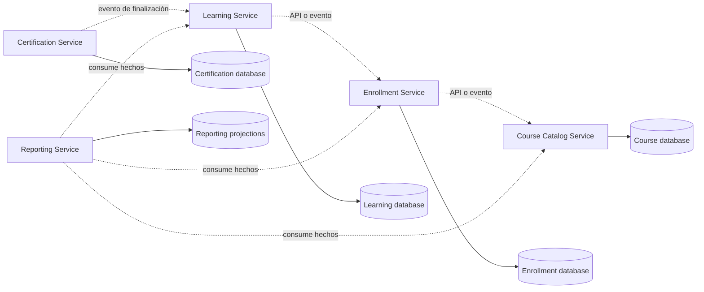
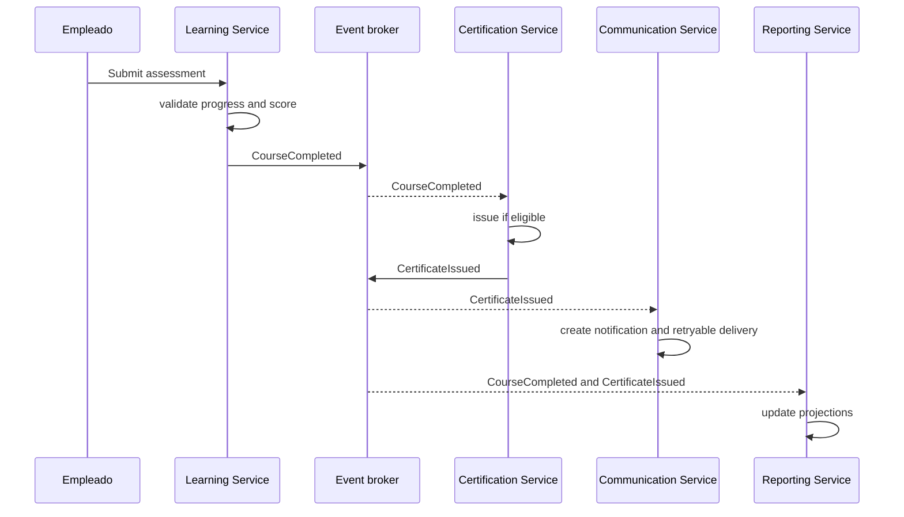
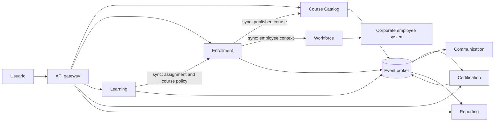

# Anexo de la Semana 3. Arquitectura de microservicios: capacidades distribuidas y operación

## Propósito del anexo

La **microservices architecture**, o arquitectura de microservicios, organiza una solución como un conjunto de servicios autónomos alrededor de capacidades de negocio. Cada servicio tiene un límite, un contrato, un ciclo de despliegue y una responsabilidad operativa propios. Los servicios colaboran mediante red, por lo que deben asumir latencia, fallos parciales, cambios de versión y consistencia distribuida.

Este anexo desarrolla cómo se ve una arquitectura de microservicios dentro de un proyecto. Explica qué define a un microservicio, cómo se eligen sus límites, cómo se diseñan APIs y eventos, cómo se distribuyen los datos, cómo se manejan fallos y reintentos, y qué elementos operativos hacen posible ejecutar la solución.

El ejemplo utiliza Java y diagramas Mermaid como material ilustrativo. No prescribe un framework, proveedor cloud, broker, base de datos ni topología definitiva. El objetivo es comprender las decisiones y el costo de convertir límites conceptuales en procesos independientes.

## 1. Qué es un microservicio

Un **microservice**, o microservicio, es un servicio desplegable y operable de manera independiente alrededor de una capacidad coherente. Expone contratos para colaborar, posee una responsabilidad clara y debe poder evolucionar sin requerir que todo el sistema se publique al mismo tiempo.

Un microservicio suele tener:

- una capacidad de negocio identificable;
- un límite de código y de responsabilidad;
- una API síncrona, eventos asíncronos o ambos;
- propiedad sobre sus datos y decisiones;
- un proceso de despliegue independiente;
- configuración y observabilidad propias;
- una estrategia explícita para fallos y recuperación.

“Micro” no significa necesariamente pocas clases, pocas líneas o un tamaño fijo. Un servicio es demasiado pequeño si necesita coordinarse constantemente con otros para completar cualquier operación. Es demasiado grande si contiene varias capacidades con propietarios, ritmos de cambio o necesidades operativas que deberían evolucionar por separado.

La distribución no crea automáticamente una arquitectura de calidad. Solo hace que las dependencias incorrectas tengan costo de red, latencia, fallos parciales y coordinación de versiones.

## 2. Por qué distribuir una solución

Separar una capacidad en un proceso puede aportar beneficios concretos:

- desplegar una capacidad sin publicar las demás;
- escalar una carga específica;
- aislar ciertos fallos;
- asignar propiedad a un equipo autónomo;
- proteger un límite de datos;
- usar una tecnología adecuada para una necesidad particular;
- aplicar una política de disponibilidad o seguridad diferenciada.

Estos beneficios aparecen cuando existe una razón operacional o de evolución. No aparecen simplemente porque se hayan creado varios repositorios o porque cada módulo tenga su propio contenedor.

La distribución también introduce responsabilidades nuevas:

- latencia y límites de tiempo;
- pérdida de conectividad;
- respuestas duplicadas o fuera de orden;
- contratos compatibles entre versiones;
- consistencia eventual;
- autenticación entre servicios;
- trazas distribuidas;
- despliegues coordinados cuando un contrato cambia;
- costos de plataforma, monitoreo y soporte.

Una decisión de microservicios debe registrar qué beneficio se busca, qué costo se acepta y cómo se sabrá si la decisión funciona.

## 3. Límites de servicio

El límite de un servicio debe derivarse de una capacidad de negocio, un contexto delimitado o una razón operativa clara. No conviene empezar por “una tabla equivale a un servicio” o “cada entidad debe tener un servicio”.

Un servicio saludable tiene:

- una razón principal para cambiar;
- reglas que deben permanecer juntas;
- datos que puede modificar directamente;
- un contrato que otros pueden consumir sin conocer su interior;
- un propietario técnico y funcional identificable;
- fallos y requisitos de disponibilidad comprensibles.

En SkillHub, posibles límites son:

- Course Catalog Service: gobierno editorial y cursos publicados;
- Enrollment Service: asignaciones e inscripciones;
- Learning Service: progreso y evaluación;
- Certification Service: certificados y evidencia;
- Workforce Service: contexto de empleados y autorización;
- Communication Service: notificaciones y bandeja;
- Reporting Service: proyecciones, reportes y auditoría.

Esta lista no es una decisión automática de despliegue. Es un conjunto de límites candidatos. Algunos pueden comenzar dentro de un monolito modular y separarse cuando aparezca una necesidad comprobada.

## 4. Propiedad de datos

En microservicios, cada servicio debe ser propietario de los datos que necesita modificar. Otros servicios pueden consultar una API, consumir eventos o mantener una proyección local, pero no deberían escribir directamente en las tablas de otro servicio.



La propiedad no exige una tecnología de base de datos distinta para cada servicio. Puede existir una misma instancia física con bases, esquemas o credenciales separadas. Lo importante es que el límite de escritura y el contrato sean explícitos.

Una tabla compartida puede parecer sencilla al inicio, pero crea acoplamiento estructural:

- un cambio de esquema obliga a coordinar servicios;
- cualquier servicio puede saltarse las reglas del propietario;
- no está claro quién garantiza una invariante;
- una recuperación o migración afecta a consumidores desconocidos.

Si una restricción obliga a compartir una base de datos durante una etapa inicial, debe tratarse como deuda o restricción documentada, no como evidencia de autonomía.

## 5. APIs de servicio

Una **service API** es un contrato que permite a un servicio solicitar una capacidad o consultar información de otro. Puede utilizar HTTP, gRPC u otro protocolo. El protocolo es un detalle; la capacidad y sus reglas son el contrato importante.

Una API debe definir:

- propósito de la operación;
- identidad y autorización necesarias;
- datos de entrada y salida;
- códigos o categorías de error;
- límites de tiempo esperados;
- comportamiento ante reintentos;
- compatibilidad entre versiones;
- trazabilidad y correlación.

Ejemplo de contrato HTTP para consultar una oferta publicada:

```text
GET /published-courses/{courseId}

200 OK
{
  "courseId": "C-20",
  "publishedVersion": 4,
  "title": "Seguridad industrial",
  "eligibility": ["ROLE_TECHNICIAN"],
  "evaluationPolicy": {
    "passingScore": 80,
    "maxAttempts": 3
  }
}

404 COURSE_NOT_PUBLISHED
503 CATALOG_UNAVAILABLE
```

El Enrollment Service no necesita conocer la estructura interna del catálogo. Solo necesita la vista publicada que permite decidir si una asignación es válida.

### API interna no significa API informal

Una llamada entre servicios del mismo equipo debe tener el mismo cuidado que una API pública. Si no se documenta, versiona y observa, el contrato queda implícito en el código del consumidor y resulta más difícil cambiarlo.

### Compatibilidad hacia atrás

Durante una transición pueden existir consumidores con versiones distintas. Un proveedor debe preferir cambios compatibles:

- agregar campos opcionales;
- no cambiar el significado de un campo existente;
- no eliminar una respuesta sin periodo de transición;
- tolerar campos desconocidos cuando sea posible;
- publicar una nueva versión cuando el contrato incompatible sea necesario.

La compatibilidad debe probarse con contratos automatizados, no solo con acuerdos verbales.

## 6. Comunicación síncrona

La comunicación **síncrona** espera una respuesta antes de continuar. Puede ser adecuada cuando el resultado es necesario para tomar una decisión inmediata.

Ejemplo: Enrollment Service consulta al Workforce Service antes de crear una asignación.

```java
public final class WorkforceClient {
    private final HttpClient http;

    public EmployeeContext requireActive(EmployeeId employeeId) {
        HttpResponse response = http.get(
                "/employees/" + employeeId.value());

        if (response.status() == 404) {
            throw new EmployeeNotFound(employeeId);
        }
        if (response.status() >= 500) {
            throw new WorkforceUnavailable();
        }
        return EmployeeContext.from(response.body());
    }
}
```

Una llamada síncrona debe considerar:

- timeout corto y explícito;
- límites de conexiones;
- reintentos solo cuando sean seguros;
- circuit breaker si una dependencia falla repetidamente;
- respuesta alternativa o degradación cuando sea posible;
- métricas de latencia y errores.

Una cadena larga de llamadas síncronas aumenta la latencia y multiplica los puntos de fallo:

```text
Request -> API Gateway -> Enrollment -> Workforce -> Course Catalog -> Database
```

Si cada salto espera al siguiente, el tiempo total y la probabilidad de fallo crecen. Las operaciones deben reducir dependencias innecesarias y utilizar datos locales o eventos cuando la decisión no requiera información en tiempo real.

## 7. Comunicación asíncrona

La comunicación **asíncrona** utiliza eventos o mensajes que se procesan después de que el productor los publica. El productor no necesita esperar a que todos los consumidores terminen.

```java
public record CourseCompleted(
        String eventId,
        String employeeId,
        String courseId,
        Instant occurredAt,
        int schemaVersion) {}
```

El Learning Service puede publicar `CourseCompleted`. Certification Service lo consume y decide si emite un certificado. Communication Service puede crear una notificación y Reporting Service puede actualizar una proyección.

Ventajas:

- desacopla tiempos de ejecución;
- permite reintentos independientes;
- evita que una notificación lenta bloquee la finalización;
- facilita que aparezcan nuevos consumidores;
- permite absorber picos mediante una cola.

Costos:

- el resultado puede tardar en propagarse;
- los mensajes pueden duplicarse o llegar fuera de orden;
- el contrato debe versionarse;
- diagnosticar una operación requiere correlación;
- el consumidor debe ser idempotente;
- se necesitan colas de errores y políticas de reintento.

Un evento debe representar un hecho que ya ocurrió, no una orden disfrazada. `CourseCompleted` describe un resultado; `GenerateCertificate` es una instrucción. Ambos pueden existir, pero tienen semánticas distintas.

## 8. Consistencia distribuida

Una transacción de base de datos normalmente protege cambios dentro de un servicio. No se debe asumir que una transacción local puede abarcar varias bases de datos y servicios con la misma simplicidad.

Para completar un curso pueden ocurrir estos estados:

1. Learning Service registra la finalización.
2. Publica `CourseCompleted`.
3. Certification Service recibe el evento.
4. Verifica elegibilidad y emite el certificado.
5. Communication Service notifica al empleado.
6. Reporting Service actualiza una vista.

Entre estos pasos pueden existir estados intermedios. El producto debe decidir qué significa para el usuario cada estado y cuánto tiempo puede durar.

### Consistencia eventual

La **eventual consistency**, o consistencia eventual, significa que distintas vistas pueden tardar en reflejar el mismo hecho. Es aceptable cuando el negocio puede tolerar ese retraso y existe una forma de observarlo y recuperarlo.

El certificado podría aparecer unos segundos después de marcar el curso como completado. La interfaz debe comunicar ese estado en lugar de prometer que ambos cambios son atómicos.

### Sagas

Una **saga** coordina una operación distribuida mediante pasos locales y acciones compensatorias o estados de recuperación.

Ejemplo de asignación masiva:

```text
1. Crear campaña de asignación.
2. Obtener población desde Workforce.
3. Crear asignaciones en lotes.
4. Publicar AssignmentCreated por empleado.
5. Communication programa notificaciones.
6. Reportes registra cobertura.
7. Si una parte falla, reintentar o marcar elementos pendientes.
```

Una saga no deshace mágicamente los efectos externos. Debe definir estados, reintentos, duplicados, compensaciones y operación manual cuando el proceso no pueda continuar automáticamente.

### Transactional outbox

La **transactional outbox** guarda el cambio de negocio y el evento pendiente dentro de la misma transacción local:

```text
BEGIN
  INSERT enrollment(...)
  INSERT outbox(event_id, type, payload, status = PENDING)
COMMIT

Publisher reads PENDING events
Publisher sends event
Publisher marks event as PUBLISHED
```

Así se evita confirmar una inscripción y perder el evento por una caída entre la base de datos y el broker. El consumidor aún debe tolerar duplicados, porque el publicador puede enviar el evento y fallar antes de marcarlo como publicado.

## 9. Idempotencia y duplicados

Una operación es **idempotente** si repetirla produce el mismo resultado observable que ejecutarla una vez. En un sistema distribuido, los reintentos hacen que la idempotencia sea una propiedad necesaria.

```java
public final class CertificateConsumer {
    private final ProcessedEventRepository processed;
    private final CertificateService certificates;

    public void consume(CourseCompleted event) {
        if (processed.exists(event.eventId())) {
            return;
        }

        certificates.issueIfEligible(
                new EmployeeId(event.employeeId()),
                new CourseId(event.courseId()));
        processed.mark(event.eventId());
    }
}
```

La implementación completa debe considerar la transacción entre marcar el evento y emitir el certificado. También puede utilizar una clave de negocio única, como `(employeeId, courseId, completionVersion)`, para evitar certificados duplicados.

Casos que requieren idempotencia:

- crear una asignación tras un timeout del cliente;
- procesar dos veces `CourseCompleted`;
- enviar una notificación reintentada;
- repetir una operación de sincronización;
- ejecutar una saga después de una recuperación.

Un identificador de correlación no evita duplicados; permite seguir una operación. Un identificador de idempotencia evita aplicar dos veces el mismo efecto.

## 10. Fallos parciales

Un fallo parcial ocurre cuando una parte de la solución falla mientras otras siguen funcionando. Es una condición normal de un sistema distribuido, no una excepción remota que pueda ignorarse.

Ejemplos en SkillHub:

- Workforce no responde durante una asignación;
- Course Catalog responde con timeout;
- el broker acepta un evento pero la confirmación se pierde;
- Certification procesa el hecho pero falla al guardar el documento;
- Communication no puede enviar correo;
- Reporting se retrasa mientras el negocio continúa.

Cada dependencia debe tener una política:

| Dependencia | Fallo posible | Respuesta inicial |
|---|---|---|
| Workforce | Timeout o datos no disponibles | Rechazar o dejar asignación pendiente; no inventar estado activo. |
| Course Catalog | Curso no publicado o indisponible | No crear asignación sin una versión válida; reintentar solo errores temporales. |
| Learning | Servicio no disponible | Mantener progreso local y permitir recuperación según la operación. |
| Certification | Documento no generado | Mantener finalización y dejar emisión pendiente. |
| Communication | Correo fallido | Reintentar sin revertir la inscripción o finalización. |
| Reporting | Proyección atrasada | Mostrar fecha de actualización y procesar backlog. |

### Timeouts

Toda llamada de red necesita un límite de espera. Sin timeout, los hilos y conexiones pueden quedar ocupados hasta agotar recursos.

### Retries

Los reintentos deben limitarse, usar backoff y aplicarse solo cuando la operación sea segura o idempotente. Reintentar inmediatamente una operación que ya está saturando una dependencia puede empeorar la falla.

### Circuit breaker

Un **circuit breaker** deja de llamar temporalmente a una dependencia que está fallando repetidamente. Permite recuperar recursos y responder con una degradación o error controlado.

### Bulkhead

Un **bulkhead** separa recursos para que una dependencia lenta no consuma todas las conexiones o hilos del servicio. Por ejemplo, la sincronización con Workforce no debería impedir que empleados consulten sus certificados.

## 11. Seguridad entre servicios

La seguridad no termina en el gateway. Cada servicio debe autenticar y autorizar las solicitudes que recibe, incluso si provienen de otro servicio interno.

Decisiones relevantes:

- identidad del usuario original;
- identidad técnica del servicio llamador;
- autorización por capacidad y alcance;
- cifrado en tránsito;
- rotación de credenciales;
- protección contra replay cuando aplique;
- minimización de datos compartidos;
- auditoría de acciones sensibles.

Una llamada desde Reporting no debería obtener automáticamente permiso para leer todos los resultados individuales. El contrato debe definir qué vistas puede consultar y bajo qué contexto autorizado.

```java
public record ServiceRequestContext(
        String callerService,
        String subjectEmployeeId,
        Set<String> scopes,
        String correlationId) {}
```

El servicio debe distinguir entre:

- quién ejecuta la llamada técnicamente;
- en nombre de quién se ejecuta;
- qué alcance está autorizado;
- qué datos puede recibir el consumidor.

En SkillHub, Workforce puede entregar un contexto autorizado, pero cada servicio sigue siendo responsable de aplicar sus propias reglas de acceso a sus datos.

## 12. Observabilidad distribuida

La **observability**, o observabilidad, permite inferir el estado del sistema a partir de señales externas. En microservicios debe cubrir la operación completa, no solo cada proceso de forma aislada.

### Logs estructurados

Cada servicio debe registrar eventos con campos consistentes:

```json
{
  "timestamp": "2026-09-27T10:15:30Z",
  "service": "learning-service",
  "event": "course_completed",
  "correlationId": "corr-123",
  "eventId": "evt-456",
  "employeeId": "E-10",
  "courseId": "C-20"
}
```

No se deben registrar respuestas, contraseñas o documentos sensibles sin una razón y controles de protección.

### Métricas

Algunas métricas útiles:

- latencia por operación y percentil;
- tasa de errores por dependencia;
- profundidad y edad de colas;
- mensajes procesados, reintentados y enviados a dead letter;
- tiempo de emisión de certificados;
- asignaciones pendientes;
- disponibilidad por servicio;
- tasa de duplicados e idempotencias activadas.

### Trazas distribuidas

Una **distributed trace**, o traza distribuida, conecta los spans de una operación que atraviesa varios servicios. El `correlationId` permite seguir la asignación desde la petición inicial hasta la notificación y el reporte.

Sin trazas, un usuario puede reportar “no recibí mi certificado” y el equipo no saber si falló Learning, el evento, Certification, almacenamiento de documentos o Communication.

## 13. Descubrimiento, configuración y entrada

Una plataforma de microservicios necesita resolver dónde está cada servicio y cómo conectarse a él.

### Service discovery

El **service discovery**, o descubrimiento de servicios, permite localizar instancias disponibles. Puede ser estático en una instalación pequeña o gestionado por la plataforma.

### API gateway

Un **API gateway** puede centralizar entrada externa, autenticación inicial, límites de tráfico y composición de respuestas. No debe convertirse en el lugar donde viven todas las reglas de negocio ni en una dependencia obligatoria para las llamadas internas.

### Configuración

La configuración de endpoints, timeouts, credenciales y flags debe separarse del código y gestionarse con control de acceso. Una configuración diferente por entorno no debe cambiar el significado de una política sin una decisión documentada.

### Versionado de servicios

Cada servicio debe poder coexistir temporalmente con versiones compatibles. El despliegue independiente requiere automatización que publique, observe y revierta cambios sin dejar contratos incompatibles.

## 14. Código de un servicio

Un microservicio puede mantener dentro de su proceso las estructuras aprendidas en los anexos anteriores. Por ejemplo, Enrollment Service puede tener una organización interna por dominio, aplicación, puertos y adaptadores:

```text
enrollment-service/
├── src/main/java/
│   └── com/example/enrollment/
│       ├── domain/
│       │   ├── Assignment.java
│       │   ├── Enrollment.java
│       │   └── EnrollmentPolicy.java
│       ├── application/
│       │   ├── CreateAssignment.java
│       │   └── CancelAssignment.java
│       ├── api/
│       │   ├── AssignmentController.java
│       │   └── AssignmentResponse.java
│       ├── clients/
│       │   ├── WorkforceClient.java
│       │   └── CourseCatalogClient.java
│       ├── persistence/
│       │   └── SqlAssignmentRepository.java
│       └── messaging/
│           └── AssignmentEventPublisher.java
├── src/test/
│   ├── domain/
│   ├── application/
│   ├── contract/
│   └── integration/
├── Dockerfile
└── service-config/
```

La existencia de un proceso independiente no elimina la necesidad de buenos límites internos. Un microservicio mal diseñado puede ser un monolito distribuido: muchas clases acopladas, una base compartida y llamadas remotas que sustituyen llamadas internas sin resolver la propiedad de las reglas.

## 15. Recorrido completo: completar un curso

Consideremos la operación que inicia cuando un empleado aprueba su evaluación.

### Paso 1. Learning Service decide

Learning valida que el contenido obligatorio esté revisado y que el intento cumpla la política. Guarda el resultado y marca la finalización dentro de su propia transacción.

```java
public final class SubmitAssessment {
    private final ProgressRepository progress;
    private final AttemptRepository attempts;
    private final CompletionRepository completions;
    private final EventOutbox outbox;

    public void execute(SubmitAssessmentCommand command) {
        transaction.run(() -> {
            AssessmentAttempt attempt = attempts.require(command.attemptId());
            AssessmentResult result = attempt.submit(command.answers());
            attempts.save(attempt);

            if (completionPolicy.isComplete(
                    progress.for(command.employeeId(), command.courseId()),
                    result)) {
                Completion completion = completions.complete(
                        command.employeeId(), command.courseId());
                outbox.add(new CourseCompleted(
                        completion.eventId(),
                        command.employeeId().value(),
                        command.courseId().value(),
                        clock.now()));
            }
        });
    }
}
```

### Paso 2. Certification Service reacciona

Certification consume `CourseCompleted`, verifica que el evento no se haya procesado y crea el certificado. Si el almacenamiento de documentos está temporalmente caído, deja una emisión pendiente y reintenta.

### Paso 3. Communication Service notifica

Communication consume `CertificateIssued`, crea una entrega en la bandeja y programa el correo. Un fallo de correo no revierte el certificado.

### Paso 4. Reporting Service proyecta

Reporting consume los hechos y actualiza las vistas que Recursos Humanos puede consultar. La vista puede quedar retrasada sin cambiar el estado de negocio de Learning o Certification.



El flujo deja visibles los estados intermedios y las responsabilidades. También muestra por qué no se debe prometer que certificado, correo y reporte cambian en la misma transacción.

## 16. Contratos de eventos

Un evento compartido necesita un contrato estable:

```json
{
  "eventType": "course.completed",
  "schemaVersion": 1,
  "eventId": "evt-456",
  "occurredAt": "2026-09-27T10:15:30Z",
  "producer": "learning-service",
  "data": {
    "employeeId": "E-10",
    "courseId": "C-20",
    "completionId": "cmp-789",
    "completedAt": "2026-09-27T10:15:29Z"
  }
}
```

El contrato debe distinguir:

- identificador del evento;
- versión del esquema;
- momento de ocurrencia;
- productor;
- datos del hecho;
- claves de partición o correlación si el transporte las necesita.

Un consumidor no debería depender de campos privados del productor. Si Certification necesita la versión del curso para decidir elegibilidad, ese dato debe formar parte del contrato o debe consultarse mediante una API estable.

Los eventos históricos también requieren evolución. Cambiar el significado de un campo sin versionar puede producir certificados incorrectos o reportes incompatibles.

## 17. Operación y despliegue

Un microservicio no está terminado cuando compila y responde localmente. Debe poder desplegarse, observarse, recuperarse y actualizarse.

Un servicio operable necesita:

- imagen o artefacto reproducible;
- configuración por entorno;
- health checks de disponibilidad y dependencias;
- métricas y logs;
- límites de recursos;
- estrategia de despliegue y rollback;
- migraciones de datos compatibles;
- gestión de secretos;
- documentación de operación;
- alertas con umbrales accionables.

### Health checks

Un **liveness check** indica si el proceso puede continuar. Un **readiness check** indica si está preparado para recibir tráfico. Mezclarlos puede provocar reinicios innecesarios cuando una dependencia externa está temporalmente caída.

### Migraciones compatibles

Una migración de datos debe permitir que versiones vieja y nueva del servicio convivan durante el despliegue:

1. agregar la nueva columna o estructura de forma compatible;
2. desplegar código que escriba ambos formatos si hace falta;
3. rellenar datos existentes;
4. cambiar lectores;
5. retirar el formato antiguo después de confirmar consumidores.

Una migración destructiva coordinada con varios servicios es una señal de que la propiedad de datos o el contrato necesitan revisión.

### Despliegues

Blue-green, rolling y canary son estrategias posibles, pero no eliminan la necesidad de contratos compatibles y observabilidad. El equipo debe saber qué versión procesa cada mensaje y cómo revertir sin perder eventos.

## 18. Pruebas en un sistema de microservicios

Las pruebas deben cubrir tanto cada servicio como sus relaciones.

### Pruebas unitarias y de dominio

Verifican reglas de entidades, políticas y casos de uso sin red ni infraestructura real.

### Pruebas de contrato

Verifican que el proveedor cumple la API o evento que el consumidor espera. Pueden ejecutarse en el proveedor y en el consumidor para evitar cambios incompatibles.

```text
Provider: Course Catalog Service
Contract: PublishedCourseView v1
Consumer: Enrollment Service
Expectation: courseId, publishedVersion, eligibility and availability
```

### Pruebas de integración

Confirman persistencia, broker, clientes y configuración del servicio. Deben ejecutarse con dependencias controladas o entornos efímeros cuando sea posible.

### Pruebas de resiliencia

Simulan:

- timeouts;
- respuestas 500;
- mensajes duplicados;
- mensajes fuera de orden;
- broker no disponible;
- base de datos lenta;
- reinicio del consumidor;
- caída de una instancia.

### Pruebas de flujo

Verifican un escenario completo como completar un curso, emitir un certificado y actualizar un reporte. Deben tener datos controlados, correlación y limpieza para diagnosticar fallos.

Una suite que solo prueba cada servicio de forma aislada puede dejar sin verificar el contrato real que permite que el sistema funcione como conjunto.

## 19. Aplicación a SkillHub

Los siete módulos identificados en la semana 3 pueden ser límites candidatos. Cada servicio tendría una responsabilidad y una propiedad de datos concreta.

### Course Catalog Service

Posee cursos, contenidos, revisiones y publicación. Expone cursos publicados y publica `CoursePublished`. No crea asignaciones ni registra progreso.

### Enrollment Service

Posee asignaciones, inscripciones y fechas límite. Consulta la oferta publicada y el contexto de Workforce. Publica `AssignmentCreated` y `EnrollmentActivated`.

### Learning Service

Posee progreso, intentos, calificaciones y finalización. Consume la versión publicada y las asignaciones válidas. Publica `AssessmentPassed` y `CourseCompleted`.

### Certification Service

Posee certificados, vigencia y estado de emisión. Consume `CourseCompleted`, evita duplicados y publica `CertificateIssued`.

### Workforce Service

Adapta el sistema corporativo, conserva una representación local si se necesita y ofrece contexto autorizado. El sistema externo sigue siendo la fuente maestra de nombre, área, rol y estado.

### Communication Service

Posee notificaciones, bandeja, entregas y reintentos. Consume hechos de negocio y no decide si un empleado completó un curso.

### Reporting Service

Posee proyecciones de cobertura, finalización y resultados, además de auditoría. Consume eventos y aplica el alcance autorizado para cada consulta.

### Vista de colaboración



Esta vista no significa que todos los servicios deban crearse al mismo tiempo. También muestra que Learning y Enrollment necesitan contratos cuidadosamente definidos: si cada operación exige llamadas remotas en cadena, el costo operativo y la latencia pueden superar el beneficio de separar los procesos.

## 20. Requisitos operativos derivados de SkillHub

Los requisitos del MVP producen decisiones específicas:

- **Sistema de empleados:** la indisponibilidad de Workforce no debe inventar empleados activos ni corromper asignaciones. Debe existir timeout, reintento controlado y estado pendiente o error claro.
- **Notificaciones:** el correo no es requisito para completar un curso. Communication puede reintentar de forma independiente y registrar el estado de entrega.
- **Certificados:** la finalización y la emisión pueden ser estados distintos si el almacenamiento de documentos falla. El empleado debe conocer si el certificado está pendiente.
- **Resultados individuales:** cada servicio debe limitar datos y verificar autorización; Reporting no debe convertirse en una puerta de acceso sin alcance.
- **Campañas:** asignaciones masivas y notificaciones pueden usar procesamiento por lotes y colas para no bloquear la interfaz.
- **On-premise:** operar varios servicios requiere automatización, monitoreo, respaldos, recuperación y personal con capacidad para diagnosticar fallos distribuidos.
- **Aproximadamente 1.000 empleados y 100 cursos:** la carga conocida no justifica por sí sola la distribución. La decisión debe apoyarse en autonomía, fallos, despliegue o escalado diferenciados que puedan medirse.

## 21. Errores frecuentes

### Crear servicios por tabla

Dividir cada tabla en un servicio crea llamadas remotas sin límites de negocio. Los datos pueden estar separados y aun así las responsabilidades permanecer mezcladas.

### Compartir una base de datos sin propietario

Cada servicio puede consultar y modificar las tablas de todos. El resultado es una aplicación distribuida con acoplamiento de esquema y sin autoridad clara sobre las reglas.

### Usar llamadas síncronas para todo

Una cadena de llamadas para completar cada pantalla aumenta latencia, disponibilidad requerida y complejidad de diagnóstico. Debe decidirse qué información necesita estar fresca y qué puede propagarse mediante eventos o proyecciones.

### Usar eventos para ocultar diseño débil

Un evento no corrige un límite mal definido. Si varios servicios necesitan el mismo modelo interno o modifican la misma decisión, el problema está en la propiedad y el contrato, no en el transporte.

### Ignorar duplicados y orden

Los consumidores deben ser idempotentes y definir qué hacer si un evento llega dos veces, tarde o antes de otro evento relacionado.

### Reintentar sin límites

Los reintentos sin timeout, backoff ni límite pueden convertir una falla temporal en una saturación generalizada. Toda política de reintento debe considerar la capacidad de la dependencia y la seguridad de repetir la operación.

### Distribuir transacciones locales

Intentar que una única transacción cubra Enrollment, Learning, Certification y Communication puede aumentar acoplamiento y disponibilidad requerida. La consistencia debe diseñarse con eventos, sagas, estados pendientes y compensaciones cuando corresponda.

### No propagar contexto de seguridad

Autenticar al gateway y confiar ciegamente en cualquier llamada interna permite que un servicio acceda a datos fuera de su alcance. La identidad, el sujeto y los permisos deben viajar y verificarse.

### No invertir en operación

Varios procesos sin logs correlacionados, métricas, trazas, alertas y rollback son difíciles de operar. La complejidad operativa forma parte de la arquitectura, no es una tarea posterior.

### Confundir independencia de despliegue con independencia de cambio

Un servicio puede desplegarse solo y aun así depender de cinco contratos que deben cambiar juntos. La verdadera autonomía requiere contratos estables, propiedad de datos y límites de cambio razonables.

## 22. Cuándo resulta útil

Los microservicios suelen ser apropiados cuando:

- existen equipos capaces de poseer y operar servicios de forma autónoma;
- algunas capacidades requieren despliegue o escalado independiente;
- hay razones claras para aislar fallos o datos;
- los límites de dominio están suficientemente comprendidos;
- la organización puede sostener observabilidad, automatización y seguridad distribuidas;
- la carga, disponibilidad o ritmo de cambio difieren significativamente entre capacidades;
- el costo de coordinación distribuida está justificado por beneficios medibles.

Pueden ser prematuros cuando:

- el dominio todavía está aprendiendo sus límites;
- el equipo es pequeño y no puede operar muchos servicios;
- la carga inicial es moderada y homogénea;
- se necesitan transacciones simples entre varias capacidades;
- no existen contratos, métricas ni automatización de despliegue;
- la división se basa únicamente en entidades o tablas;
- la organización espera que separar procesos resuelva problemas de diseño interno.

Un monolito modular puede conservar límites de negocio, contratos internos y propiedad de datos mientras se valida el dominio. Extraer un servicio después requiere trabajo, pero extraer desde un límite comprendido suele ser menos riesgoso que distribuir un límite inventado por anticipado.

## 23. Lista de revisión

Antes de considerar implementada una arquitectura de microservicios, revisar:

1. ¿Cada servicio posee una capacidad de negocio y una razón de cambio comprensibles?
2. ¿Existe un propietario claro de las reglas y de los datos?
3. ¿Los contratos síncronos y asíncronos están documentados y versionados?
4. ¿Las APIs definen timeouts, errores, reintentos e idempotencia?
5. ¿Los eventos distinguen hechos de órdenes y tienen esquemas evolutivos?
6. ¿Los servicios evitan escribir directamente en los datos de otros?
7. ¿Las operaciones distribuidas tienen una estrategia de consistencia y recuperación?
8. ¿Se han diseñado duplicados, mensajes fuera de orden y fallos parciales?
9. ¿La seguridad verifica tanto el servicio llamador como el alcance del usuario?
10. ¿Logs, métricas y trazas permiten seguir una operación completa?
11. ¿Los despliegues, migraciones, rollbacks y secretos están automatizados?
12. ¿Las pruebas verifican reglas, contratos, integraciones y resiliencia?
13. ¿La operación on-premise o cloud tiene capacidad humana y técnica suficiente?
14. ¿El beneficio de distribuir cada servicio puede medirse frente a su costo?

## Cierre

La arquitectura de microservicios convierte límites de negocio en procesos que colaboran mediante red. Sus ventajas dependen de la autonomía real: propiedad de datos, contratos estables, despliegue independiente y operación capaz de manejar fallos parciales.

En SkillHub, la separación de catálogo, asignaciones, aprendizaje, certificación, workforce, comunicación y reportes puede ofrecer beneficios concretos solo si cada capacidad tiene reglas y datos propios. La finalización de un curso, la emisión de un certificado, el envío de un correo y la actualización de un reporte no deben tratarse como una única transacción invisible; necesitan estados, eventos, reintentos y observabilidad.

La pregunta práctica es: **¿qué capacidad necesita realmente independencia de despliegue, datos, escala o fallos, y qué costo operativo estamos preparados para asumir para obtenerla?**
